**SPA**

В интернете встречаются очень разные сайты. Одни выглядят просто и в
основном используются для чтения информации. Пример такого сайта ---
[wikipedia](https://www.wikipedia.org/).

Другие же представляют собой целые веб-приложения! Они содержат много
элементов для активного взаимодействия с пользователем: кнопки,
модальные окна, сайдбары, чаты, ленту и многое другое. Вспомните, к
примеру, сайт [ВКонтакте](https://vk.com/feed). Для
реализации таких веб-приложений хорошо подходит концепция SPA.

В работе вы будете часто сталкиваться с подобными веб-приложениями,
поэтому крайне важно знать, что такое эти самые SPA, в чём их
особенности, как их создавать и поддерживать. Об этом мы и поговорим в
этой теме.

**Что такое SPA**

SPA --- это сокращение от Single Page Application, что означает
одностраничное веб-приложение. Оно содержит ровно одну HTML-страницу, а
весь контент на ней динамически генерируется с помощью JavaScript.

Обычные многостраничные сайты, MPA, работают по такой схеме:

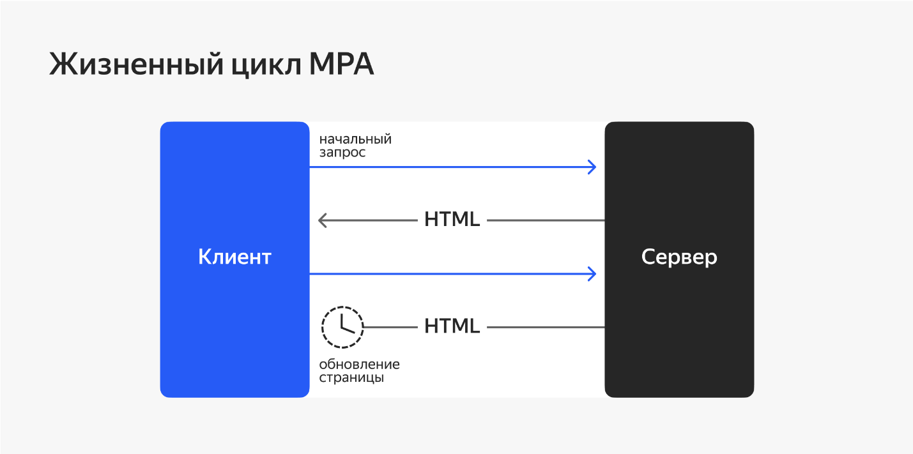{width="6.496527777777778in"
height="3.2333333333333334in"}

1.  Пользователь делает запрос в адресной строке браузера.

2.  Сервер отдаёт готовую HTML-страничку, на которую уже подставлены все
    необходимые данные.

3.  При переходе на другую страницу сайта процесс повторяется: сервер
    заново формирует HTML-разметку и страница перезагружается.

SPA работает иначе. Ответственность за формирование контента берёт на
себя клиентский JavaScript. Жизненный цикл одностраничного приложения
выглядит так:

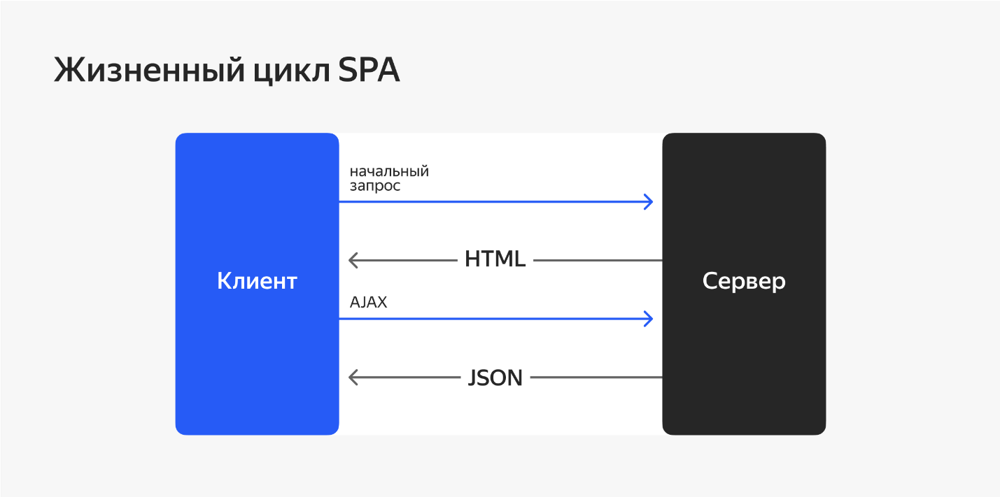{width="6.496527777777778in"
height="3.2333333333333334in"}

1.  Пользователь делает запрос в адресной строке браузера.

2.  Сервер отдаёт пустую HTML-страницу (кроме случая c SSR, о котором
    поговорим позже), а также js-бандл. Все компоненты на странице
    появляются именно благодаря JavaScript.

3.  При переходе на другую страницу сайта JavaScript перехватывает
    инициативу в свои руки: перезагрузка страницы отменяется. JavaScript
    сам меняет компоненты в зависимости от адреса новой страницы.

4.  Если нужны какие-нибудь дополнительные данные с сервера, JavaScript
    тихонько их запрашивает в фоновом режиме. Это делается с помощью
    специальной технологии AJAX-запросов --- они позволяют получить
    данные с сервера, не перезагружая страницу.

Отсутствие перезагрузок страницы при взаимодействии с сайтом --- это и
есть киллер-фича SPA. У пользователя может сложиться впечатление, что он
взаимодействует не с сайтом, а пользуется настольным приложением: всё
работает плавно и не подвисает.

        Перед вами несколько сайтов.  Определите, какие из них относятся к SPA, а какие --- к традиционным многостраничникам?

 


- [lamoda.ru](https://www.lamoda.ru/)


- [habr.com](https://habr.com/)

 


- [learn.javascript.ru](https://learn.javascript.ru/)


- [freelance.ru](https://freelance.ru/)


- [hh.ru](https://hh.ru/)


**Требования к SPA**

При написании одностраничного приложения важно сделать его удобным для
пользователя. Для этого нужно соблюдать некоторые нюансы, присущие
многостраничным приложениям.

**Ссылка определяет контент.** В любом многостраничном приложении от
ссылки, которая находится в адресной строке браузера, зависит то, какая
страница отображается. Скажем, в интернет-магазине есть страница
определённого товара. Вы можете скопировать ссылку на эту страницу,
отправить другу и быть уверенными, что у него в браузере по этой ссылке
откроется та же страница, что и у вас. Это называется роутингом. Такое
же поведение нужно реализовывать и в SPA, несмотря на то, что там всего
одна страница. Контент на этой странице должен полностью определяться
адресом в адресной строке. Как такое организовать, мы подробно обсудим в
следующем спринте.

**Пользователь должен знать о загрузке.** Если данные, которые нужны
пользователю, находятся в состоянии загрузки, важно сообщить об этом
пользователю. К сожалению, запросы на сервер не мгновенные, а иногда
даже весьма долгие. С момента, когда пользователь нажал на кнопку и
получил результат запроса, может пройти неопределённое количество
времени. Если в этот момент у пользователя в голове возникнут вопросы:
«Почему ничего не происходит?», «А точно ли нажалась кнопка?», «Сайт
завис или я?», то вряд ли он захочет ещё раз зайти на такой сайт. Вы
потеряете пользователя, а компания --- деньги. Поэтому в момент загрузки
данных нужно показать ему лоадер или скелетон --- тогда пользователь
поймёт, что данные загружаются и нужно немного подождать.

**Преимущества и недостатки SPA**

Вот какие преимущества есть у SPA в сравнении с традиционными
многостраничными приложениями:

1.  Высокая скорость. Браузер не запрашивает все ресурсы повторно и не
    перезагружает страницу целиком, а значит, пользователь увидит
    обновлённый контент максимально быстро.

2.  Отзывчивый интерфейс. Мы не перерисовываем страницу целиком, а
    меняем отдельные её части. Этим достигается плавность работы
    веб-приложения и открываются возможности для анимированных переходов
    между страницами.

3.  Быстрый старт. Благодаря тому, что вся разметка формируется на
    стороне клиента, интерфейс можно разрабатывать сразу, не тратя время
    на написание серверной части. Иногда можно и вовсе обойтись без
    сервера. В MPA, наоборот, между сервером и клиентом связь очень
    тесная, поэтому их нельзя развивать параллельно.

Есть и недостатки. В основном они не критичны, но всё же о них нужно
знать:

**Потенциальные проблемы с SEO-оптимизацией.** Дело в том, что поисковые
сервисы, чтобы прочитать контент сайта, читают содержимое HTML-страницы,
которая приходит с сервера. А она, как вы помните, у SPA является пустой
и не содержит никакого контента.

С этой проблемой справляются так:

-   Сервер запускает JS-код, который рендерит разметку ещё на этапе
    обработки запроса на сервере. Этот процесс называется
    Server-Side-Rendering, или сокращённо SSR.
-   На стороне клиента HTML-вёрстка уже готова, осталось только навесить
    обработчики событий и проверить, что все элементы на месте. Этот
    процесс называют гидратацией.

Получается, что и поисковые сервисы довольны, и SPA работает исправно.
Как говорится: и волки сыты, и овцы целы. Нужно только настроить сервер.

На самом деле, популярные поисковики уже научились распознавать SPA,
поэтому эта проблема становится всё менее актуальной.

**Нагрузка на браузер.** Часто SPA являются достаточно большими
приложениями, которые под капотом используют ещё и большие фреймворки и
библиотеки. Если не следить за размером ресурсов и утечками памяти в
JavaScript, то можно легко «положить» браузер клиента.

**Для работы SPA требуется поддержка JavaScript в браузере.** Это
очевидно, ведь именно он генерирует весь контент на странице. Но иногда
JavaScript в браузере клиента может быть отключён из соображений
безопасности. Такие случаи нечасты, но иногда происходят. В такой
ситуации ваше SPA будет максимально беспомощным.

 

        Выберите особенности, которые относятся к SPA:? 

- Разметку страницы формирует сервер


- Обмен данными с сервером происходит с помощью AJAX-запросов


- Прямой запрос на сервер происходит только в первый раз, а
дальше используются только AJAX-запросы.


- Плавные переходы между страницами с использованием анимаций
- В SPA мы можем менять отдельные части страницы, что открывает
дополнительные возможности для плавных переходов.


**Вывод**

SPA --- хороший выбор для приложений с насыщенным пользовательским
интерфейсом. Например, для интернет-магазинов, социальных сетей,
образовательных сайтов.

Однако, если сайт используется в основном для чтения информации и есть
необходимость, чтобы его использовали в браузерах без поддержки
JavaScript, то правильным выбором будет традиционный MPA.

В следующем уроке мы рассмотрим один важный принцип, который очень
помогает разрабатывать SPA.

**Реактивное программирование**

Представьте, что есть источник данных и есть компонент, который эти
данные использует. Данные постоянно меняются, и компонент должен как-то
об этом узнать и отреагировать. Тут возможно несколько вариантов:

1.  Компонент постоянно мониторит данные, от которых зависит, и
    проверяет, не изменились ли они. Подход не очень надёжный, мягко
    говоря.

2.  Императивный подход: тот компонент, который поменял данные, должен
    вызвать реакцию всех остальных компонентов, которые от этих данных
    зависят. Получается, что каждый компонент знает слишком много про
    все остальные. Такие зависимости тяжело поддерживать. Всё приложение
    становится монолитным и тесно связанным. Это не путь джедаев.

3.  Источник данных сам оповещает все зависимые компоненты, когда эти
    данные меняются по какой-либо причине.

Последний вариант --- это и есть реактивность. Она сильно упрощает
разработку веб-приложений, поэтому ей стоит уделить особое внимание.

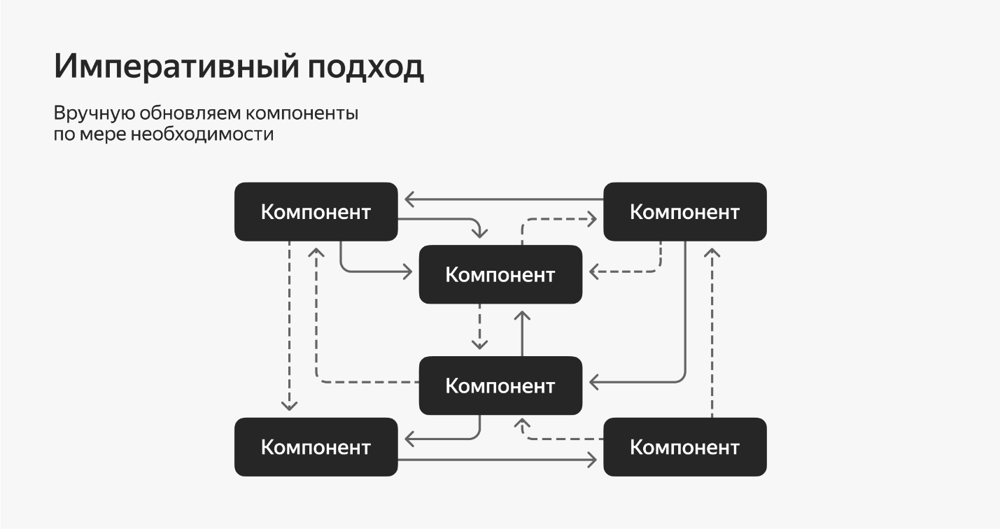{width="6.496527777777778in"
height="3.4368055555555554in"}

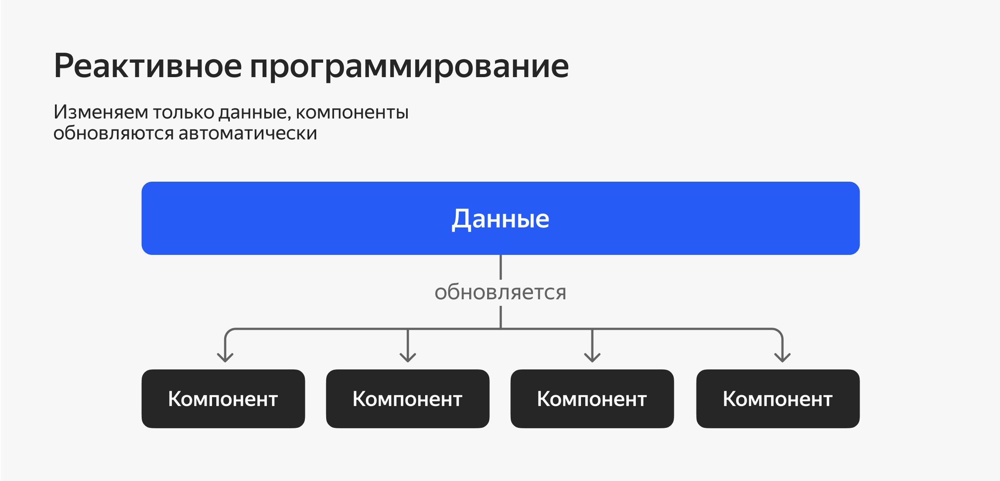{width="6.496527777777778in"
height="3.126388888888889in"}

Этим вы и займётесь в этом уроке!

**Реактивность**

Реактивность --- это когда источник данных оповещает зависимые
компоненты о том, что данные обновились. Реализовать такое можно через
механизм подписок:

1.  Компонент подписывается.

2.  Источник при изменении данных оповещает подписчиков.

3.  Подписчики обрабатывают изменение.

Ничего не напоминает? Это и есть тот самый паттерн Observer, который вы
изучали в предыдущем спринте!

Это также очень похоже на работу формул в Excel. При обновлении значения
в ячейке все другие, которые её используют, пересчитываются
автоматически --- вам не нужно делать это вручную.

Благодаря реактивности код приложения превращается из императивного в
декларативный. Это значит, что не нужно вручную описывать все тонкости
работы интерфейса: что и как именно нужно перерисовывать. Нужно лишь
описать, какие компоненты должны быть на странице и от каких данных они
должны зависеть. Далее можно будет сосредоточиться только на описании
бизнес-логики приложения.

Вся суть именно в том, что обновление компонента происходит только по
причине изменения данных, от которых он зависит. Задача разработчика ---
следить только за изменением этих данных, а остальное доверить
реактивности. Код становится более понятным и надёжным.

**Потоки**

Реактивность в веб-приложении можно реализовать, например, с помощью
асинхронных потоков. Сейчас вы узнаете, как это делается, чтобы вы лучше
разобрались в сути реактивности.

Поток --- это последовательность событий, распределённых во времени.
Напоминает дорожку на диктофоне, на которой появляются звуки, или
движущуюся ленту перед кассой в магазине, или кардиограмму на экране в
операционной. Есть прямая времени, а на ней в определённые моменты
появляются точки:

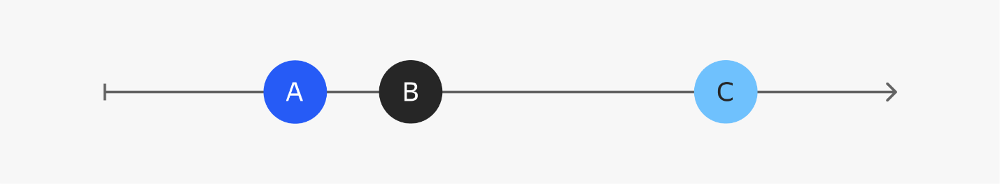{width="6.496527777777778in"
height="1.195138888888889in"}

В мире JavaScript поток можно сравнить с Promise, но тот генерирует
всего одно значение, а поток --- много.

Потоки можно создавать практически из любых асинхронных данных:

-   событий DOM-элемента, таких как:

    -   клик,

    -   ховер;

-   промиса;

-   по таймеру или интервалу;

-   другого потока.

Потоки можно фильтровать, модифицировать и объединять. А самое главное,
что на потоки можно подписаться и реагировать на изменения данных ---
вот тут реактивность и появляется. По сути, поток --- реализация
паттерна Observer.

 

Сейчас краем глаза посмотрим, как это работает на примере.

**RxJS**

RxJS --- прекрасная библиотека, позволяющая создавать потоки и управлять
ими. Она пользуется большой популярностью, поэтому для примера
рассмотрим именно её.

Детально изучать эту библиотеку мы не будем, но при желании вы всегда
можете обратиться к [официальной
документации](https://rxjs.dev/).

Итак, сделаем регулятор громкости. Вот как он будет выглядеть:

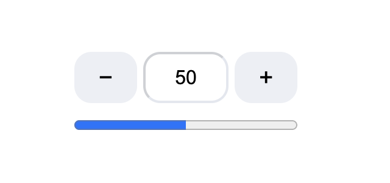{width="6.496527777777778in"
height="3.0444444444444443in"}

Всё просто: есть две кнопки, поле ввода и progress-bar, который
визуально отображает уровень громкости. Вот такая получилась разметка:

```HTML

<div class="wrapper">

<div class="controlls">

<button class="button button_minus">−</button>

<input class="input" value="50"/>

<button class="button button_plus">+</button>

</div>

<progress class="progress" max="100" value="50">50</progress>

</div>
```
Также мы добавили стили CSS. Полный код вы сможете увидеть в тренажёре в
конце урока, а пока что следите за руками.

Сейчас нажатия на кнопки и ввод в текстовое поле ничего не делают.
Оживим наше приложение! Сперва нужно получить ссылки на все необходимые
DOM-элементы:

```TYPESCRIPT

const buttonMinus = document.querySelector<HTMLButtonElement>('.button_minus');

const buttonPlus = document.querySelector<HTMLButtonElement>('.button_plus');

const input = document.querySelector<HTMLInputElement>('.input');

const progress = document.querySelector<HTMLProgressElement>('.progress');
```

Теперь создадим главный поток, который будет содержать значение
громкости:

```TYPESCRIPT

import { BehaviorSubject } from "rxjs";

/** Поток, содержащий значения громкости */

export const value$ = new BehaviorSubject<number>(50);
```

В этом потоке будет начальное значение --- 50.

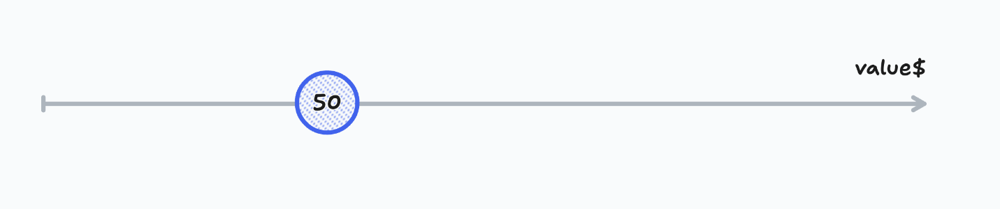{width="6.496527777777778in"
height="1.3666666666666667in"}

Потоки обычно обозначаются знаком \$ после названия. Это условная
договорённость, чтобы отличать их от других переменных.

Созданный поток value\$ --- это источник данных для поля ввода и
progress-bar. Нужно создать подписку на изменение этих данных и менять
их в интерфейсе:


```TYPESCRIPT

/* Подписываемся на изменение данных */

value$.subscribe(value => {

input.value = String(value);

progress.value = value;

});
```
Наши кнопки и поле ввода до сих пор не интерактивны. Пора бы это
исправить! Будем отслеживать события нажатия и изменения кнопок и поля
ввода соответственно. Создадим из событий потоки с помощью функции
[fromEvent](https://rxjs.dev/api/index/function/fromEvent)
из библиотеки RxJS:

 

```TYPESCRIPT

import { fromEvent } from "rxjs";

/* Создаём поток из нажатий на кнопку - */

const decrements$ = fromEvent(buttonMinus, 'click');

/* Создаём поток из нажатий на кнопку + */

const increments$ = fromEvent(buttonPlus, 'click');

/* Создаём поток изменений поля ввода */

const byInput$ = fromEvent(input, 'change');
```

Однако сами события не должны вас интересовать. Более важно, что вы с
ними будете делать.

Потоки можно преобразовывать! Для этого в RxJS есть целый набор
специальных операторов: полный их список есть в
[документации](https://rxjs.dev/api). Обращайтесь к нему,
если:

-   есть незнакомый оператор и хочется понять, что он делает;

-   знаете, что в библиотеке есть нужный оператор, но не помните, как он
    называется;

-   хочется ознакомиться с полным списком, узнать что-то новое.

Один из операторов --- это
[map](https://rxjs.dev/api/index/function/map). Он
преобразует элементы потока точно так же, как и метод map в массиве.

Преобразуем нажатия на кнопку «--» в число -1, а на кнопку «+»,
соответственно, в +1. Потом вы сможете просто добавить эти значения к
текущему уровню громкости. События изменения поля ввода лучше будет
преобразовать в значения поля ввода, которое получилось в итоге:

 

```TYPESCRIPT

import { fromEvent, map } from "rxjs";

const decrements$ = fromEvent(buttonMinus, 'click')

/* Превращаем каждый элемент потока в -1 */

.pipe(map(() => -1));

const increments$ = fromEvent(buttonPlus, 'click')

/* Превращаем каждый элемент потока в 1 */

.pipe(map(() => 1));

const byInput$ = fromEvent(input, 'change')

/* Превращаем каждый элемент потока в значение поля ввода */

.pipe(map(() => toNumber(input.value)));
```
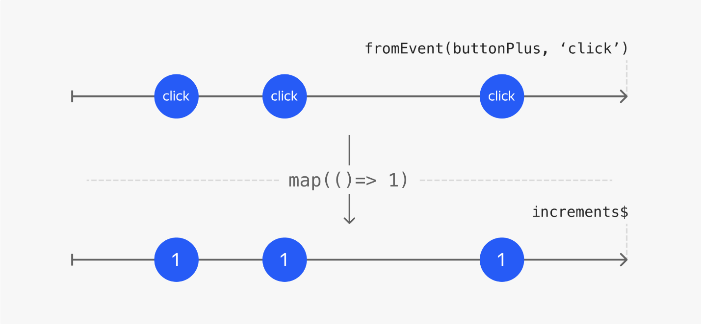{width="6.496527777777778in"
height="3.0083333333333333in"}

Операторы применяются к потоку по очереди, с помощью метода pipe.

Потоки decrements\$ и increments\$ далее будут обрабатываться одинаково,
поэтому можно их объединить. Поможет в этом функция
[merge](https://rxjs.dev/api/index/function/merge):


```TYPESCRIPT

import { merge } from "rxjs";

/* Объединяем потоки инкремента и декремента */

merge(decrements$, increments$);
```

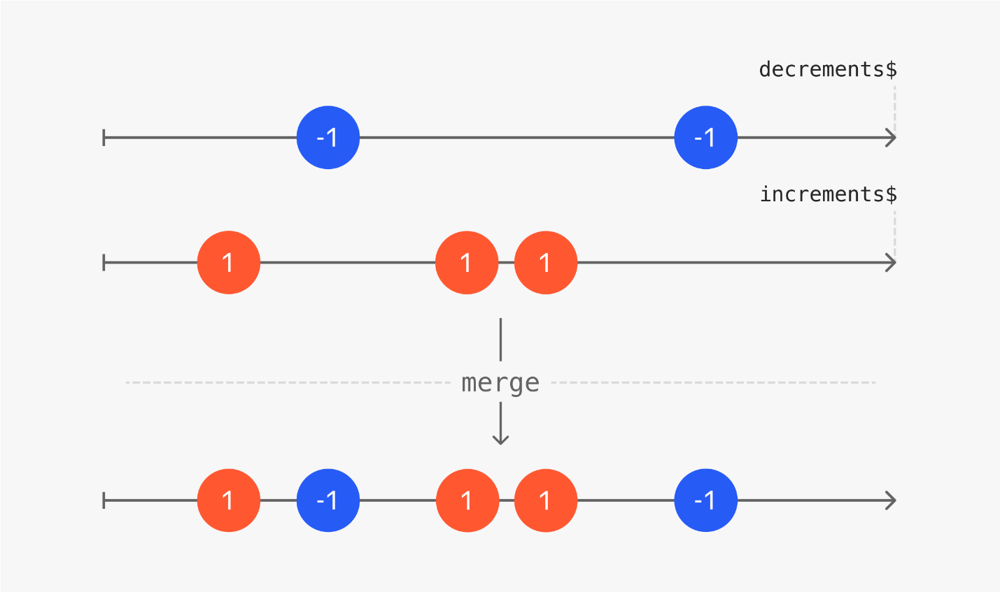{width="6.496527777777778in" height="3.85in"}

Обратите внимание, что создался новый, объединённый поток, а исходные
потоки при этом не изменились. Это концепция иммутабельности, она
спасает от ошибок, связанных с неочевидными и нежелательными
изменениями.

Вернёмся к потокам инкремента и декремента. Их элементы, а это
потенциально 1 и -1, нужно объединить с последним значением уровня
громкости из потока value\$. В этом помогут операторы
[withLatestFrom](https://rxjs.dev/api/index/function/withLatestFrom)
и уже известный вам map:


```TYPESCRIPT
import { merge, withLatestFrom, map } from "rxjs";

merge(decrements$, increments$).pipe(

/* Присоединяем к каждому элементу последнее значение громкости */

withLatestFrom(value$),

/* Складываем предыдущее значение и инкремент */

map(([increment, previous]) => previous + increment)

);
```

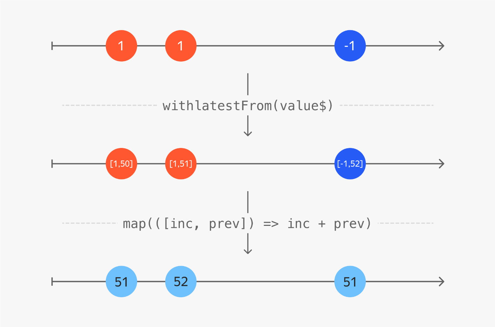{width="6.496527777777778in"
height="4.288888888888889in"}

Теперь у вас есть поток, состоящий из новых значений уровня громкости.
Поток byInput\$, состоящий из значений поля ввода после его изменения,
имеет такую же суть. Добавим его элементы к текущему потоку! Эта работа
для оператора
[mergeWith](https://rxjs.dev/api/index/function/mergeWith):

```TYPESCRIPT

import { merge, withLatestFrom, map, mergeWith } from "rxjs";

merge(decrements$, increments$).pipe(

withLatestFrom(value$),

map(([increment, previous]) => previous + increment),

/* Объединяем с потоком значений поля ввода */

mergeWith(byInput$)

);
```

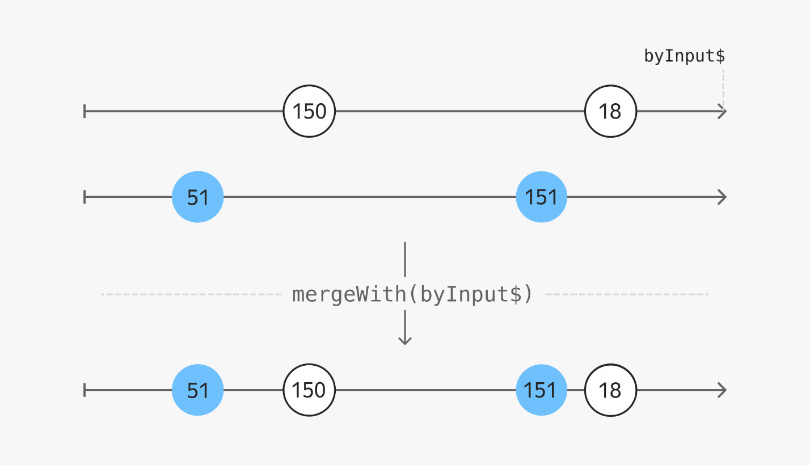{width="6.496527777777778in"
height="3.7284722222222224in"}

Есть один небольшой нюанс: уровень громкости от 0 до 100, а в инпут
можно ввести всё что угодно! Да и увеличивать значение кнопкой тоже
можно до бесконечности. Преобразуем итоговые значения потока так, чтобы
они укладывались в диапазон:


```TYPESCRIPT

import { merge, withLatestFrom, map, mergeWith } from "rxjs";

merge(decrements$, increments$).pipe(

withLatestFrom(value$),

map(([increment, previous]) => previous + increment),

mergeWith(byInput$),

/* Корректируем результат, чтобы он не выходил за пределы допустимого интервала */

map(inRange(0, 100))

);
```

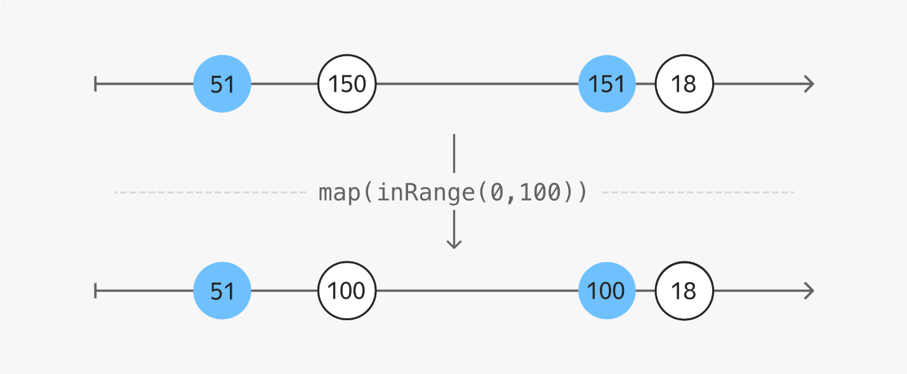{width="6.496527777777778in"
height="2.685416666666667in"}

Теперь у вас есть поток с новыми, корректными значениями уровня
громкости после обработки пользовательских событий. Каждое такое
значение нужно добавить в наш основной поток value\$. Сделаем это с
помощью подписки:

```TYPESCRIPT

import { merge, withLatestFrom, map, mergeWith } from "rxjs";

merge(decrements$, increments$).pipe(

withLatestFrom(value$),

map(([increment, previous]) => previous + increment),

mergeWith(byInput$),

map(inRange(0, 100))

/* Помещаем каждое новое значение в поток значений уровня громкости */

).subscribe(result => value$.next(result));
```

После этого сработает подписка на поток value\$, которую мы писали в
самом начале, и значение в поле ввода и progress-bar обновится.

Вот и всё, регулятор громкости готов. Не забудьте запустить и проверить
его в тренажёре после урока!

Вот так работает реактивное программирование на RxJS. Если какие-то
нюансы остались непонятны --- загляните [в
документацию](https://rxjs.dev/) и рассмотрите другие
примеры.

**Заключение**

Поначалу реактивное программирование с асинхронными потоками данных
кажется очень непонятным и сложным. Если у вас возникло такое чувство
--- не переживайте. На данном этапе главное запомнить, что реактивность
--- это инициализация обработки данных источником данных, которая
реализуется с помощью подписок. Можно использовать паттерн Observer или
асинхронные потоки, если хватит смелости!

Реактивное программирование хорошо подходит для веб-приложений, которые
обрабатывают большое количество разных событий в интерфейсе, а также для
мобильной разработки. Также реактивность помогает уйти от императивного
кода в сторону более декларативного и понизить связанность приложения.

Некоторые фреймворки используют внутри реактивный подход. Поговорим об
этом в следующем уроке.

______

**Практика1**

[project1-1.zip](project1-1)

В этом задании ничего делать не нужно! Просто посмотрите на код проекта,
попробуйте что-нибудь поменять по желанию:

-   сделайте, чтобы кнопки добавляли не по 1%, а по 5% громкости.

-   добавьте кнопку отключения звука.

_________

**Фреймворки**

Сегодня трудно найти веб-приложение, написанное на чистом JS. В основном
разработчики используют вспомогательные библиотеки и фреймворки. Ничего
плохого в ванильном JS нет, но есть нюансы, которые нужно учитывать:

**Чистый JS --- это свобода, а свобода --- это большая
ответственность.** Гораздо тяжелее придумывать архитектуру приложения с
нуля, легко где-нибудь ошибиться. Это вы точно прочувствовали в
проектной работе предыдущего спринта. Но не думайте, что всё было
напрасно, --- теперь вы знаете, как это всё устроено изнутри, а это
ценно. Фреймворки же сразу навязывают свою, заранее продуманную
архитектуру --- они направляют ваш код в правильное русло.

**Зачастую нет необходимости тратить своё время на то, что уже и так
придумано.** Другие разработчики уже протоптали дорожку, и нет ничего
стыдного в том, чтобы идти по ней. Лучше потратить силы на создание
классного продукта или развитие уже существующих инструментов.

Если ваша задача не в написании приложения с уникальной архитектурой или
создание своего собственного фреймворка, то определённо есть смысл
посмотреть в сторону готового решения, а не изобретать велосипед.

{width="6.496527777777778in"
height="3.0458333333333334in"}

Фреймворки призваны упрощать жизнь: они содержат вспомогательный,
шаблонный код, который в противном случае пришлось бы писать руками. За
счёт этого у разработчика освобождается свободное время, которое он
может потратить для написания продуктового кода и развития самого
приложения.

В этом уроке вы узнаете, какими особенностями обладают современные
фреймворки и почему стоит их использовать.

**Компонентный подход**

Почти любую задачу тяжело решать «в лоб», всю сразу. Намного проще
разбить её на более мелкие и делать поэтапно. Так же и с интерфейсом:
нужно разбивать его на компоненты и реализовывать их постепенно.

Если держать всю вёрстку в одном файле, непременно можно столкнуться с
такими проблемами:

-   Часть кода повторяется, что не есть хорошо: нужно вносить правки
    сразу в несколько мест и ничего не упустить.

-   Тяжело ориентироваться в коде: всё свалено в одну кучу.

-   Сложно поддерживать, высок риск что-то сломать.

-   Сложно тестировать всё сразу.

А вот разбив интерфейс на компоненты, мы все эти проблемы исправим:

-   Компоненты можно переиспользовать сколько угодно раз, нет
    дублирования.

-   Если компоненты умело разложены по папкам, то сориентироваться на
    месте будет легко.

-   Отдельные компоненты легко править и улучшать.

-   Можно тестировать компоненты по отдельности --- работа ускоряется.

Компонентный подход очень важен в современной разработке, и хороший
фреймворк должен этому способствовать.

**Реактивные фреймворки**

Императивность хороша на низком уровне, для отдельных инструкций.
Например, для обработчиков событий или в функциях, обрабатывающих
данные: они должны быть чёткими и понятными. Но если использовать
императивную парадигму для описания архитектуры приложения, то ничего
хорошего из этого не выйдет.

При императивном подходе в JavaScript придётся описать не только логику
самой задачи, но и её выполнение пошагово:

-   Работать напрямую с DOM-элементами, искать их через селекторы и
    всегда убеждаться, что они существуют на странице.

-   Добавлять и удалять обработчики событий.

-   При изменении данных вручную менять DOM‑элементы.

Всё это превращается в весьма трудную задачу, но даже если вы с ней
справитесь --- код будет далёк от идеала. Нарушается принцип
единственной ответственности, код становится сильно связанным,
монолитным и трудно поддерживаемым.

Как писать декларативно?

Тут пригодится то, что вы так тщательно изучали в прошлом уроке, ---
реактивность.

Реактивность --- это концепция, которая выводит фреймворк на новый
уровень. Идея в том, чтобы декларативно описать компоненты и определить,
от каких данных они зависят, а затем сосредоточиться на описании логики
и менять только состояние приложения.

Не нужно описывать, как перерисовать интерфейс. Вместо этого мы просто
указываем, что должно быть на странице, учитывая входные данные. При
изменении данных зависимые от них части интерфейса обновятся
автоматически.

Реализуется это с помощью механизма подписок, но реализовывать их самому
--- задача утомительная. Реактивные фреймворки умеют это делать из
коробки!


Где же эти чудо-фреймворки?

Везде, и их много --- нужно ещё повыбирать.

**Какой фреймворк выбрать**

Нет идеального фреймворка на все случаи жизни. На любом из популярных
фреймворков можно создать веб-приложение любой сложности --- на то они и
популярны. Каждый из фреймворков в чём-то хорош:

-   **Angular** большой и мощный, имеет решения на все случаи жизни
    прямо из коробки. **React** и **Vue** проще, но весят меньше и
    довольно гибкие: их можно использовать в тандеме с другими крутыми
    библиотеками.

-   **React** отличается большим сообществом разработчиков, а **Svelte**
    и **Marko** имеют уникальную концепцию, которая решает конкретный
    круг задач.

-   Многие привлекают удобным синтаксисом, а **Vue** быстрее остальных.

Какой фреймворк использовать --- зависит только от ваших предпочтений и
задач. Или от проекта, в который вы пришли работать =)

В следующих уроках мы обзорно посмотрим на несколько фреймворков,
популярных на текущий момент времени.

**React**

React появился в 2013 году. За это время он приобрёл большую
популярность, сейчас его используют в Netflix, Airbnb, Dropbox,
WhatsApp, PayPal, Yahoo, Codecademy, The New York Times. Из
отечественных компаний React используют Яндекс, Альфа-Банк, ВТБ,
Мегафон, СберБанк, МТС, Авито, S7 и многие другие.

{width="6.496527777777778in"
height="3.209722222222222in"}

React имеет большое сообщество разработчиков, хорошо поддерживается и
регулярно обновляется.

Мы уделим React больше внимания и подробно его изучим, потому что он
наиболее популярен среди конкурентов, а значит:

-   Больше приложений написано на React.

-   При выборе фреймворка для нового приложения скорее выберут React.

**Фреймворк?**

На самом деле React --- не полноценный фреймворк. Его ядро содержит
только основные функции, отвечающие за работу с DOM и компонентами. Из
коробки в нём, к примеру, нет:

-   инструментов для роутинга,

-   ленивой подгрузки модулей,

-   глобального состояния приложения.

Однако за счёт этого фреймворк получается лёгким и гибким: недостающие
функциональности можно набрать сторонними библиотеками на любой вкус.

React даёт разработчикам больше свободы в выборе технологий, и за это
его очень любят! А ещё у React большое community. Какую проблему вы ни
решали бы, скорее всего, уже есть кто-то, кто придумал для неё своё
решение --- и его легко найти в интернете.

**Компоненты**

React --- реактивный фреймворк. Это позволяет декларативно описывать
компоненты, которые автоматически обновятся при изменении входных
данных.

Вёрстка компонента записывается с помощью специального синтаксиса ---
JSX. Он очень похож на HTML, но который мы пишем прямо в JavaScript:

```TYPESCRIPT

function SomeComponent() {

return (

<h1>Заголовок</h1>


<ul>

<li>Пункт 1</li>

<li>Пункт 2</li>

<li>Пункт 3</li>

</ul>

);

}
```

Да-да, JSX --- это расширение спецификации JavaScript, которое было
изначально сделано исключительно для React, а затем его подхватили и
другие фреймворки, например Vue. Этот синтаксис лёгок для восприятия: не
нужно учить ничего принципиально нового.

Поначалу в React были только классовые компоненты. В таких классах есть
метод render, который возвращает JSX разметку, а также:

-   другие, вспомогательные методы,

-   обработчики событий,

-   методы жизненного цикла компонента.

Однако такие компоненты на практике очень быстро разрастались, их стало
тяжело тестировать, и они уже не соответствовали принципу единственной
ответственности. Поэтому со временем в React появились функциональные
компоненты.

В функциональном компоненте из классового осталась, по сути, только
render-функция, а работа с состоянием и сайд-эффектами переехала в хуки,
о которых вы подробно узнаете в следующих темах.

Теперь главная ответственность компонента --- это отображение
DOM-элементов, а всю тяжёлую логику обработки данных нужно выносить
отдельно. И это прекрасно!

**Одностороннее связывание**

У каждого компонента в React есть состояние и свойства.

Свойства, также называемые props, --- это данные, которые передаются
компоненту извне и не могут быть изменены им изнутри.

Состояние --- это данные, которые меняются по ходу работы приложений.
Работа с этим состоянием происходит в одностороннем формате.

 

И что это значит?

React создаёт объект state для хранения данных. Эти данные можно
использовать, но нельзя менять напрямую объект state:

```TYPESCRIPT

// Так нельзя

state.counter = 15;
```

Для изменения этих данных React предоставляет специальную функцию
setState:

```TYPESCRIPT

// Так можно

setState({ counter: 15 });
```

Такой подход может показаться неудобным поначалу, но со временем
привыкаешь и ощущаешь его преимущества.

Разработчик может выяснить, что привело к изменению тех или иных данных.
Есть гарантия, что данные не могут быть изменены никак иначе в обход
функции setState. Это даёт больше контроля над состоянием приложения и
повышает его надёжность.

**Виртуальный DOM**

Работа с DOM-деревом отнимает достаточно много времени. Для решения этой
проблемы React первым стал использовать концепцию виртуального DOM.

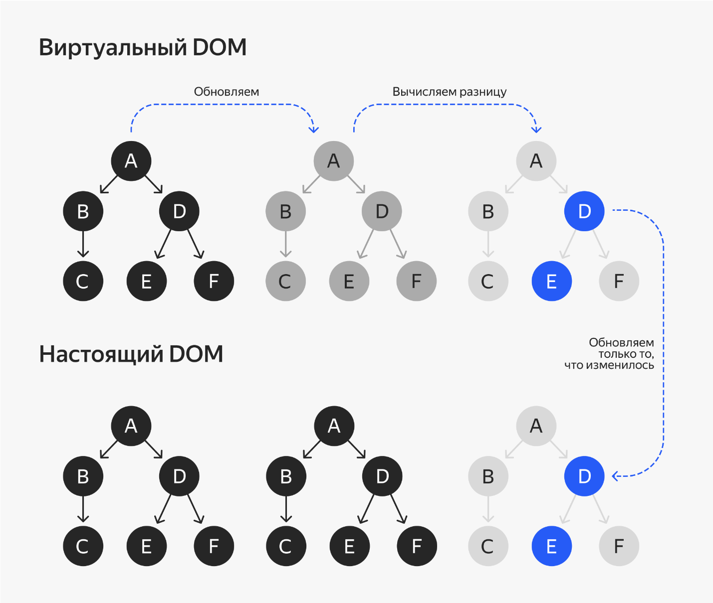{width="6.496527777777778in"
height="5.500694444444444in"}

Это специальный объект, который хранит информацию обо всех узлах DOM.
React сравнивает его с настоящим и перерисовывает только ту часть
страницы, которая изменилась. Это позволяет приложению не тратить время
на лишние перерисовки интерфейса.

**SSR**

В предыдущих уроках мы говорили о том, как рендер на сервере помогает
оптимизировать приложение для поисковиков:

-   Сервер рендерит компоненты в html-строку.

-   Клиент парсит эту строку с помощью метода hydrate и восстанавливает
    виртуальное дерево.

В React эта возможность поддерживается из коробки --- не нужно искать
или придумывать дополнительные решения.

**Вывод**

React --- быстрый и гибкий фреймворк. Он имеет большое сообщество
разработчиков, обладает приятным синтаксисом и не сложен для изучения.
Наверное, именно поэтому React и пользуется такой популярностью.

Вы уже знакомы с JavaScript и HTML, и начать писать на React вам будет
не сложно. Конечно, чтобы делать это правильно и красиво, понадобится
время, но приступить к работе можно безо всяких проблем.

**Angular**

Фреймворк Angular был создан в 2016 году компанией Google. Он пришёл на
смену AngularJS --- старой версии фреймворка --- ещё из 2009. Angular
используется при разработке таких крупных веб-приложений, как Snapchat,
Amazon, Gmail, Udemy и Forbes. Из отечественных продуктов: М.Видео,
Yota, Kion и Skyeng.

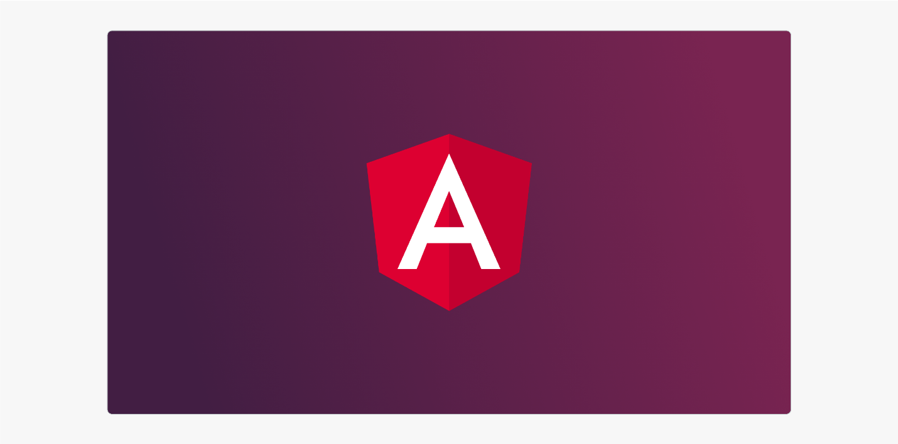{width="6.496527777777778in"
height="3.21875in"}

**Всё включено**

React --- это библиотека: она предоставляет только базовые функции и
даёт разработчику свободу в выборе дополнительных библиотек. Angular же
--- это полноценный фреймворк. Он, наоборот, идёт ва-банк: в нём
содержится сразу всё необходимое для создания почти любого
веб-приложения.

Надобность в установке дополнительных библиотек зачастую отпадает
совсем. Мы теряем гибкость, которая есть в React, но так ли это плохо?

Большая свобода --- большая ответственность. В React начинающему проще
допустить ошибку, а вот Angular специально ограничивает разработчика и
тем самым не даёт ему сбиться с верного пути.

Ещё есть приятный бонус: изучив одно приложение на Angular, вы безо
всяких проблем разберётесь и с остальными. В то время как каждое
приложение на React сильно отличается от прочих.

**Всё очень специфично**

Если вы решили изучить Angular, то приготовьтесь, что поначалу вам будет
нелегко:

-   В Angular непростой и немного громоздкий синтаксис и много
    специфичных особенностей, например директивы.

-   Приходится писать шаблонный код, которого так много, что для его
    генерации существует отдельный инструмент --- Angular CLI.

-   Иногда кажется, что используется не TypeScript и HTML, а какой-то
    отдельный язык под названием Angular:

```HTML

<button type="button" (click)="share()">Share</button>

<app-product-alerts

[product]="product"

(notify)="onNotify()"

>

</app-product-alerts>
```
Для сравнения, начать проект на React сильно проще: код пишется на уже
знакомом TypeScript, используется JSX, который очень напоминает HTML.

Angular трудно назвать простым фреймворком. Но его достаточно выучить
один раз, чтобы потом писать как по накатанной.

**Реактивность**

Angular --- реактивный фреймворк. Это значит, что под капотом он
использует наблюдаемые объекты и подписки. При обновлении данных
зависимые от них компоненты автоматически обновляются. И это здорово!

**Двусторонняя привязка данных**

В React нельзя изменить состояние напрямую --- нужно писать что-то вроде
    
    setState(newData).

В Angular дело обстоит несколько иначе --- состояние можно менять
напрямую. При этом реактивность будет по-прежнему работать: зависимые
компоненты интерфейса обновятся.

Поначалу кажется, что это удобно --- можно писать меньше кода. Однако
двустороннее связывание данных сильно усложняет отладку: тяжело
уследить, по какой причине поменялись данные в состоянии приложения.

**Инкапсуляция сборки**

Если в React сборка настраивается вручную, то Angular сделает это за
вас. Он использует Webpack под капотом. Вы настраиваете только само
приложение в файле angular.json, а Angular уже сам, в зависимости от
этих настроек, конфигурирует сборку.

Это, опять же, даёт меньшую гибкость, но очень упрощает процесс
обновления на новую версию фреймворка --- всё делается одной командой.

**Классовые компоненты**

Angular --- фреймворк, который использует всю мощь ООП и TypeScript.
Каждый компонент --- это класс. Код, конечно же, становится сложнее, но
это открывает двери для внедрения зависимостей и использования
декораторов.

В результате компоненты становится легче тестировать: легко подставить в
класс данные, необходимые специально для теста, или подменить реализацию
используемых внутри классов.

**Новый компилятор**

Angular был тяжёлым и медленным, однако не так давно он обзавёлся новым
компилятором lvy, который заметно его ускорил.

Использует механизм tree-shaking, который позволяет не включать
неиспользуемый код в итоговый бандл и таким образом уменьшать его
размер.

Также новый компилятор собирает каждый файл отдельно, что позволяет
быстрее компилировать проект повторно --- собирать заново только то, что
изменилось.

В итоге вы получаете бандл меньшего размера, более простой код на выходе
и быструю повторную компиляцию проекта.

**Вывод**

Angular --- большой и сложный фреймворк, и, чтобы его изучить, вам
понадобится время. Однако потом вы сможете открыть любой проект на
Angular и с лёгкостью разобраться в нём.

Практически всё, что вам понадобится для разработки веб-приложения, есть
в Angular прямо «из коробки». Он использует классы и декораторы,
помогает реализовать внедрение зависимостей и легко тестировать
компоненты.

В Angular используется двусторонняя привязка данных, что позволяет
писать меньше кода, но усложняет дебаг приложения.

**Vue**

Vue был создан разработчиком Эваном Ю в 2014 году. В прошлом Эван
работал в Google, где успел попробовать Backbone.js и Angular. Затем ему
пришла идея создать свой фреймворк как альтернативу Angular и React,
используя их сильные стороны. Изначально Vue был пэт-проектом, а затем
превратился в конкурентоспособную машину, которая догнала Angular и
продолжает набирать обороты!

{width="6.496527777777778in"
height="3.227777777777778in"}

Vue в качестве основного фреймворка для разработки используют Alibaba,
GitLab, Upwork, Nintendo, Sony, Zoom, Grammarly, 9GAG. Из отечественных
компаний --- Ozon и Спортмастер.

**Лёгкий, прогрессивный, адаптируемый**

Vue взял лучшее из React --- это прогрессивный фреймворк, и его ядро
решает только задачи создания компонентов и отображения интерфейса, что
позволяет ему быть очень лёгким.

Также открывается свободный выбор инструментов и библиотек, если нужна
дополнительная функциональность. Есть стандартные библиотеки, которые
помогут реализовать остальную функциональность:

-   [Vue Router](https://router.vuejs.org/) --- для
    настройки роутинга и построения SPA.

-   [Vuex](https://vuex.vuejs.org/) или Pinia
    --- для управления состоянием приложения.

-   [Nuxt](https://nuxtjs.org/) --- для организации
    серверного рендеринга.

-   [Vue CLI](https://cli.vuejs.org/) --- для решения
    рутинных задач и генерации шаблонного кода.

Эти библиотеки формируют целую экосистему и интегрируются с Vue как
нельзя лучше. Однако по желанию можно выбрать любые другие.

Также Vue очень адаптируемый --- его легко внедрять в любые проекты. Это
можно делать постепенно: сначала сверстать компоненты, а затем
постепенно добавлять дополнительные библиотеки.

**Директивы**

Vue использует для шаблонизации синтаксис HTML --- это его особенность.
Шаблон, стили и JavaScript можно писать в одном файле с расширением
.vue:

```HTML

<template>

<!-- HTML-разметка и отображение данных -->

</template>

<script>

// Логика компонета

</script>

<style scoped>

/* Стили. Аттрибут scoped изолирует стили в рамках конкретного компонента */

</style>
```

Но можно и разнести по разным файлам --- на усмотрение разработчика.

Также Vue добавляет одну очень интересную возможность, которая
называется директивами. Выглядят они как атрибуты HTML, только
начинаются с префикса v-. Директивы помогают более гибко, декларативно и
изящно настраивать поведение DOM-элементам. А чем быстрее пишешь --- тем
быстрее сдаёшь готовый проект.

Например, есть директива v-bind, позволяющая связать данные и
отображение:

```HTML

<!-- Привязка данных к атрибуту -->


```

Так работает реактивность: при изменении данных значение атрибута
пересчитается.

Есть вспомогательные директивы, которые позволяют отображать элементы по
условию, организовать цикл:

```HTML

<ul v-show="showTodos">

<li v-for="todo in todos">

{{ todo.text }}

</li>

</ul>
```

Также директивы позволяют более гибко настроить обработку действий
пользователя:

 

```TYPESCRIPT

<input type="text" v-on:keyup.enter="sumbitForm"/>
```

**Двусторонняя привязка**

Состояние компонента Vue реализуется объектом, содержимое которого можно
свободно менять. Vue, как реактивный фреймворк, отслеживает эти
изменения и обновляет компоненты по необходимости.

В React чтобы настроить работу элементов ввода, мы должны указать две
вещи: данные, и функцию-обработчик. Вот как это выглядит:

```TYPESCRIPT

<input value={this.state.todo} onChange={this.handleInput} />
```

Vue же использует двустороннюю привязку данных: у него есть специальная
директива v-model, которая связывает элемент формы и данные в состоянии:


```TYPESCRIPT

<input v-model="todo" />
```

Теперь изменение состояния повлечет за собой обновление данных в поле
ввода, и наоборот: изменение поля ввода обновит данные состояния.

**Общение с родительским компонентом**

В React компонент получает все необходимые ему обработчики с помощью
свойств и вызывает их по мере необходимости. Во Vue же дочерний
компонент должен вызывать события, а родительский --- определить, как он
будет на них реагировать. Вот простой тому пример:

```TYPESCRIPT

// Родителький компонент

function onDeleteItem() {

...

}

// Добавляем обработчик события в шаблоне:

// <item @delete="onDeleteItem" />

// Где-нибудь в дочернем элементе:

this.$emit('delete')
```

**Вывод**

Vue получился отличным фреймворком. В нём есть лучшие черты других
фреймворков:

-   Из React: прогрессивность и виртуальный DOM. Это делает Vue лёгким,
    адаптируемым и быстрым.

-   Из Angular: двусторонняя привязка данных и директивы. Это упрощает
    работу с интерактивными компонентами на странице и привносит
    синтаксический сахар во Vue.

Также хочется отметить, что у Vue отличная
[документация](https://v3.ru.vuejs.org/ru/guide/introduction.html#%D1%87%D1%82%D0%BE-%D1%82%D0%B0%D0%BA%D0%BE%D0%B5-vue-js),
которая позволяет ограничиться только ей в большинстве случаев. Это
отличная новость для тех, кто решил попробовать этот фреймворк впервые!

Если сравнивать Vue с React, то он более строг и декларативен. Директивы
помогают решать частые задачи, которые в React пишутся руками. Также
описание самих компонентов предполагает чёткое разделение отображения,
от стилей и логики. Эти моменты добавляет Vue немного больше
декларативности и ставит определённые рамки.

Таким образом, новичкам будет проще не совершить ошибку и писать
читаемый код --- их как бы сразу направляют на правильный путь.

**Заключение**

Давайте кратко повторим то, что вы узнали из этой темы, --- тем более
информации было много, и вся разная.

**SPA**

В этой теме вы узнали про SPA. Это такие веб-приложения, где
формированием HTML-разметки занимается JavaScript, что позволяет не
обновлять вкладку при переходе от страницы к странице.

SPA отличаются скоростью, плавностью перехода и отзывчивостью
интерфейса. Чтобы не было потенциальных проблем с SEO-оптимизацией,
рекомендуется выполнять первый рендер на сервере (SSR).

Одностраничные приложения хорошо подходят для сложных веб-приложений,
где много интерактивных элементов и много взаимодействия с
пользователем. Однако, если вы делаете сайт, где пользователь в основном
будет читать информацию, или же приложение должно работать без поддержки
JavaScript, то остановите свой выбор на традиционном MPA.

Чтобы построить хороший SPA, лучше воспользоваться одним из готовых
фреймворков, потому что вы из коробки получите:

-   Компонентный подход. Будет возможность удобно, декларативно
    создавать переиспользуемые компоненты, а из них собрать готовый
    интерфейс.

-   Реактивное обновление. При изменении входных данных все зависимые от
    них компоненты автоматически обновятся.

-   Готовые инструменты для роутинга и управления состоянием приложения.

**Фреймворки**

Самый популярный реактивный фреймворк, а точнее библиотека ---
**React**. Он:

-   Быстрый за счёт использования виртуального DOM.

-   Гибкий: ядро библиотеки содержит только ту функциональность, которая
    помогает описать компоненты. Для роутинга, управления состоянием и
    других полезных штук можно выбрать любые дополнительные библиотеки.

-   Имеет большое сообщество разработчиков, которые, скорее всего,
    решили все возможные задачи на React и могут подсказать вам при
    необходимости.

-   Обладает понятным синтаксисом: компоненты на React пишутся с помощью
    JavaScript или TypeScript, а также HTML-подобного JSX --- не
    приходится изучать что-то принципиально новое.

-   Использует одностороннюю привязку данных. Объект состояния нельзя
    менять напрямую --- только специальной функцией. Поначалу это
    кажется усложнением жизни и занудством, однако такой подход
    обеспечивает надёжность и упрощает отладку. В больших приложениях
    это играет свою роль.

Гибкость React может сыграть злую шутку с новичками, помните: большая
свобода --- большая ответственность!

**Angular** --- настоящий гигант:

-   Содержит сразу всё, что может понадобиться для разработки
    веб-приложения: роутинг, менеджер состояния, SSR и так далее.

-   Имеет специфичный синтаксис, навязывает свою архитектуру приложения,
    поэтому все приложения на Angular похожи друг на друга.

-   Активно использует ООП, декораторы и внедрение зависимостей.
    Привязка данных двусторонняя. Содержит много шаблонного кода, для
    его генерации используется специальный инструмент.

-   Всё это делает Angular не самым простым фреймворком для новичков.
    Нужно один раз сесть и хорошенько выучить --- набить руку. Дальше
    дело пойдёт как по маслу.

Не менее популярным сегодня является **Vue**:

-   Он взял лучшее от обоих предыдущих: виртуальный DOM от React,
    двустороннее связывание и синтаксический сахар в виде директив от
    Angular.

-   Это делает его быстрым, лёгким, прогрессивным и адаптируемым
    фреймворком. Поэтому он и набирает популярность так стремительно. У
    Vue отличная документация.

-   Он, возможно, чуть лучше подходит для новичков, чем React, потому
    что заранее направляет разработчика на правильную архитектуру.

-   Однако он чуть хуже типизирован, чем React, и менее гибкий.

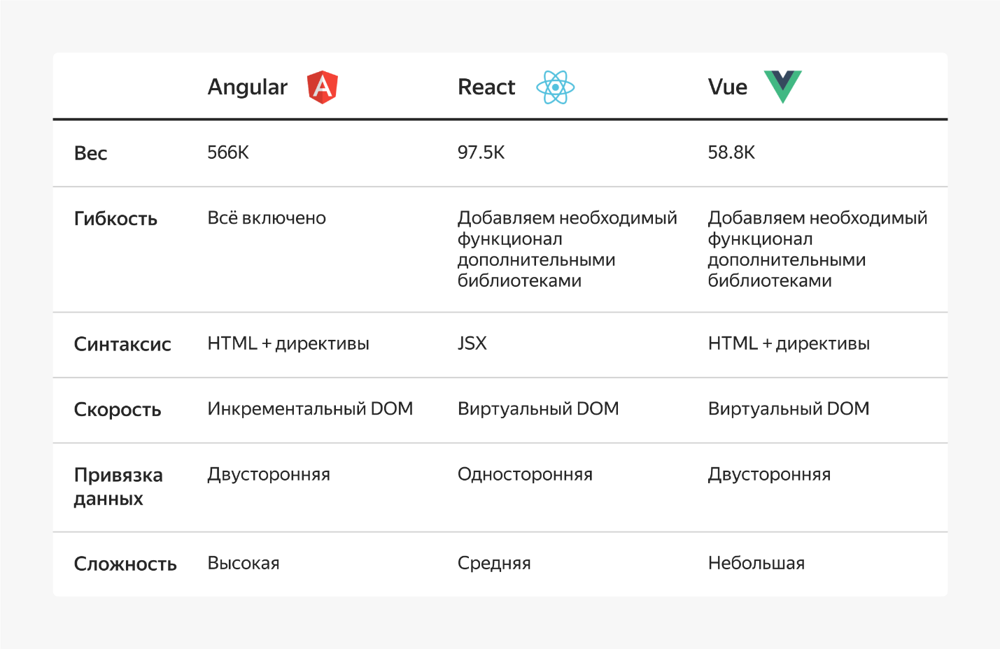{width="6.496527777777778in"
height="4.218055555555556in"}

**И ещё несколько слов**

Давайте кратко коснёмся других фреймворков, о которых хорошо знать для
расширения кругозора. На собеседовании о них, скорее всего, не спросят,
но важно, чтобы они были для вас на слуху. Это формирует ту самую
насмотренность, о которой мы часто упоминаем. Вот эти фреймворки:

-   **Preact.** Выглядит так же, как и React, но имеет другую реализацию
    внутри. Из него убрали то, что используется реже, и вынесли это в
    отдельный пакет
    [preact-compat](https://www.npmjs.com/package/preact-compat).

-   **Svelte.** По сути, не фреймворк, а компилятор. Компилирует весь
    свой код в ванильный JavaScript, что позволяет не тащить за собой
    код фреймворка. Всё, что приезжает в браузер, --- это код вашего
    приложения, и больше ничего.

-   **Marko.** Умеет очень быстро рендерить код на сервере: он не строит
    DOM-дерево для последующей сериализации в HTML-строку, а сразу
    формирует её с помощью потока вывода.

У каждого из фреймворков есть свои сильные и слабые стороны ---
выбирайте тот, который больше подходит для решения той или иной задачи.
А мы более подробно остановимся на React как на наиболее
распространённом варианте.

[Далее](Спринт11-2.md).