**Сравнение и обзор вариантов сборки**

Вы уже познакомились со сборщиком Webpack и даже настроили его для проекта Mesto. Если что-то подзабылось, предлагаем освежить теорию, а также узнать про новые программы-сборщики — о них и расскажем в этой теме.

**Что такое сборка**

Сборка кода — превращение отдельных файлов в один. Все файлы на JS преобразуют в единый JS-файл, а файлы на CSS — в единый CSS-файл. Полученные файлы подключают в HTML. При этом код преобразуется:

  - JavaScript-код, написанный по новой спецификации, переделывается в такой же, но написанный по старой. Это позволяет пользоваться всеми современными инструментами языка и не беспокоиться о поддержке сайта старыми браузерами.

  - JavaScript и CSS минифицируются. Это значит, что внутри файла удаляются все пробелы, переносы строк и комментарии: браузеру они не нужны, а файл с кодом становится короче и оттого — легче. Более лёгкий файл быстрее загрузится.

  - Вендорные префиксы тоже проставляются автоматически. Так что за поддержку CSS-кода старыми браузерами тоже можно не волноваться.

Сборку выполняют специальные программы-сборщики. Их несколько, например, CRA, Vite и Webpack.

**Зачем использовать сборщики**

Давайте рассмотрим пример, не связанный с разработкой. Представьте, что у вас много фотографий разного размера, формата и качества и вы хотите создать альбом с оптимизированными изображениями для онлайн-галереи.

Сборщик в данном случае будет вашим инструментом для обработки этих изображений, он:

  - сожмёт их;

  - выровняет размеры;

  - добавит эффекты;

  - создаст галерею с оптимизированными фотографиями, что ускорит их загрузку и сделает альбом более привлекательным для просмотра.

В разработке тоже нужна оптимизация загружаемых ресурсов. Допустим, у вас есть большой проект со множеством страниц. Каждая страница имеет свои стили, скрипты, изображения и другие ресурсы. Если каждая страница загружает все ресурсы отдельно — это может замедлить загрузку сайта из-за большого количества запросов к серверу.

Сборщики, например, Webpack или CRA, помогут собрать все эти ресурсы в оптимизированные файлы. Они объединят все стили в один файл, а также оптимизируют и сожмут скрипты и изображения. Когда пользователь зайдёт в приложение, браузеру нужно будет выполнить меньше запросов к серверу, что ускорит загрузку страниц и улучшит пользовательский опыт.


    Что представляет собой сборка кода в разработке? выберите только один


- Процесс объединения различных файлов в один, при котором происходит оптимизация кода.


- Процесс написания нового кода на JavaScript.

- Процесс добавления вендорных префиксов в CSS.

- Процесс объединения различных файлов в один, без оптимизации кода.


Теперь давайте посмотрим, какие бывают сборщики кода.

**Webpack**

[<span class="underline">Webpack</span>](https://webpack.js.org/) — это сборщик статических модулей для современных приложений JavaScript. Webpack, анализируя код, может заранее определить, какие модули будут импортированы, и включить их в сборку. Это обеспечивает лучшую производительность и оптимизацию приложения.

Когда Webpack обрабатывает приложение, он строит граф модулей, исходя из одной или нескольких точек входа — entry points. Подробнее об этом поговорим в уроках, посвящённых Webpack.

Затем Webpack объединяет каждый модуль, необходимый вашему проекту, в один или несколько файлов — бандлов.

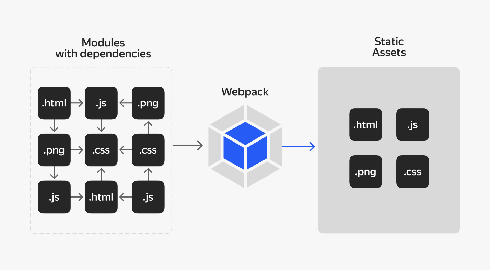

Граф модулей показывает, какие модули зависят от других и какие зависимости нужно подключить к сборке.

Webpack использует этот граф модулей для оптимизации сборки, управления зависимостями и разрешения конфликтов. Например, Webpack может определить, какие модули можно объединить в один файл (бандл) для уменьшения размера конечного бандла и ускорения загрузки приложения.

Граф модулей также позволяет Webpack проводить различные анализы и оптимизации:

  - удаление неиспользуемого кода ([<span class="underline">tree shaking</span>](https://webpack.js.org/guides/tree-shaking/)),

  - минимизация исходного кода,

  - распределение кода по разным файлам ([<span class="underline">code splitting</span>](https://webpack.js.org/guides/code-splitting/)) для лучшей оптимизации загрузки приложения.

**Преимущества**

**Полный контроль.** Можно настроить каждый аспект сборки под свои потребности.

**Оптимизация.** Можно оптимизировать сборку для улучшения производительности и размера конечного бандла. Это позволяет быстрее доставить необходимые файлы в браузер клиента, уменьшив время ожидания загрузки сайта.

**Плагины и интеграции.** Webpack имеет большое количество плагинов и интеграций, которые позволяют расширить его функциональность и упростить нам разработку проекта.

**Недостатки**

**Сложность настройки.** Требуется изучение документации Webpack и его конфигурации, что может быть сложным для новичков.

**Производительность.** В некоторых случаях использование Webpack может замедлить процесс сборки, особенно если у вас большое приложение или вы используете сложные плагины и конфигурации.

**Не подходит для небольших проектов.** Если у вас небольшой проект или прототип, использование Webpack может быть излишним и усложнять процесс разработки.

**Create React App**

Автомобильные производители обычно используют комплектующие, которые собирают заранее. Это экономит им много времени и денег. Так и в программировании: утилита Create React App помогает разработчикам писать код быстрее и эффективнее. Благодаря [<span class="underline">CRA</span>](https://create-react-app.dev/docs/getting-started/) можно создать проект на основе стандартного шаблона и не беспокоиться о детальной настройке.

**Преимущества**

  - Можно развернуть полноценный рабочий проект с помощью одной команды.

  - Проект уже содержит удобную файловую структуру, стандартную для большинства приложений на React.

  - В проект легко подключить статические ресурсы: изображения, шрифты и так далее.

  - Есть готовый механизм для тестирования компонентов. С ним вы познакомитесь позже.

  - Проект будет автоматически обновляться в браузере, если вносить изменения в режиме разработки.

  - Настроена оптимизация продакшн-сборки.

  - Можно использовать NPM, легко устанавливать пакеты.

**Недостатки**

**Ограниченный контроль.** Нельзя настраивать сборку до мельчайших деталей. Для более сложных потребностей это может быть ограничивающим фактором. Допустим, у вас есть потребность включить специфическую оптимизацию или использовать инструменты, которые не поддерживаются CRA из коробки. Например, вы хотите включить определённый Babel-плагин, настроить Webpack для работы с нестандартными типами файлов или использовать свой собственный линтер с определёнными правилами.

**Слабая поддержка.** Существуют проблемы, связанные с актуальностью npm-пакетов, установленных в качестве зависимостей к CRA. Команда [<span class="underline">facebook перестала временно поддерживать</span>](https://github.com/reactjs/react.dev/pull/5487#issuecomment-1409720741) данный продукт. В данный момент она ищет пути развития CRA, но точных сроков, когда она найдёт этот путь, нет.


    Какие плюсы есть у CRA? один верный 

 

- Не требуется настройка сборки и изучение документации для разворачивания простого приложения на React.


- Имеет гибкую конфигурацию и детальную настройку управления процессами сборки.

- CRA позиционирует себя как инструмент создания проекта из коробки, поэтому возможности по настройке сборки и управления её процессами очень сильно ограничены.

- Поддержка всех современных фреймворков и библиотек.


**Vite**

[<span class="underline">Vite</span>](https://vitejs.dev/) — сборщик веб-приложений и библиотек, который в небольших проектах не требует настройки. Он **«**из коробки**»** поддерживает быстрый сервер разработки, работу c CSS-модулями, TypeScript.

**Преимущества**

**Очень быстрая сборка.** Vite использует ES Module (ESM) в браузере для быстрой разработки. Каждый модуль может быть загружен по мере необходимости, без предварительной сборки всего кода, что сокращает время разработки. Это особенно полезно при работе с крупными приложениями, где сокращение времени сборки и перезагрузки приложения влияет на производительность разработки.

Вот как это выглядит на примере:

1.  Создадим новый файл компонента, например MyComponent.tsx.

2.  Теперь добавим этот компонент в наш основной файл приложения App.tsx.

3.  Когда вы вносите изменения в файле MyComponent.tsx, Vite автоматически обнаружит изменения и обновит ваше приложение в браузере без необходимости полной пересборки. Вы моментально увидите результаты своей работы.

Благодаря использованию ES Module в браузере и быстрому горячему перезапуску (Fast HMR), Vite позволяет мгновенно видеть изменения в реальном времени во время разработки, делая этот процесс быстрым и эффективным.

**Поддержка различных фреймворков и библиотек.** Vite поддерживает не только React, но и другие фреймворки, такие как Vue.js. Это позволяет разработчикам выбирать тот фреймворк, который им больше нравится или который лучше подходит для конкретного проекта.

**Простота конфигурации.** В отличие от некоторых других инструментов, Vite имеет минимальную конфигурацию по умолчанию. Это упрощает начало работы без необходимости тратить много времени на настройку.

**Недостатки Vite**

**Экспериментальность:** Поскольку Vite является относительно новым инструментом, некоторые функции могут быть экспериментальными или не столь широко поддерживаемыми, как у более старых инструментов сборки.

**Ограничения сборки:** Несмотря на то что Vite хорошо подходит для быстрой разработки, он может быть менее гибким для более сложных проектов, так как не имеет такой большой настройки, как Webpack.

Vite становится всё более популярным среди разработчиков благодаря своей скорости и простоте использования. Он предоставляет новый подход к разработке, основанный на современных возможностях браузеров, что делает его привлекательным выбором для быстрой разработки React-приложений.


    В чём заключается основное преимущество Vite перед другими сборщиками? только один правильный

- Работает только с устаревшими версиями фреймворков.

- Осуществляет сборку в один большой файл для каждого проекта.

- Требует установки большого количества дополнительных плагинов для работы.

 

- Предоставляет очень быструю сборку и поддержку популярных библиотек и фреймворков.


**Как выбрать подходящий инструмент**

Выбор инструмента сборки для проекта играет ключевую роль в эффективности разработки и производительности приложения.

Выше мы рассмотрели различные варианты, их плюсы и минусы. На данный момент Webpack — самый популярный и гибкий инструмент, а потому и самый универсальный. Наиболее подробно изучать мы будем именно его. Однако других сборщиков мы тоже коснёмся и, обладая навыками настройки Webpack, вы легко сможете их освоить, если возникнет такая потребность.

**Сборка проекта на Webpack. Часть 1**

Ранее вы уже работали с Webpack, но здесь начнём заново — развернём новый проект и установим Webpack.

Мы подготовили три урока-инструкции с подробными пояснениями. Некоторые блоки информации вам уже знакомы по спринту 5. Урок может показаться длинным, но не переживайте: шаги отсюда необязательно заучивать наизусть, их нужно просто пройти, чтобы запомнить и потом при необходимости легко повторить.

**Создаём проект и устанавливаем Webpack**

1.  Создайте папку для своего проекта. Назовите её webpack-react.

2.  Зайдите в эту папку в терминале и введите npm init --yes, чтобы создать package.json.

3.  Введите команду npm i webpack --save-dev.

**Разберём, что произошло**

Давайте ещё раз закрепим и более подробно разберём, что происходит при разворачивании проекта. Понимание значения каждой команды, которую мы вводим в командную строку, важно, так как мы часто работаем только с терминалом.

Команда npm init создала файл *package.json.* Все приложения начинаются с этого файла. В нём описано:

  - какие команды запускают наше приложение,

  - какие поставить зависимости в нашем приложении,

  - автор,

  - версии…

Команда для установки Webpack состоит из 4 частей:

  - npm — так начинаются все команды NPM. Терминал благодаря этому понимает, что команду нужно брать именно из этого пакетного менеджера.

  - i (сокращение от install, можно ввести и полное слово) — «установить». Мы будем пользоваться этой командой всякий раз при установке пакетов.

  - webpack — имя пакета, который мы хотим установить.

  - \--save-dev или -D — это флаг. Ниже разберём, для чего он нужен.

После установки в папке webpack-react появилась папка node\_modules и два файла: package.json и package-lock.json.

Напомним, что все пакеты можно разделить на два типа:

  - для финальной сборки — код будет загружаться к клиенту на компьютер;

  - для разработки — внутренний код проекта.

Чтобы разделить эти два типа пакетов, в файле package.json есть разделы: dependencies и devDependencies. Все пакеты из первого раздела попадают в финальную сборку, а из второго — нет.


```JSON

{

"name": "yandex.praktikum",

"version": "0.0.1",

"description": "Learning platform",

"main": "index.js",

"scripts": {

"test": "echo \"Error: no test specified\" && exit 1"

},

"author": "Stas Basov",

"license": "",

"dependencies": {

// здесь будут зависимости для сборки

},

"devDependencies": {

// а здесь зависимости для разработки

}

}
```
Терминалу нужно объяснить, в какой раздел package.json ему следует записать Webpack. Именно для этого и нужен флаг --save-dev или -D. С ним пакет будет добавлен в раздел devDependencies и в финальную сборку не попадёт.

 

Настроим Webpack

**React с Webpack**

Установим необходимые пакеты для работы Webpack с React и TypeScript.

1.  Введите команду npm i webpack-cli -D.

2.  Установите пакеты [<span class="underline">react</span>](https://www.npmjs.com/package/react) и [<span class="underline">react-dom</span>](https://www.npmjs.com/package/react-dom) в командной строке: с помощью команды npm install react react-dom.

3.  Если в вашем приложении используются библиотеки, которые не поддерживают типизацию по умолчанию, нужно установить набор типов для этой библиотеки. Как правило, это npm пакет @types/название-библиотеки. Для корректной работы нашего приложения необходимо установить набор типов для React @types/node @types/react @types/react-dom. Это можно сделать командой npm install -D @types/node @types/react @types/react-dom.

4.  Установите сам typescript и лоадер для работы ts-файлов в сборке. О настройке typescript и как подключить лоадер мы поговорим в следующих темах. Команда для установки такая: npm install -D typescript ts-loader.

Вы установили необходимые npm-пакеты и можете приступить к настройке сборки на Webpack.

**Базовый файл конфигурации Webpack**

Ранее вы уже создавали конфигурационный файл Webpack. Давайте вспомним, что такое точка входа в понимании Webpack, как указать путь до итогового бандла (сборки) и его название, для чего в Webpack нужны лоадеры (загрузчики) и плагины и как их использовать.

Настройка Webpack происходит в файле webpack.config.js:

1.  Создайте в проекте файл с названием webpack.config.js.

2.  Добавьте базовый конфиг, вот такой:


```JAVASCRIPT

const path = require('path');

// Импортируем пакет path

module.exports = {

entry: './path/to/my/entry/file.js',

output: {

path: path.resolve(__dirname, './dist'),

filename: 'bundle.js',

},

module: {

rules: [

{

test: /\.(js|jsx)$/,

exclude: /node_modules/,

use: [ ],

},

\],

},

resolve: {

extensions: \['\*', '.js', '.jsx'\],

},

devServer: {

static: path.resolve(\_\_dirname, './dist'), // путь, куда "смотрит" режим разработчика

compress: true, // это ускорит загрузку в режиме разработки

port: 8080, // порт, чтобы открывать сайт по адресу localhost:8080, но можно поменять порт

open: true, // сайт будет открываться сам при запуске npm run dev

hot: true,

},

};

//module.exports — это синтаксис экспорта в Node.js
```

Разберём составляющие конфигурационного файла

💡 Пытаться запустить конфигурационный файл в этом уроке не нужно, сейчас мы подробно разберём его составляющие, а уже в следующем уроке мы приступим к практике.

**Entry**

Entry point обозначает точку входа, откуда Webpack начнёт строить граф модулей. Этот граф модулей будет содержать в себе все другие модули и библиотеки, от которых зависит entry point.

По умолчанию точка входа — файл ./src/index.js. Но архитектура проекта может отличаться от той, что Webpack предполагает по умолчанию. И файл с точкой входа может называться по-другому и лежать в другом месте. В конфигурации Webpack можно указать любой другой путь:

 
```JAVASCRIPT

module.exports = {

entry: './path/to/my/entry/file.js',

};
```
Можно также указать несколько точек входа с помощью массива:


``` TYPESCRIPT

module.exports = {

entry: \['./src/file\_1.js', './src/file\_2.js'\]

};
```
Если у нас есть многостраничное приложение, то каждая страница может иметь свой собственный JavaScript-файл в качестве точки входа. Это позволяет оптимизировать загрузку ресурсов.

Также мы используем нескольких точек входа для создания независимых бандлов. Например, мы хотим иметь отдельные бандлы для основной логики приложения, библиотек, общих компонентов и т. д. Это уменьшает размер каждого бандла и улучшает кэширование ресурсов в браузере.

Также в Webpack можно использовать механизм [<span class="underline">code splitting</span>](https://webpack.js.org/guides/code-splitting/), разбивая приложение на более мелкие куски, которые загружаются по мере необходимости. Каждый из этих кусков может быть своей точкой входа.

Несколько точек входа также можно указать с помощью объекта, где ключами будут имена чанков — частей сборки. А значениями — пути к файлам.


```TYPESCRIPT

module.exports = {

entry: {

app: './src/app.js',

adminApp: './src/adminApp.js',

},

};
```
В случае указания entry в виде объекта каждое его значение можно описать не только в виде строки, но и в виде структуры EntryDescription**.** Для расширения кругозора вы можете прочитать про это [<span class="underline">в документации</span>](https://webpack.js.org/concepts/entry-points/#entrydescription-object).

**Output**

Свойство output указывает путь, по которому будут лежать получившиеся в результате сборки бандлы, а также названия этих бандлов. По умолчанию это путь ./dist/main.js для главного бандла. Если точек входа сборки было несколько, остальные бандлы будут лежать в папке ./dist.

Пример использования поля в файле-конфигурации:


```JAVASCRIPT

const path = require('path');

module.exports = {

entry: path.resolve(\_\_dirname, './src/index.js'),

output: {

path: path.resolve(\_\_dirname, './dist'), //путь и название директории, где расположится скомпилированный проект.

filename: 'bundle.js', //название бандла. Бандл — скомпилированный JavaScript.

},

};
```
**Module**

Это набор правил для работы с различными файлами проекта. Здесь мы говорим Webpack о том, как работать с кодом, стилями, изображениями, шрифтами:

  - rules — конкретное правило для определённых типов файлов. В конфигурации выше мы указываем все js- и jsx-файлы таким правилом: test: /\\.(js|jsx)$/.

  - resolve — способ работы с модулями. В нашем случае поле extensions отвечает за порядок обработки модулей.

**Loaders**

Изначально Webpack может работать только с файлами JavaScript и JSON. Лоадеры же позволяют предварительно обрабатывать файлы других расширений при их импорте.

Лоадеры позволяют:

  - Преобразовывать файлы из другого языка (например, TypeScript) в JavaScript.

  - Загружать встроенные изображения в виде URL-адресов данных.

  - Импортировать CSS-файлы прямо в JavaScript- или TypeScript-код\!

Для использования лоадера в файле конфигурации необходимо указать как минимум два поля:

1.  test — указывается, какой тип файлов должен обработать лоадер.

2.  use — указывается, какой лоадер нужно использовать для обработки типа файлов, указанного в поле test. Для одного типа файлов можно указать несколько лоадеров.

При обработке определённых типов файлов мы можем использовать как один лоадер, так и несколько.

Допустим, у нас есть проект на React и мы хотим использовать TypeScript для компиляции ts- и tsx-файлов. Для этого можно использовать загрузчик ts-loader.

Если используем только один лоадер, то можно просто указать его строкой в поле use:


```JAVASCRIPT

module.exports = {

entry: './src/index.tsx',

output: {

filename: 'main.js',

},

module: {

rules: [

{

test: /\.[tj]sx?$/,

use: 'ts-loader',

},

],

},

};
```

Если хотите использовать несколько лоадеров, то их нужно добавить в массив. В массиве лоадеры также могут быть указаны по-разному, например:

  - Если нам нужно компилировать scss-файлы — в этом поможет sass-loader.

  - Затем мы добавим преобразования с помощью postcss — этим займётся postcss-loader.

  - Далее научим Webpack обрабатывать css и как обрабатывать импорты css — этим занимается css-loader.

  - Последний style-loader берёт модули стилей, созданные **css-loader**, и добавляет их внутрь тега **\<style\>** в HTML-документе.

Вот как это может выглядеть:


```JAVASCRIPT

module.exports = {

output: {

filename: 'my-first-webpack.bundle.js',

},

module: {

rules: [

{

test: /\.(sa|sc|c)ss$/,

use: [

'style-loader',

{

loader: 'css-loader',

options: {

modules: {

mode: 'local',

localIdentName: '[name]__[local]__[hash:base64:5]',

auto: /\.module\.\w+$/i,

},

importLoaders: 2, //Значение 2 говорит о том, что некоторые трансформации PostCSS нужно применить до css-loader.

},

},

'postcss-loader',

{

loader: 'sass-loader',

options: {

sourceMap: true,

},

},

],

},

],

},

};
```

В старых версиях Webpack можно встретить другой способ указания лоадеров: вместо rules и use используются поля loaders.

Опции для лоадера указываются как GET-параметры в браузере — "css-loader?modules=true", а не в специальном поле options.


```JAVASCRIPT

module.exports = {

output: {

filename: 'my-first-webpack.bundle.js',

},

module: {

loaders: \[

{

test: /\\.css$/,

loaders: \[

"style-loader",

"css-loader?modules=true"

\]

}

\],

},

};
```

Ниже — ещё один вариант указания последовательности лоадеров из старых версий. Обратите внимание на указание последовательности лоадеров с помощью \!:


```JAVASCRIPT

module.exports = {

output: {

filename: 'my-first-webpack.bundle.js',

},

module: {

loaders: [

{

test: /\.css$/,

loaders: "style-loader!css-loader"

}

],

},

};
```


У лоадеров есть несколько важных особенностей:

  - могут быть как синхронными, так и асинхронными;

  - работают в среде Node.js, поэтому могут использовать все её возможности;

  - каждый лоадер можно дополнительно настроить с помощью поля options;

  - для работы лоадеров важен порядок, в котором они указаны в файле конфигурации Webpack, так как выходной код, полученный в результате работы одного лоадера, является входным кодом для работы следующего;

  - для одного типа файлов можно указать более одного лоадера. В этом случае они будут применяться по очереди, от последнего к первому.

**devServer**

Данный раздел отвечает за локальный cервер для разработки.

Локальный сервер — тоже npm-пакет. Его можно получить из NPM командой npm i webpack-dev-server@4.15.1 -D. Выполните эту команду, и утилита добавится в devDependencies файла package.json. Локальный сервер ещё предстоит настроить, но подготовка проведена.

Поле static в конфигурационном файле — директория, из которой код «подтягивается» на локальный сервер.

В следующем уроке вы продолжите настройку Webpack и разберётесь с транспиляцией TypeScript-кода.

**Сборка проекта на Webpack. Часть 2**

Пришло время настроить и запустить нашу сборку.

**Настроим сборку Webpack и подключим ts-loader**

В предыдущем уроке вы создали файл webpack.config.js и разобрали основные его составляющие. В этом файле будут лежать все настройки для нашей сборки. Замените его содержимое на код ниже:


```JAVASCRIPT

const path = require('path'); //для того чтобы превратить относительный путь в абсолютный, мы будем использовать пакет path

module.exports = {

entry: path.resolve(__dirname, './src/index.ts'), //точка входа в наше приложение содержит абсолютный путь к index.ts

output: {

path: path.resolve(__dirname, './dist'), //путь, куда будет собираться наш проект

filename: 'main.js', // имя нашего бандла

},

//Нужно помочь вебпаку научиться работать с jsx- и tsx-файлами, для этого используют ts-loader

module: {

rules: [

{

test: /\.[tj]sx?$/, //содержит регулярное выражение, которое содержит информацию, какие файлы должны обрабатываться этим loader'ом

use: [

{

loader: 'ts-loader',

},

], // для того чтобы ts-loader корректно отработал, нам нужен tsconfig, его можно создать вручную, а можно создать автоматически

/** чтобы проинициализировать его автоматически, можно установить пакет typesctipt глобально или использовать npx, выполнив команду npx tsc --init

После создания конфига нужно включить "allowJs": true, чтобы работать не только c typescript, также меняем "jsx": "react", чтобы мы могли работать с react-компонентами, и включаем карту ресурсов "sourceMap": true, пока на этом все вернёмся в этот конфиг позже*/

exclude: /node_modules/,

},

],

},

resolve: {

extensions: ['.js', '.jsx', '.tsx', '.ts', '.json'], //указываем файлы, с которыми будет работать webpack

},

};
```


**Добавим конфигурационный файл для TypeScript**

В корне создайте файл tsconfig.json:


```JSON

{

"compilerOptions": {

"target": "ES5" /* Specify ECMAScript target version: 'ES3' (default), 'ES5', 'ES2015', 'ES2016', 'ES2017', 'ES2018', 'ES2019', 'ES2020', or 'ESNEXT'. */,

"module": "ESNext" /* Specify module code generation: 'none', 'commonjs', 'amd', 'system', 'umd', 'es2015', 'es2020', or 'ESNext'. */,

"moduleResolution": "node" /* Specify module resolution strategy: 'node' (Node.js) or 'classic' (TypeScript pre-1.6). */ /* Type declaration files to be included in compilation. */,

"lib": [

"DOM",

"ESNext"

] /* Specify library files to be included in the compilation. */,

"jsx": "react-jsx" /* Specify JSX code generation: 'preserve', 'react-native', 'react' or 'react-jsx'. */,

"isolatedModules": true /* Transpile each file as a separate module (similar to 'ts.transpileModule'). */,

"esModuleInterop": true /* Enables emit interoperability between CommonJS and ES Modules via creation of namespace objects for all imports. Implies 'allowSyntheticDefaultImports'. */,

"strict": true /* Enable all strict type-checking options. */,

"skipLibCheck": true /* Skip type checking of declaration files. */,

"forceConsistentCasingInFileNames": true /* Disallow inconsistently-cased references to the same file. */,

"resolveJsonModule": true,

"allowJs": true /* Allow javascript files to be compiled. Useful when migrating JS to TS */,

"allowSyntheticDefaultImports": true

},

"outDir": "./dist/",

"include": ["src/**/*"]

}
```
Разберём этот файл подробнее.

В поле include вы можете указать директории или специфический набор файлов, в которых будет применяться TypeScript. Все пути должны быть указаны относительно файла tsconfig.json.

Помимо include, существует поле exclude — в нём, наоборот, указываются директории или файлы, которые будут проигнорированы компилятором TypeScript.

В поле compilerOptions описывается, как TypeScript ведёт себя в проекте.

Одним из самых значимых и полезных параметров в этой конфигурации является строгий режим (strict). Он влияет на строгую проверку типов, которая не позволяет выполнять операции между объектами, несовместимыми по типу. Это повышает качество кода и стабильность приложения, так как не позволяет разработчику неправильно обращаться к типам.

Параметр target отвечает за результат компиляции TypeScript. Например, при установке значения es5 код будет преобразован в стандарт ECMAScript 2009, который поддерживается большинством браузеров.

Свойства module и moduleResolution позволяют настроить способ компиляции модулей. С их помощью вы можете разделить код приложения на модули, а компилятор соберёт этот код в понятный браузеру JavaScript.

В свойстве lib указываются наборы определений типов, которые будут включены в проект по умолчанию. Например, если ваше приложение будет работать в браузере и вам нужна поддержка DOM API, потребуется включить определения типов для DOM (dom). Так TypeScript сможет распознать используемые вами методы.

Важное свойство для React — jsx. Оно определяет способ преобразования синтаксиса JSX в JavaScript. Значение react-jsx указывает, что весь JSX-код будет транспилирован, то есть преобразован в вызов функции \_jsx из библиотеки react/jsx-runtime.

Параметр allowJs позволяет импортировать обычные .js файлы в TypeScript-проекте. Это значит, что вы можете использовать JavaScript-файлы в вашем TypeScript-коде без предварительной компиляции.

Параметр allowSyntheticDefaultImports упрощает синтаксис импорта модулей. Он позволяет использовать синтаксис импорта модулей, который предназначен для JavaScript с поддержкой "default" экспорта, даже если импортируемый модуль явно не экспортирует "default". Это удобно, потому что вы всегда можете использовать стандартный синтаксис импорта модулей.


```TSX

// allowSyntheticDefaultImports === true

import React from "react";

// allowSyntheticDefaultImports === false

import \* as React from "react";
```
С полным списком настроек вы можете ознакомиться [<span class="underline">в документации к TypeScript</span>](https://www.typescriptlang.org/tsconfig). Вы можете возвращаться к ней, если у вас возникают какие-то вопросы.

mgppu

Проверяем запуск сборки

**Проверяем запуск сборки**

Создадим в корне проекта папку src, а в ней файл index.ts cо следующим содержимым:


```TYPESCRIPT

const numbers:number\[\] = \[2, 3, 5\];

// Стрелочная функция. Не запнётся ли на ней Internet Explorer?

const doubledNumbers = numbers.map(number =\> number \* 2);

console.log(doubledNumbers); // 4, 6, 10
```
Для проверки запустите сборку командой npx webpack --config webpack.config.js --mode=production.

Создалась папка dist, а в ней файл main.js — это и есть ваш бандл.


```JAVASCRIPT

(()=\>{"use strict";var n=\[2,3,5\].map((function(n){return 2\*n}));console.log(n)})();

// кроме изменения синтаксиса пропали пробелы, а имена переменных сократились до одной буквы
```
Чтобы постоянно не прописывать путь до конфигурационного файла Webpack и все необходимые флаги в терминале, добавьте команды start и build в блоке scripts файла package.json:


```
{

//другие блоки файла package.json

"scripts": {

"start": "webpack serve --mode=development",

"build": "rm -rf dist && webpack --mode production"

}

//другие блоки файла package.json

}
```

Проверьте работу сборки командой npm run build. В результате вы увидите успешный процесс сборки.


```BASH

$ npm run build

\> React-Webpack-Starter@1.0.0 build

\> rm -rf dist && webpack --mode production

asset main.js 83 bytes \[emitted\] \[minimized\] (name: main)

./src/index.ts 254 bytes \[built\] \[code generated\]

webpack 5.89.0 compiled successfully in 1699 ms
```
Теперь попробуйте запустить скрипт npm start. Эта команда инициирует процесс сборки приложения, а также запустит локальный сервер, который будет доступен в браузере. По адресу \[localhost:8080\](http://localhost:8080) вы увидите:

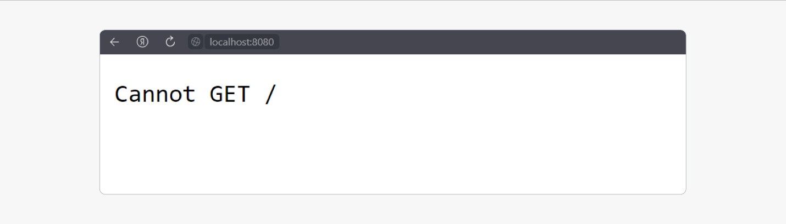

Скрипты для окружения настроены. Вы получили две отдельные сборки для разработки и для финальной версии продукта.

Вы узнали, как преобразовать TS «Вебпаком» и лоадером, и запустили сборку, но загрузка сайта обычно начинается с HTML. Разберёмся, как подружить его с «Вебпаком».

**Настраиваем обработку HTML**

Вам же знаком плагин для работы с html — html-webpack-plugin.

Пора установить его и подключить к проекту:

1.  Создайте папку public в корне проекта и добавьте в неё файл index.html:

```HTML

<!DOCTYPE html>

<html lang="en">


<head>

<meta charset="UTF-8">

<meta http-equiv="X-UA-Compatible" content="IE=edge">

<meta name="viewport" content="width=device-width, initial-scale=1.0">

<title>Document</title>

</head>


<body>

<div id="root"></div>

</body>


</html>
```

2.  Установите плагин:


```JAVASCRIPT
> 
> npm install -D html-webpack-plugin
> 
```
Плагины решают много задач, но, в отличие от лоадеров, не транспилят код. Они производят разные операции над файлами, например копирование.


3.  Добавьте настройку для HtmlWebpackPlugin:

 
```JAVASCRIPT
const HTMLWebpackPlugins = require('html-webpack-plugin');

...

plugins: [

new HTMLWebpackPlugins({

template: path.resolve(__dirname, 'public/index.html')

}),

]
```

Проверьте сборку ещё раз.

В файл index.html автоматически подключился бандл. Это поведение можно отключить, изменив опции плагина, но сейчас в этом нет необходимости. Она возникнет, если понадобится явно контролировать порядок внедрения скриптов в HTML-файле. Установка опции inject: false позволяет вручную управлять порядком их подключения в тегах \<head\> или \<body\>.

**Очищаем папку dist плагином CleanWebpackPlugin**

Пора добавить плагин, который будет каждый раз при сборке проекта удалять содержимое папки dist. Это позволит упростить команду build блока scripts файла package.json, которую мы используем для запуска сборки финального проекта.

Установите этот плагин:


```BASH

npm i clean-webpack-plugin --save-dev
```
После этого подключите его в файл webpack.config.js:


```JAVASCRIPT

const path = require('path');

const HtmlWebpackPlugin = require('html-webpack-plugin');

const { CleanWebpackPlugin } = require('clean-webpack-plugin'); // подключили плагин
```
Вызовите CleanWebpackPlugin в массиве plugins:


```JAVASCRIPT

plugins: \[

new HTMLWebpackPlugins({

template: path.resolve(\_\_dirname, 'public/index.html'),

}),

new CleanWebpackPlugin(), // использовали плагин

,

\];
```
Уберите лишний код из скрипта build в package.json:


```JSON

"scripts": {

"start": "webpack serve --mode development",

"build": "webpack --mode production",

},
```
Проверьте работу скриптов ещё раз — и можно переходить к настройке стилей. Находясь в папке проекта, выполните в терминале команды: npm run start и npm run build. Отлично\! Сборка работает — можно двигаться дальше.

Установка библиотеки clsx

Вы пока не изучали основы React и не создавали компоненты. Поэтому данной библиотекой вы пока не сможете воспользоваться. Но на будущее мы расскажем, как добавить её в сборку.

Установим npm install clsx.

Импортируем в компонент *\`import* clsx *from* 'clsx'\`.

clsx — это функция, в которую мы передаём наборы классов через запятую, либо объект с условием.

Давайте применим его к нашему классу header.


```JAVASCRIPT

import clsx from 'clsx';

const Header = ({children}) =\> {

return(

\<header className={clsx(s.header,'cover')}\>

...

\</header\>

);

};
```
Но удобство библиотеки clsx раскрывается, когда нам нужно добавить класс по условию.

Давайте создадим компонент кнопки, добавим ей стилей и подключим в App.js.


```TYPESCRIPT

//App.js

\<Button type="primary"\>

Купить

\</Button\>

//button/index.tsx

import { ReactNode } from 'react';

interface IButtonProps {

children: ReactNode;

}

export const Button: React.FC\<IButtonProps\> = ({ children }) =\> {

return \<button\>{children}\</button\>;

};

//button/button.modules.css

.button {

padding: 10px 18px;

font-size: 16px;

font-weight: 700;

line-height: 20px;

border-radius: 55px;

text-decoration: none;

display: inline-block;

transition: background-color .3s;

}
```
Давайте будем добавлять класс модификатор в зависимости от тех пропсов что мы передаём. Подключим clsx и передадим в функцию clsx наш класс и объект с условием.


```JAVASCRIPT

//App.tsx

\<Button type="primary"\>

Купить

\</Button\>

\<Button type="secondary"\>

Подробнее

\</Button\>

//Button.tsx

const Button = ({type, children}) =\> {

return (

\<button className={clsx(s.button, {

\[s.primary\]: type === 'primary',

\[s.secondary\]: type === 'secondary',

})}\>

{children}

\</button\>

);

};
```
Данный способ задавать класс в зависимости от значения props смотрится намного лучше и лучше расширяем.

Подробнее можно прочитать в [<span class="underline">документации</span>](https://www.npmjs.com/package/clsx).

Ещё один пример применения библиотеки:


```JAVASCRIPT

//card

{tags && tags.map((tag, i) =\>

\<span className={clsx('tag',{\[\`tag\_type\_${tag}\`\]: true})} key={\`${i}-${tag}\`}\>{tag}\</span\>

)}
```
**Сборка проекта на Webpack. Часть 3**

Пора переходить к финальной части сборки.

**Настройка обработки SCSS**

Установите пакеты, необходимые для работы со стилями приложения, и подключите возможность использования препроцессора Sass:


```BASH

npm install -D css-loader mini-css-extract-plugin postcss-loader autoprefixer cssnano style-loader sass sass-loader
```
Разберём флаги команды:

  - css-loader нужен, чтобы научить «Вебпак» работать с CSS.

  - mini-css-extract-plugin берёт много css-файлов и объединяет их в один, то есть собирает бандл. Используется в prod-режиме.

  - postcss-loader нужен, чтобы подключить PostCSS.

  - autoprefixer научит PostCSS добавлять вендорные префиксы.

  - cssnano делает минификацию/оптимизацию CSS-кода.

  - style-loader автоматически обрабатывает импортированные CSS-файлы, объединяет их, а затем встраивает стили в тег **\<style\>** HTML-документа. Используется в dev-режиме, чтобы автоматически внедрять стили без полной перезагрузки страницы.

  - sass-loader является надстройкой для Webpack и использует библиотеку sass для компиляции Sass-кода в CSS.

  - sass является JavaScript-реализацией Sass, препроцессора для таблиц стилей.

**Подключение CSS-модулей на React**

CSS-модули — один из самых популярных способов стилизации React-компонентов. Использование CSS-модулей гарантирует отсутствие коллизий с другими стилями, так как на этапе компиляции к классам добавляются уникальные идентификаторы. Для CSS-модулей неважно, используете ли вы только CSS или более продвинутый препроцессор (например, SASS). Вы всё равно можете записать эти стили в файлы и положить их рядом с React-компонентами.

Прежде чем использовать CSS-модули в React, нужно немного настроить приложение.

Свойство use, помимо строки, может принимать объект. В нём можно передать, какой loader мы хотим использовать, а также опции для него.

Добавьте в файл webpack.config.js новые загрузчики для работы с SCSS-файлами:


```JAVASCRIPT

const path = require('path');

const HTMLWebpackPlugins = require('html-webpack-plugin');

const { CleanWebpackPlugin } = require('clean-webpack-plugin');

const MiniCssExtractPlugin = require('mini-css-extract-plugin');

module.exports = {

entry: path.resolve(\_\_dirname, './src/index.ts'),

output: {

path: path.resolve(\_\_dirname, './dist'),

filename: 'main.js',

},

module: {

rules: \[

//подключение других лоадеров

{

test: /\\.(sa|sc|c)ss$/,

use: \[

MiniCssExtractPlugin.loader,

'style-loader',

{

loader: 'css-loader',

options: {

modules: {

mode: 'local',

localIdentName: '\[name\]\_\_\[local\]\_\_\[hash:base64:5\]',

auto: /\\.module\\.\\w+$/i,

},

importLoaders: 2, //Значение 2 говорит о том, что некоторые трансформации PostCSS нужно применить до css-loader.

},

},

'postcss-loader',

{

loader: 'sass-loader',

options: {

sourceMap: true,

},

},

\],

},

\],

},

resolve: {

extensions: \['.js', '.jsx', '.tsx', '.ts', '.json'\],

},

plugins: \[

new HTMLWebpackPlugins({

template: path.resolve(\_\_dirname, 'public/index.html'),

}),

new CleanWebpackPlugin(),

new MiniCssExtractPlugin({

filename: 'static/styles/index.css',

}),

\],

};
```
Опция modules в настройках css-loader необходима для включения конфигурации css-модулей. Давайте посмотрим, как формируется класс.

Имя генерируемого класса можно настроить в опции localIdentName.


```JAVASCRIPT

{

loader: "css-loader",

options: {

modules: {

mode: 'local',

localIdentName: '\[name\]\_\_\[local\]\_\_\[hash:base64:5\]'

},

importLoaders: 1

}

}
```
В опции localIdentName можно использовать следующие строковые шаблоны:

  - \[name\]: основное имя файла, без расширения. Например, если у вас есть файл styles.css, то \[name\] вернёт styles.

  - \[folder\]: папка, в которой находится файл. Например, если ваш файл находится в src/components, то \[folder\] вернёт components.

  - \[path\]: путь к файлу. Если файл styles.css расположен в src/components, то \[path\] вернёт src/components.

  - \[file\]: имя файла и его путь. Если файл styles.css расположен в src/components, то \[file\] вернёт src/components/styles.css.

  - \[ext\]: расширение файла с ведущей точкой. Если файл styles.css, то \[ext\] вернёт .css.

  - \[hash\]: хеш строки, генерируемый на основе localIdentHashSalt, localIdentHashFunction, localIdentHashDigest, localIdentHashDigestLength, localIdentContext, resourcePath и exportName. Этот хеш обеспечивает уникальность идентификаторов классов. Например, \[hash:base64:8\] вернёт первые 8 символов хеша в формате base64.

  - \[\<hashFunction\>:hash:\<hashDigest\>:\<hashDigestLength\>\]: хеш с определёнными настройками, указанными в hashFunction, hashDigest, hashDigestLength. Например, \[hash:base64:5\] вернёт хеш класса в формате base64, используя первые 5 символов хеша.

  - \[local\]: оригинальное имя класса. В случае CSS-модулей это будет имя класса, указанное в исходном коде стилей.

Если у вас есть файл src/components/Button.module.css с классом button, то соответствующее имя класса в результирующем CSS-коде может выглядеть как Button-module\_\_button\_\_abcde.

После изменения настроек Webpack остальные стили сайта, которые были подключены не как модули, а просто импортировались, — «отвалятся». Исправим это.

В настройках Webpack будем применять модули только к тем файлам, которые содержат .module в своём названии. Напишем настройку auto: /\\.module\\.\\w+$/i. Она ждёт регулярную строку. Теперь мы можем использовать как обычный css, так и модули. Более подробную информацию про настройку css-модулей можно [<span class="underline">прочитать в документации</span>](https://webpack.js.org/loaders/css-loader/#modules).

**Настройка PostCSS**

В корне проекта создайте файл postcss.config.js:


```JAVASCRIPT

const autoprefixer = require('autoprefixer');

const cssnano = require('cssnano');

module.exports = {

plugins: \[

autoprefixer,

cssnano({ preset: 'default' })

\]

};
```
Проверьте подключение файлов стилей в файл index.ts. Создайте в папке src файлы: index.scss и index.module.scss:


```JAVASCRIPT

//содержимое index.scss

body {

font-family: Arial, Helvetica, sans-serif;

}

//содержимое index.module.scss

.button {

padding: 20px;

background-color: transparent;

}

::placeholder {

color: gray;

}
```
Подключите их в точку входа:


```TYPESCRIPT

import style from './index.module.scss';

import './index.scss';

console.log(style); //использование объекта style важно для попадания стилей в css-бандл
```
При подключении файла модуля мы получили ошибку TypeScript: Cannot find module './index.module.scss' or its corresponding type declarations.ts(2307).

Для решения этой проблемы нужно создать в корне папки src файл custom.d.ts.

В файле custom.d.ts добавьте объявления типов для модулей, которые TypeScript не распознает автоматически. В нашем случае это файлы css-модулей, добавьте следующий код в custom.d.ts:


```TYPESCRIPT

declare module '\*.module.css' {

const classes: { \[key: string\]: string };

export default classes;

}

declare module '\*.module.scss' {

const classes: { \[key: string\]: string };

export default classes;

}

declare module '\*.module.sass' {

const classes: { \[key: string\]: string };

export default classes;

}
```

Также временно закомментируйте style-loader в Webpack-конфиге. Он не используется совместно с MiniCssExtractPlugin.loader, и эту проблему мы решим позже. Запустите сборку приложения npm run build. В папке dist появился файл стилей index.css со следующим содержимым:


```CSS

.index-module\_\_button\_\_hKxt0{background-color:transparent;padding:20px}::-moz-placeholder{color:gray}::placeholder{color:gray}

body{font-family:Arial,Helvetica,sans-serif}
```

Вы увидите сгенерированные селектор нашего css-модуля и добавленные postcss-префиксы для псевдокласса ::placeholder.

В следующих темах вы научитесь применять css-модули на практике.

**Настройка работы с изображениями и шрифтами**

Для работы с файлами шрифтов и изображениями понадобится [<span class="underline">Asset Modules</span>](https://webpack.js.org/guides/asset-modules/) — специальный тип модулей, которые позволяют добавлять в сборку ресурсы без помощи отдельных загрузчиков.

Эта функциональность уже встроена в Webpack. Достаточно научить его видеть файлы шрифтов.

Файлы шрифтов и изображение:

[<span class="underline">OpenSans-Bold.woff2</span>](https://code.s3.yandex.net/web-developer/frontend_sprint10/OpenSans-Bold.woff2?etag=c9e6ced6ee6d6f30cc5d3de2a811c27a)

[<span class="underline">OpenSans-Regular.woff2</span>](https://code.s3.yandex.net/web-developer/frontend_sprint10/OpenSans-Regular.woff2?etag=a725497524525c361f0d545e4e8ec577)

[<span class="underline">Изображение</span>](https://code.s3.yandex.net/web-developer/frontend_sprint10/file.jpg?etag=842a9fac7c71aa6bc8b95c13be2a9b45)

Для начала поместите файлы изображений в папку src/assets/images/, а шрифтов — в папку src/assets/fonts/.


```JAVASCRIPT

\- src/

\--- assets/

\----- images/

\------- dog.jpg

\----- fonts/

\------- OpenSans-Bold.woff2

\------- OpenSans-Regular.woff2
```
Теперь нужно расширить массив rules. Добавьте в него правило работы с файлами форматов woff и woff2 и популярными форматами изображений:


```JAVASCRIPT

{

test: /\\.(png|jpg|gif|webp)$/,

type: 'asset/resource',

generator: {

filename: 'static/images/\[hash\]\[ext\]\[query\]',

},

},

{

test: /\\.(woff(2)?|eot|ttf|otf)$/,

type: 'asset/resource',

generator: {

filename: 'static/fonts/\[hash\]\[ext\]\[query\]',

},

},
```
Теперь файлы шрифтов и изображений будут обрабатываться Webpack — остаётся только подключить их в проекте. В файле index.scss используйте директиву @font-face и подключите наш любимый шрифт OpenSans, а в файле index.ts подключите изображение:


```CSS

// index.scss

@font-face {

font-family: 'OpenSans';

font-style: normal;

font-weight: 700;

src: url("./assets/fonts/OpenSans-Bold.woff2") format("woff2");

}

@font-face {

font-family: 'OpenSans';

font-style: normal;

font-weight: 400;

src: url("./assets/fonts/OpenSans-Regular.woff2") format("woff2");

}

html,

body {

font-family: 'OpenSans', sans-serif;

}

// index.ts

import './assets/images/dog.jpg';

...
```

Шрифт OpenSans и изображения появились в папке dist:

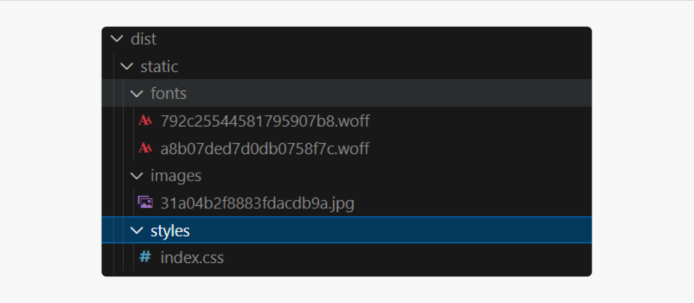

Подробнее обо всех этих шагах можно прочитать по ссылке [<span class="underline">https://webpack.js.org/guides/asset-modules/</span>](https://webpack.js.org/guides/asset-modules/).

 

Двигаемся дальше

Для работы с svg установите url-loader и \[@svgr/webpack\](https://www.npmjs.com/package/@svgr/webpack).


```BASH

npm install -D url-loader \[@svgr/webpack\](https://www.npmjs.com/package/@svgr/webpack)
```
Подключите новое правило в блоке rules:


```JAVASCRIPT

{

test: /\\.svg$/i,

issuer: /\\.\[jt\]sx?$/,

use: \['@svgr/webpack', 'url-loader'\],

},
```
Теперь вы можете подключать svg как React-компоненты:


```JAVASCRIPT

\*\*import { ReactComponent as ReactLogo } from './assets/images/react.svg';\*\*
```
При таком подключении svg-изображения вы также будете получать ошибку typescript. Чтобы её исправить в файле custom.d.ts, добавьте объявления типов svg, jpg, png и json добавьте следующий код в custom.d.ts:


```TYPESCRIPT

declare module '\*.svg' {

import React = require('react');

export const ReactComponent: React.FunctionComponent\<

React.SVGProps\<SVGSVGElement\>

\>;

const src: string;

export default src;

}

declare module '\*.png' {

const content: any;

export default content;

}

declare module '\*.jpg' {

const content: any;

export default content;

}

declare module '\*.json' {

const content: any;

export default content;

}
```
Теперь вы можете подключать в ваше React-приложение изображения и шрифты.

**Файл .gitignore**

Наверняка мы захотим хранить наш код где-то в облачном хранилище типа GitHub, для этого неплохо было бы заранее к этому подготовиться. Дело в том, что когда мы инициируем git в своём репозитории, он покажет нам несколько тысяч неотслеживаемых изменений. Произойдёт это потому, что мы установили множество сторонних библиотек, которые попали в папку node\_monules. Эта папка уже сейчас весит очень много, а в будущем она разрастётся ещё сильнее. Но у нас нет необходимости хранить эту папку вместе с нашим кодом, потому что любой разработчик при скачивании кода из репозитория может одной командой npm i скачать себе все зависимости. Поэтому мы можем создать файл .gitignore в корне проекта и написать туда все файлы и папки, которые мы не хотим, чтобы git отслеживал. Создайте такой файл и добавьте папку node\_modules:


```TYPESCRIPT

node_modules

dist

build
```
Теперь git будет предварительно смотреть в этот файл и исключать написанные в нём файлы и папки из списка отслеживаемых.

Основная сборка почти подходит к концу — осталось разобраться со средами prod и dev.

**Разделение prod-сборки и dev**

Обычно в проекте есть две сборки: одна для разработки, другая для конечного пользователя. Разработка и использование — разные процессы, поэтому и требования к сборкам разные:

|                                       | **В сборке для разработки**                                    | **В сборке для использования**                                    |
| ------------------------------------- | -------------------------------------------------------------- | ----------------------------------------------------------------- |
| Старый синтаксис и вендорные префиксы | **Не нужны.** Они не несут полезной информации и засоряют код. | **Нужны.** Закрывают проблему совместимости в разных браузерах.   |
| Webpack                               | **Нужен.** При изменении кода проект нужно собрать.            | **Не нужен.** Проект уже собран, не надо собирать его второй раз. |

С точки зрения конфига Webpack часто также делают два разных конфига.

Создайте папку Webpack в корне проекта. Переименуйте webpack.config.js в webpack.common.js и переместите в созданную папку. Создайте в папке Webpack ещё три файла: webpack.config.js, webpack.dev.js, webpack.prod.js.

Для объединения конфигураций будем использовать пакет merge:


```JAVASCRIPT

npm install -D merge
```
Опишите новые конфиги и измените запуск скрипта:


```JAVASCRIPT

//webpack.config.js

const { merge } = require('webpack-merge')

const commonConfig = require('./webpack.common.js')

module.exports = (envVars) =\> {

const { env } = envVars; //переменную env мы будем передавать при запуске скрипта со значением dev или prod

const envConfig = require(\`./webpack.${env}.js\`)

const config = merge(commonConfig, envConfig)

return config

}
```

```JAVASCRIPT
//webpack.dev.js

const path = require('path'); //для того чтобы превратить относительный путь в абсолютный, мы будем использовать пакет path

module.exports = {

mode: 'development',

devtool: 'eval-source-map',

devServer: {

static: path.resolve(\_\_dirname, './dist'), // путь, куда "смотрит" режим разработчика

// compress: true, // это ускорит загрузку в режиме разработки

port: 8080, // порт, чтобы открывать сайт по адресу localhost:8080, но можно поменять порт

open: true, // сайт будет открываться сам при запуске npm run dev

hot: true,

},

}
```
```JAVASCRIPT
//webpack.prod.js

module.exports = {

mode: 'production',

devtool: false,

}
```

```JAVASCRIPT
//package.json

"scripts": {

"build": "cross-env NODE\_ENV=production webpack --config webpack/webpack.config.js --env env=prod",

"start": "webpack serve --config webpack/webpack.config.js --env env=dev"

},
```
В начале скрипта build используется пакет cross-env для кроссплатформенного создания переменной окружения NODE\_ENV. Она нужна для определения переменной production файла в webpack.common.js. Установите пакет cross-env командой npm i -D cross-env.

Переменную production мы будем использовать для параметризации сборки. Файл webpack.common.js примет вид:


```JAVASCRIPT

const HTMLWebpackPlugins = require('html-webpack-plugin');

const { CleanWebpackPlugin } = require('clean-webpack-plugin');

const MiniCssExtractPlugin = require('mini-css-extract-plugin');

const path = require('path');

const webpack = require('webpack'); //подключаем webpack для использования встроенного плагина EnvironmentPlugin

//в зависимости от того, какой скрипт мы запустили

// переменная production получит либо false, либо true

const production = process.env.NODE\_ENV === 'production';

module.exports = {

entry: path.resolve(\_\_dirname, '..', './src/index.tsx'),//путь до папки src изменился

output: {

path: path.resolve(\_\_dirname, '..', './dist'), //путь до папки dist изменился

filename: production

? 'static/scripts/\[name\].\[contenthash\].js'// добавляем хеш к имени файла, если запускаем в режиме production

: 'static/scripts/\[name\].js',

publicPath: '/',

},

module: {

rules: \[

{

test: /\\.\[tj\]sx?$/,

use: \[

{

loader: 'ts-loader',

},

\],

exclude: /node\_modules/,

},

{

test: /\\.(png|jpg|gif|webp)$/,

type: 'asset/resource',

generator: {

filename: 'static/images/\[hash\]\[ext\]\[query\]',

},

},

{

test: /\\.(woff(2)?|eot|ttf|otf)$/,

type: 'asset/resource',

generator: {

filename: 'static/fonts/\[hash\]\[ext\]\[query\]',

},

},

{

test: /\\.svg$/i,

issuer: /\\.\[jt\]sx?$/,

use: \['@svgr/webpack', 'url-loader'\],

},

{

test: /\\.(sa|sc|c)ss$/,

use: \[

//в режиме production создаём физический файл в папке dist, в dev режиме добавляем стили в тег style в html-файле

production ? MiniCssExtractPlugin.loader : 'style-loader',

{

loader: 'css-loader',

options: {

modules: {

mode: 'local',

localIdentName: '\[name\]\_\_\[local\]\_\_\[hash:base64:5\]',

auto: /\\.module\\.\\w+$/i,

},

importLoaders: 2,

},

},

'postcss-loader',

{

loader: 'sass-loader',

options: {

sourceMap: true,

},

},

\],

},

\],

},

resolve: {

extensions: \['.js', '.jsx', '.tsx', '.ts', '.json'\],

},

plugins: \[

new HTMLWebpackPlugins({

template: path.resolve(\_\_dirname, '..', './public/index.html'), //путь до папки public изменился

}),

new CleanWebpackPlugin(),

new MiniCssExtractPlugin({

filename: 'static/styles/\[name\].\[contenthash\].css'

}),

//Плагин позволяет установить переменные окружения, можно переопределить переменную из блока script файла package.json

new webpack.EnvironmentPlugin({

NODE\_ENV: 'development', // значение по умолчанию 'development', если переменная process.env.NODE\_ENV не передана при вызове сборки

}),

\],

};
```
Обратите внимание: мы вернули подключение style-loader, теперь он запускается только в dev-режиме.

Запустите наши скрипты npm run build и npm run start. Проверьте, что всё по-прежнему работает.

Остался один нюанс. Чтобы React не сбрасывал свои состояния при сохранении файлов, добавьте пакеты @pmmmwh/react-refresh-webpack-plugin react-refresh.


```BASH

npm install -D @pmmmwh/react-refresh-webpack-plugin react-refresh
```
Добавьте плагин в конфиг dev:


```JAVASCRIPT

const ReactRefreshWebpackPlugin = require('@pmmmwh/react-refresh-webpack-plugin')

module.exports = {

...

plugins: \[

new ReactRefreshWebpackPlugin(),

\],

}
```
💡 Для поддержки и корректной работы JSX измените расширение точки входа с .ts на .tsx и замените путь в поле entry файла webpack.common.js.

Вы настроили сборку для React-приложения и настроили компиляцию ts-файлов. Все эти задачи вам предстоит решать ещё не раз, потому что Webpack — самый популярный сборщик фронтенд-проектов. Очень вероятно, что на новом месте работы вы столкнётесь именно с ним.

**Повторение: основные шаги сборки**

Ниже основные моменты, которые мы рассмотрели:

1.  **Установка зависимостей:**
    
      - Установка **webpack**, **webpack-cli**, **webpack-dev-server**.
    
      - Установка **typescript**, **react**, **react-dom**.

2.  **Настройка TypeScript:**
    
      - Создание файла **tsconfig.json** с основными настройками для TypeScript.
    
      - Использование опций **compilerOptions** для настройки компиляции TypeScript.
    
      - Добавление **ts-loader** в конфигурацию Webpack для обработки TypeScript-файлов.

3.  **Настройка Dev Server:**
    
      - Настройка **webpack-dev-server** для удобной разработки с функцией hot-reloading.

4.  **Обработка стилей:**
    
      - Включение поддержки стилей и препроцессора Sass.
    
      - Добавление поддержки CSS-модулей для изоляции стилей в компонентах.

5.  **Разделение на dev- и prod-режимы запуска сборки:**
    
      - Включение оптимизаций и минификации кода в режиме prod.
    
      - Корректная работа с React в режиме dev.

6.  **Дополнительные настройки:**
    
      - Работа с изображениями, шрифтами и другими ресурсами.
    
      - Использование плагинов Webpack для различных задач.

**Сборка проекта на CRA**

Как вы узнали из первого урока, кроме Webpack существуют и другие сборщики. С ними тоже полезно познакомиться, хотя бы в общих чертах. Первый на очереди — CRA.

**Зачем использовать Create React App**

  - Можно развернуть полноценный рабочий проект с помощью одной команды.

  - Проект сразу содержит удобную файловую структуру, стандартную для большинства приложений на React.

  - В проект легко подключить статические ресурсы: изображения, шрифты и так далее.

  - Есть готовый механизм для тестирования компонентов. С ним вы познакомитесь позже.

  - Проект будет автоматически обновляться в браузере, если вносить изменения в режиме разработки.

  - Настроена оптимизация продакшн-сборки.

  - Можно использовать NPM, легко устанавливать пакеты.

В теории настроить всё это можно и вручную, но CRA существенно ускоряет этот процесс и учитывает общепринятые подходы. У вас будет возможность самостоятельно настроить всю инфраструктуру, но об этом мы расскажем в дополнительной программе.

**Установка Create React App**

Это несложно и похоже на установку пакетов NPM.

Установите CRA глобально с помощью npm install -g create-react-app или yarn global add create-react-app.

Вот и всё\! Можно создавать первое React-приложение.

**Создание приложения с поддержкой TS с помощью CRA**

В командной строке перейдите в директорию, где планируете создать проект. Для нового CRA-проекта используют команду create-react-app название\_проекта. Возможности этой утилиты можно расширять, применяя специальные шаблоны. Воспользуйтесь одним из них, чтобы создать новое приложение с поддержкой TS:


```BASH

create-react-app react-with-ts --template typescript
```
После этого начинается магия CRA. Этот процесс может занять несколько минут — отличный повод сделать перерыв.

После успешного выполнения скрипта появится такое сообщение:

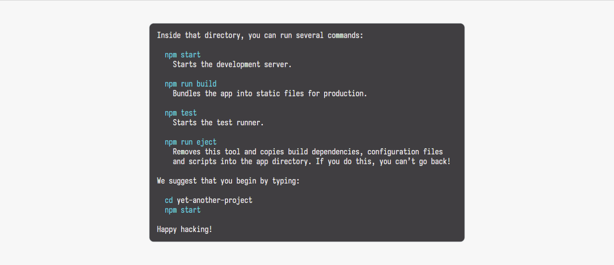

После выполнения этой команды будет создана директория react-with-ts. В ней развернётся уже знакомое вам NodeJS окружение для работы с React-приложениями, а также установятся все зависимости.

Чтобы проверить работоспособность проекта, достаточно перейти в директорию react-with-ts и выполнить команду npm run start (или yarn start).

У вас должен запуститься локальный сервер со стартовой страницей CRA. Если этого не произошло, введите адрес [<span class="underline">http://localhost:3000/</span>](http://localhost:3000/).

Сейчас проект выглядит так:

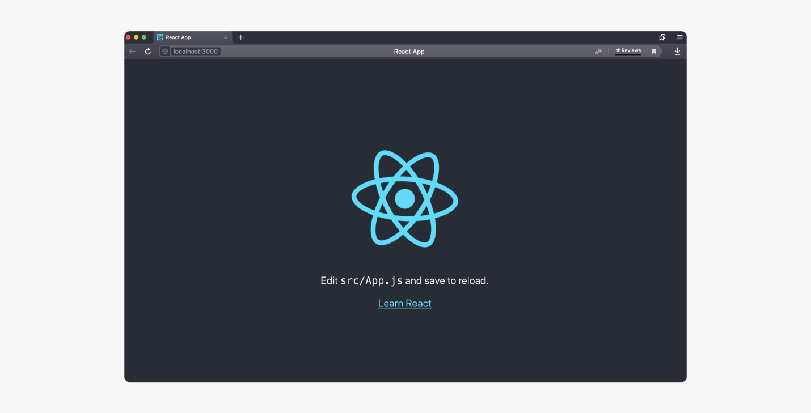

Уже неплохо, но будет ещё лучше.

Это шаблон проекта, который Create React App создаёт по умолчанию: простой компонент из вращающегося логотипа и текста. Настоящему приложению потребуется совсем другое наполнение. Но прежде чем редактировать App.js, нужно ознакомиться со структурой созданного проекта.

**Файлы инфраструктуры**

Посмотрите на созданные файлы в новом приложении:

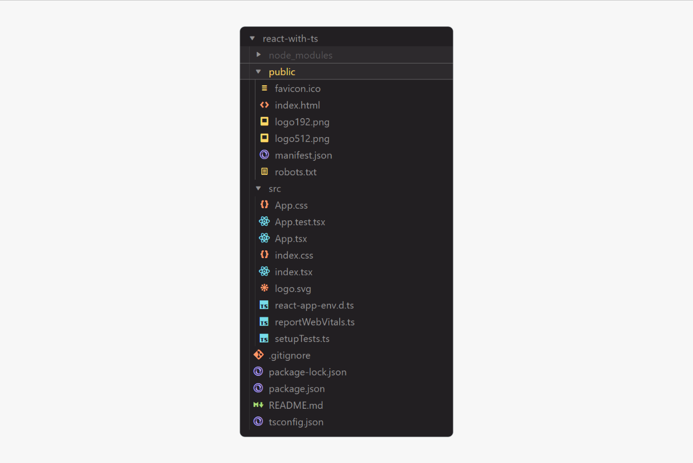

**Детальный разбор файлов инфраструктуры**

tsconfig.json — файл конфигурации TypeScript. В файле указываются настройки, которые будут использоваться TypeScript при компиляции нашего кода. При необходимости мы можем изменить настройки в этом файле.

react-app-env.d.ts — этот файл ссылается на декларации типов TypeScript, которые характерны для проектов, запущенных с помощью Create React App.

Эти объявления типов добавляют поддержку импорта файлов ресурсов, таких как bmp, gif, jpeg, jpg, png, webp и svg. Это означает, что следующий импорт будет работать без ошибок, как и ожидалось:


```TYPESCRIPT

import logo from './logo.svg';
```
Также добавлена поддержка импорта CSS-модулей. Это относится к импорту файлов с расширениями .module.css, .module.scss и .module.sass.

💡 Не удаляйте файл react-app-env.d.ts, чтобы избежать ошибок.

Папка src содержит исходный код приложения. В ней обязательно должен быть файл с именем index.ts или index.tsx. Все скрипты в папке src будут иметь расширения TypeScript. У нас будет расширение .ts вместо .js и .tsx вместо .jsx. Все файлы, которые относятся к функциональности и работе приложения, должны находиться внутри src/. Файлы вне этой директории CRA игнорирует при сборке.

reportWebVitals.ts — файл, содержащий функцию reportWebVitals. Она позволяет нам получить результаты производительности приложения с использованием различных метрик. Для их измерения используется сторонняя библиотека [<span class="underline">web-vitals</span>](https://github.com/GoogleChrome/web-vitals). Использовать это вы не будете, поэтому удалите файл и его подключение.

setupTests.ts и App.test.tsx нужны для запуска тестов в приложении. Вы узнаете о них больше далее в программе. Запуск тестов производится командой npm run test.

public — директория public/ содержит обязательный файл index.html. Это HTML-шаблон приложения. В директории также содержатся файлы favicon.ico, manifest.json, robots.txt и другие файлы. Они должны быть просто скопированы в собранное приложение без обработки с помощью Webpack.

В директории проекта нет знакомых вам файлов babel.config.js и webpack.config.js, в которых указываются настройки для сборки приложения и транспиляции кода. Но это не магия вне Хогвартса. CRA использует Babel и Webpack «под капотом» и всю настройку этих пакетов выполняет за вас.

Тем не менее CRA предлагает возможность редактировать настройки ESLint и Babel. Это можно сделать внутри файла package.json. Например, настройка расширений для ESLint выглядит так:


```JSON

"eslintConfig": {

"extends": [

"react-app",

"react-app/jest"

]

},
```
**Инфраструктурные скрипты. Сборка проекта**

Внутри файла package.json, который создан с помощью CRA, хранятся четыре готовых скрипта:


```JAVASCRIPT

"scripts": {

"start": "react-scripts start",

"build": "react-scripts build",

"test": "react-scripts test",

"eject": "react-scripts eject"

},
```

Мы уже использовали скрипт "start", когда запускали проект на локальном сервере. А вот про скрипты "test" и "eject" не сказали ни слова. Разберёмся, что они делают:

  - npm run test — исполняет все написанные файлы тестирования. Мы ещё не занимались вопросом тестирования, поэтому вернёмся к этой команде немного позже.

  - npm run eject — после запуска команды CRA необратимо копирует все инфраструктурные файлы конфигурации из пакета react-scripts в сам проект и редактирует package.json файл. Назовём её «красной кнопкой». Мы сообщаем CRA о том, что перед ней крутой разработчик, который не прочь сам изменять конфигурацию Babel, Webpack и ESLint. Но мы только начали изучать React, поэтому на красную кнопку нажимать не будем.

Остался последний скрипт, который отвечает за сборку проекта, — "build". При запуске команды npm run build через консоль скрипт генерирует оптимизированную сборку проекта. На практике это означает, что внутри проекта появится новая папка build/. Внутри build/static можно найти оптимизированные версии всего кода наряду с другими ресурсами: JS, CSS и шрифтами.

Затем файлы из директории build можно разместить на любом доступном сервере. Иными словами, эти файлы можно использовать для деплоя веб-приложения в интернете.

Чтобы посмотреть, что получится, запустим проект из папки build/ на локальном сервере. Для этого понадобится установить ещё один пакет. Из командной строки запустим команду npm i -g serve. Пакет установлен в вашей системе глобально — так же, как вы установили ранее Create React App.

Если вы используете macOS, установите пакет глобально командой sudo npm i -g serve и введите пароль.

Далее остаётся только запустить serve -s build. В консоли отобразится сообщение, что проект выполняется на локальном сервере — по умолчанию адресом будет localhost:3000. Введите этот адрес в браузере и увидите свой проект\!

Вы познакомились с готовой инфраструктурой CRA, которая позволяет быстро создать заготовку приложения на React.

**Сборка проекта на Vite**

[<span class="underline">Vite</span>](https://vitejs.dev/) — сборщик веб-приложений и библиотек, который вообще не требует настройки в небольших проектах. Он «из коробки» поддерживает быстрый сервер разработки, работу c CSS-модулями, TypeScript. Об этих и других возможностях, которые облегчают жизнь разработчика, пойдёт речь в уроке.

**Какие проблемы решает Vite**

До того как браузеры стали поддерживать ES-модули, разработчики использовали инструменты, которые сканировали, обрабатывали и объединяли файлы с исходным кодом приложения в общие файлы с JS-кодом и CSS-стилями.

Примеры таких инструментов — Webpack, Rollup и Parcel. Они формировали файлы, которые называются бандлами. Когда браузер загружает эти бандлы, веб-приложение начинает свою работу.

С течением времени приложения стали более массивными и сложными, что привело к увеличению объёма JavaScript-кода в них. Это вызвало серьёзные неудобства в процессе разработки:

1.  **Долгий запуск сервера разработки.** Крупные проекты нередко содержат тысячи модулей. Появляется «бутылочное горлышко», то есть узкое место для производительности JavaScript-модулей. Чтобы запустить dev-сервер, часто может потребоваться неоправданно большое количество времени (иногда этот процесс превышает минуты\!).

2.  **Процесс замены модулей в реальном времени занимает несколько секунд.** Это происходит из-за тех же причин, что и в предыдущем пункте, — даже малейшие изменения в коде заставляют сборщик создавать новые бандлы. А для «реального времени» несколько секунд — это долго, всё должно происходить почти мгновенно.

Vite улучшает скорость запуска dev-сервера за счёт разделения всех модулей в приложении на две категории: source code (исходный код) и dependencies (зависимости).

**Исходный код** — это то, что пишет разработчик. Файлы предоставляются браузеру как [<span class="underline">ES-модули</span>](https://developer.mozilla.org/en-US/docs/Web/JavaScript/Guide/Modules) без предварительного соединения в один файл-бандл. Это позволяет браузеру взять на себя часть работы сборщика. Vite нужно только преобразовывать и предоставлять файлы исходного кода, когда браузер их запрашивает.

Код, который импортируется из других файлов приложения, загружается в браузер через условные динамические импорты только в том случае, если он фактически используется на текущей странице. Этот подход придуман не командой Vite, а в целом является правильной практикой разработки. В браузер должен попадать только тот код, от которого зависит работа приложения в данный момент.

Для лучшего понимания обратимся к схемам из [<span class="underline">документации</span>](https://vitejs.dev/guide/why.html) Vite.

Вот как выглядит стандартная схема работы сборщика, например, того же Webpack:

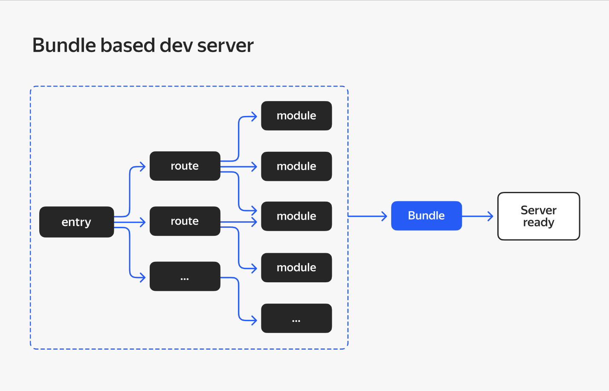

Весь код приложения собирается в единый бандл, который передаётся в браузер независимо от текущей отображаемой страницы.

А вот схема работы Vite:

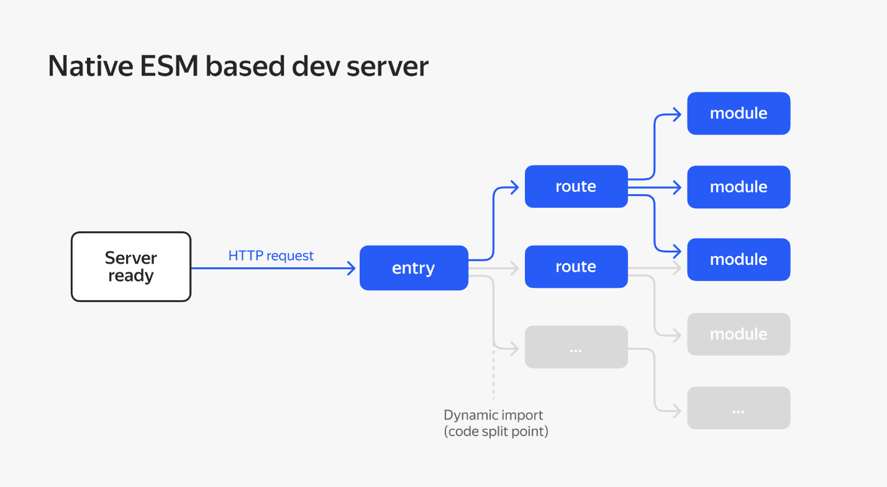

Здесь видна динамическая загрузка только необходимых для работы страницы модулей без их предварительной сборки в файл-бандл. Код условного динамического импорта обрабатывается только когда он действительно используется на текущем экране.

Вторая категория кода, которую Vite выделяет в приложении, — это **зависимости**. Например, библиотеки из npm.

Vite исходит из идеи, что библиотеки-зависимости — это некоторый JavaScript-код, который в процессе разработки практически никогда не меняется. Значит, перед запуском сервера разработки их можно один раз преобразовать в формат ES-модулей и отдавать в браузер по запросу — как и исходный код приложения. Преобразование библиотек-зависимостей приложения перед запуском сервера разработки в терминологии Vite называется [<span class="underline">dependency pre-bundling</span>](https://vitejs.dev/guide/dep-pre-bundling.html) — пребандлинг.

Преобразование библиотек-зависимостей в Vite означает выполнение двух операций:

1.  **Конвертирование библиотек**, распространяемых в форматах CommonJS и UMD, в формат ES-модулей. Это происходит с помощью инструмента-сборщика esbuild, который написан на Go и потому обеспечивает очень высокую скорость конвертирования.

2.  Если библиотека распространяется уже в формате ES-модулей и содержит в себе большое количество внутренних модулей, то все они будут **записаны в один файл-модуль**. Это позволяет браузеру не делать множество запросов за каждым из внутренних модулей библиотеки, ухудшая тем самым производительность.

Некоторые пакеты поставляются как сборка множества отдельных ES-модулей, импортирующих друг друга. Например, [<span class="underline">lodash-es имеет более 600 внутренних модулей</span>](https://unpkg.com/browse/lodash-es/)\! Когда мы делаем import { debounce } from 'lodash-es', браузер запускает 600+ HTTP-запросов одновременно\! Несмотря на то что у сервера нет проблемы с их обработкой, огромное количество запросов создаёт перегрузку сети на стороне браузера, в результате чего страница загружается гораздо медленнее. С pre-bundling lodash-es в один модуль нам нужно сделать только один HTTP-запрос\!

Vite кэширует все преобразованные библиотеки в папке node\_modules/.vite и отсюда же загружает их в браузер. По каким признакам Vite обновляет этот кэш, подробно описано в [<span class="underline">документации</span>](https://vitejs.dev/guide/dep-pre-bundling.html#caching).

Все описанные выше алгоритмы используются для оптимизации сервера разработки. Для production-сборки Vite использует Rollup, который собирает файл-бандл с кодом приложения.

Почему бы и для production-сборки не использовать esbuild? Дело в том, что это достаточно молодой инструмент. В нём нет стабильной реализации важных и широко используемых фич (например, таких как code-splitting). Однако разработчики Vite не исключают в будущем полный переход на esbuild.

 

    Какие проблемы решает Vite? Два правильных

 

- Устранение необходимости в сложной конфигурации проекта с нуля и предоставление шаблонов для создания проектов.


- Обеспечение быстродействия dev-сервера.

- Решение проблемы большого размера prod-бандла приложения.


_______
 

    Благодаря чему в Vite быстрый dev-сервер? 1 правильный


- Пре-бандлинг зависимостей.


- Сборка dev-бандла с кодом происходит с помощью быстрого esbuild.

- Использование ES-модулей в браузере.

 

**Zero config**

Vite представляет собой реализацию концепции Zero config. В этой концепции, в отличие от Webpack, не нужно создавать файл конфигурации или дополнительного кода для начала работы.

Vite предлагает быстрый сервер разработки, в котором уже настроен Hot Module Replacement. Также по умолчанию сборщик поддерживает различные способы работы с CSS. Разметка из импортированных файлов с расширением .css вставляется в тег style на странице. Если в проекте есть конфиг для postcss, то он автоматически будет применён ко всем импортируемым CSS-файлам. Любой файл с расширением .module.css воспринимается Vite как файл CSS-модулей.

Vite также поддерживает TypeScript без необходимости загрузки дополнительных плагинов и их использования в конфигурации сборщика. Достаточно наличия файла **tsconfig.json** и написания кода в файлах с расширением **.ts**. Важно отметить, что Vite не выполняет проверку типов в коде TypeScript при компиляции, а лишь транспилирует его из TS в JS.

**Создание приложения на Vite**

Вы познакомились с особенностями Vite и изучили, какие проблемы он решает. Теперь пора проверить его скорость работы на практике и закрепить полученные знания.

Для начала создайте новый проект на Vite и откройте его в VS Code. Убедитесь, что у вас установлена Node.js версии 20.10.0 или выше, а затем выполните следующую команду:


 

    npm create vite@latest .

Точка в конце означает, что сборку нужно делать в текущую папку и название проекта будет взято из имени папки.

В консоли Vite предложит указать фреймворк из нескольких предложенных вариантов, среди которых есть React, Vue и другие. Выберите вариант “React” — для создания приложения на React.


```BASH

? Select a framework: » - Use arrow-keys. Return to submit.

Vanilla

Vue

\> React

Preact

Lit

Svelte

Solid

Qwik

Others
```
Затем выберите, на каком языке будет проект. Выбираем TypeScript.


```BASH

√ Select a framework: » React

? Select a variant: » - Use arrow-keys. Return to submit.
```

```
TYPESCRIPT

TypeScript + SWC

JavaScript

JavaScript + SWC
```
На этом всё\!

После завершения интерактивной конфигурации проекта Vite подскажет действия, которые нужно совершить, чтобы запустить созданный проект. Первая команда — это установка зависимостей, вторая — запуск локального веб-сервера.


```BASH

Done. Now run:

npm install

npm run dev
```
После выполнения этих шагов вы увидите в консоли следующее:


```BASH

VITE v5.0.11 ready in 411 ms

➜ Local: http://127.0.0.1:5173/

➜ Network: use --host to expose

➜ press h + enter to show help
```
Перейдите по адресу [<span class="underline">http://127.0.0.1:5173/</span>](http://127.0.0.1:5173/) в браузере. Вы увидите, что открылся приветственный интерфейс:

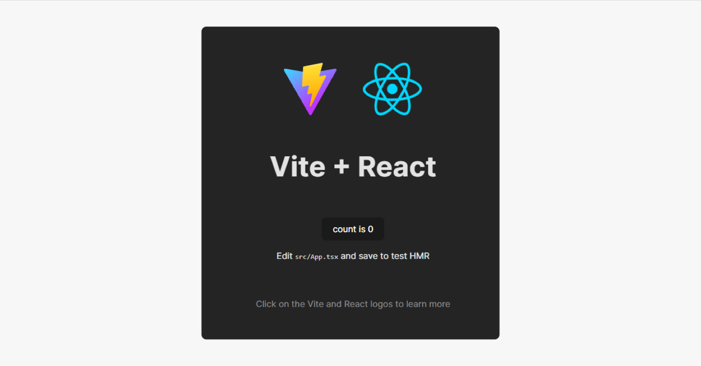

Давайте подробнее изучим приложение, чтобы оценить результаты оптимизаций сервера разработки, которые были описаны ранее. Для начала убедитесь, что исходный код проекта доставляется в браузер как ES-модули.

Откройте файл index.html. В нём есть такая строка:


```HTML

<script type="module" src="/src/main.tsx"\>\</script\>
```
Она говорит о том, что файл main.js будет загружен браузером как модуль благодаря атрибуту type=module.

Затем откройте консоль разработчика в браузере Chrome, а в ней вкладку “Network”. В этой вкладке вы увидите, какие запросы делает приложение. Пока там будут лишь запросы на получение файлов. Среди них вы увидите файлы с JS-кодом, которые называются так же, как файлы, что лежат в папке с проектом.

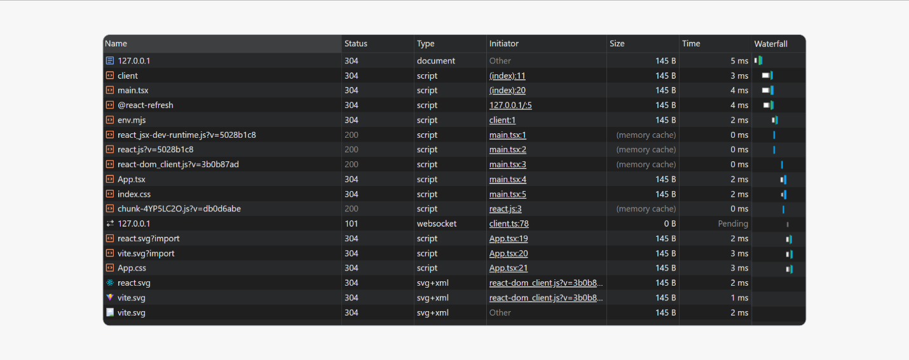

Как браузер понял, что нужно загружать не только main.tsx, который указан в теге script в HTML-разметке, но и другие ts-файлы?

Чтобы разобраться, нажмите, например, на запрос файла App.tsx, а затем перейдите во вкладку Initiator. В ней вы увидите, что инициатором запроса стал скрипт main.tsx.

В этом и есть суть ES-модулей. Браузер сам понимает, какие импорты есть в main.tsx. Он загружает их и двигается по дереву импортов, выполняя такие же действия с зависимостями этих зависимостей. Это продолжается до тех пор, пока браузер не загрузит код, который необходим для работы страницы.

Обратите внимание и на то, как Vite работает с библиотеками-зависимостями.

Так как мы использовали сборку с предустановленной библиотекой React, то на вкладке “Network” можно увидеть запрос файла react.js, который загружается из http://127.0.0.1:5173/node\_modules/.vite/deps/react.js, где node\_modules/.vite/deps — папка, в которую Vite складывает все преобразованные перед запуском сервера разработки библиотеки-зависимости. На вкладке “Initiator” видно, что файл был запрошен как модуль-зависимость из main.tsx, так как именно в этой точке входа мы первоначально подключаем React:


 

    import React from 'react'

**Конфигурация сборки**

Несмотря на то что создать и начать разрабатывать проект с Vite можно без дополнительной конфигурации, в процессе роста проекта точно понадобится более точная настройка сборщика. Поэтому у Vite, как и у любого другого популярного сборщика, есть файл конфигурации — vite.config.js.

В самом базовом виде конфиг файл выглядит как-то так:


```JAVASCRIPT

import { defineConfig } from 'vite'

export default defineConfig({

// тут пишем всякие настройки

})
```
Функция-хелпер defineConfig помогает IDE подсказывать разработчику, какие настройки есть у Vite.

Мы помним, что Vite под капотом использует rollup и для настройки сборки production-бандла у Vite есть специальная секция под названием build.rollupOptions. В [<span class="underline">документации</span>](https://vitejs.dev/guide/dep-pre-bundling.html#caching) Vite даже есть ссылки на [<span class="underline">документацию</span>](https://rollupjs.org/configuration-options/) настроек Rollup.

Также можно указать Vite, какие плагины ему использовать для сборки. В качестве примера уже установлен для работы с React — \[@vitejs/plugin-react\](https://www.npmjs.com/package/@vitejs/plugin-react). Для чего этот плагин:

  - он добавляет поддержку React Fast Refresh;

  - использует новый механизм JSX трансформации [<span class="underline">automatic JSX runtime</span>](https://legacy.reactjs.org/blog/2020/09/22/introducing-the-new-jsx-transform.html);

  - позволяет подключить пресеты для транспайлера Babel.

Подключается он в файле конфигурации в поле plugins, которое хранит массив подключаемых плагинов:


```JAVASCRIPT

import { defineConfig } from 'vite'

import react from '@vitejs/plugin-react'

export default defineConfig({

plugins: \[react()\],

})
```
Vite c помощью плагинов может работать и с другими библиотеками и фреймворками. Все плагины и инструкции к ним можно отыскать на просторах [<span class="underline">npm</span>](https://www.npmjs.com/).

**Заключение**

Несмотря на то что изначально Vite не требует какой-либо конфигурации, у него всё равно есть обширные возможности в этом плане. Все необходимые плагины и настройки могут быть указаны в файле **vite.config.js**.

**Общие настройки линтера и TS**

Stylelint, ESLint и Prettier — инструменты для статического анализа и форматирования кода, которые используются в разработке программного обеспечения. Их точно придётся использовать в работе, так как без них проверка кода станет слишком сложной и рутинной задачей.

**Добавление stylelint, eslint и prettier**

Вот краткое описание каждого из инструментов и примеры их использования:

**Stylelint**

Stylelint используется для проверки и поддержания согласованности стилей в коде CSS, Less, Sass и других препроцессорах.

Если у вас есть файл CSS с использованием разных стилей написания, например, комбинирующие кавычки и одинарные кавычки для строковых значений, Stylelint может помочь обнаружить такие несогласованности и предложить исправления.

**ESLint**

ESLint используется для обнаружения потенциальных проблем в JavaScript-коде, обеспечения согласованности стиля и применения лучших практик программирования.

Если у вас есть функция, которая объявлена, но нигде не используется, ESLint поможет обнаружить эту проблему и предупредить вас о ненужном коде.

**Prettier**

Prettier предназначен для автоматического форматирования кода, чтобы обеспечить единообразие и согласованность стиля в проекте.

Если у вас есть файл JavaScript с разными отступами (например, использование пробелов и табуляции), Prettier сможет автоматически отформатировать код согласно предопределённым правилам, чтобы убрать несогласованности и сделать его более читабельным.

В целом эти инструменты:

  - помогают разработчикам поддерживать стандарты кодирования,

  - повышают читаемость кода,

  - обнаруживают потенциальные проблемы,

  - упрощают сотрудничество в команде разработчиков.

Они могут быть интегрированы в рабочий процесс разработки с помощью плагинов, конфигураций и средств автоматического исправления.

Продолжим настраивать нашу сборку на Webpack, добавим проверку кода на соответствие код-стайлу.

**Установка инструментов**

Для установки нужно выполнить команды:


```JAVASCRIPT

npm install -D eslint prettier eslint-config-prettier eslint-plugin-eslint-comments eslint-plugin-import eslint-plugin-jsx-a11y eslint-plugin-prettier eslint-plugin-react eslint-plugin-react-hooks

npm install -D @typescript-eslint/parser @typescript-eslint/eslint-plugin

npm install -D stylelint stylelint-config-standard stylelint-order
```
Также для VSCode понадобится установить плагины prettier, eslint и stylelint и добавить конфигурационные файлы в корень проекта.

Конфиг для stylelint


```JSON

//.stylelintignore

\*\*/normalize.css

\*\*/normalize.min.css

\*\*/fonts/

\*\*/images/

\*\*/img/

//.stylelintrc.json

{

"extends": \["stylelint-config-standard"\],

"plugins": \["stylelint-order"\],

"rules": {

"color-no-invalid-hex": true,

"font-family-no-duplicate-names": true,

"function-calc-no-unspaced-operator": true,

"function-linear-gradient-no-nonstandard-direction": true,

"string-no-newline": true,

"unit-no-unknown": true,

"property-no-unknown": \[

true,

{

"ignoreProperties": \["print-color-adjust"\]

}

\],

"declaration-block-no-shorthand-property-overrides": true,

"block-no-empty": true,

"selector-pseudo-class-no-unknown": true,

"selector-pseudo-element-no-unknown": true,

"selector-type-no-unknown": true,

"media-feature-name-no-unknown": true,

"at-rule-no-unknown": true,

"comment-no-empty": true,

"no-empty-source": true,

"no-invalid-double-slash-comments": true,

"no-unknown-animations": true,

"function-url-no-scheme-relative": true,

"number-max-precision": 2,

"declaration-block-single-line-max-declarations": 1,

"comment-word-disallowed-list": \["todo"\],

"color-hex-length": "long",

"font-family-name-quotes": "always-unless-keyword",

"function-name-case": "lower",

"function-url-quotes": "always",

"length-zero-no-unit": true,

"value-keyword-case": \[

"lower",

{

"ignoreKeywords": \["A4"\]

}

\],

"declaration-empty-line-before": "never",

"declaration-property-unit-allowed-list": {

"line-height": \[\]

},

"selector-class-pattern": "^\[a-z\]\[a-zA-Z0-9\]\*(-\[a-zA-Z0-9\]+)\*(\_\_\[a-z0-9\]+(-\[a-z0-9\]+)\*)?(\_\[a-z0-9\]+(-\[a-z0-9\]+)\*)?(\_\[a-z0-9\]+(-\[a-z0-9\]+)\*)?$",

"selector-attribute-quotes": "always",

"selector-pseudo-element-colon-notation": "double",

"selector-type-case": "lower",

"rule-empty-line-before": \[

"always-multi-line",

{

"except": \["first-nested"\]

}

\],

"at-rule-empty-line-before": \[

"always",

{

"except": \["blockless-after-blockless", "first-nested"\]

}

\],

"comment-empty-line-before": \[

"always",

{

"except": \["first-nested"\]

}

\],

"comment-whitespace-inside": "always",

"order/order": \["custom-properties", "declarations"\],

"order/properties-order": \[

"all",

"position",

"top",

"right",

"bottom",

"left",

"inset",

"inset-block-start",

"inset-block-end",

"inset-inline-start",

"inset-inline-end",

"z-index",

"display",

"grid-template",

"grid-template-rows",

"grid-template-columns",

"grid-template-areas",

"grid-auto-rows",

"grid-auto-columns",

"grid-auto-flow",

"grid-area",

"grid-row",

"grid-column",

"grid-row-start",

"grid-row-end",

"grid-column-start",

"grid-column-end",

"flex",

"flex-grow",

"flex-shrink",

"flex-basis",

"flex-flow",

"flex-direction",

"flex-wrap",

"order",

"justify-content",

"justify-items",

"justify-self",

"align-content",

"align-items",

"align-self",

"grid-gap",

"gap",

"grid-row-gap",

"row-gap",

"grid-column-gap",

"column-gap",

"float",

"clear",

"box-sizing",

"writing-mode",

"width",

"min-width",

"max-width",

"height",

"min-height",

"max-height",

"inline-size",

"min-inline-size",

"max-inline-size",

"block-size",

"min-block-size",

"max-block-size",

"margin",

"margin-top",

"margin-right",

"margin-bottom",

"margin-left",

"margin-block-start",

"margin-block-end",

"margin-inline-start",

"margin-inline-end",

"padding",

"padding-top",

"padding-right",

"padding-bottom",

"padding-left",

"padding-block-start",

"padding-block-end",

"padding-inline-start",

"padding-inline-end",

"overflow",

"overflow-x",

"overflow-y",

"color",

"font",

"font-weight",

"font-size",

"font-family",

"font-style",

"font-display",

"font-variant",

"font-size-adjust",

"font-stretch",

"font-effect",

"font-emphasize",

"font-emphasize-position",

"font-emphasize-style",

"font-smooth",

"line-height",

"direction",

"letter-spacing",

"white-space",

"text-align",

"text-align-last",

"text-transform",

"text-decoration",

"text-emphasis",

"text-emphasis-color",

"text-emphasis-style",

"text-emphasis-position",

"text-indent",

"text-justify",

"text-outline",

"text-wrap",

"text-overflow",

"text-overflow-ellipsis",

"text-overflow-mode",

"text-orientation",

"text-shadow",

"vertical-align",

"word-wrap",

"word-break",

"word-spacing",

"overflow-wrap",

"tab-size",

"hyphens",

"unicode-bidi",

"columns",

"column-count",

"column-fill",

"column-gap",

"column-rule",

"column-rule-color",

"column-rule-style",

"column-rule-width",

"column-span",

"column-width",

"page-break-after",

"page-break-before",

"page-break-inside",

"src",

"list-style",

"list-style-position",

"list-style-type",

"list-style-image",

"table-layout",

"empty-cells",

"caption-side",

"background",

"background-color",

"background-image",

"background-repeat",

"background-position",

"background-position-x",

"background-position-y",

"background-size",

"background-clip",

"background-origin",

"background-attachment",

"background-blend-mode",

"box-decoration-break",

"border",

"border-width",

"border-style",

"border-color",

"border-top",

"border-block-start",

"border-top-width",

"border-top-style",

"border-top-color",

"border-right",

"border-inline-end",

"border-right-width",

"border-right-style",

"border-right-color",

"border-bottom",

"border-block-end",

"border-bottom-width",

"border-bottom-style",

"border-bottom-color",

"border-left",

"border-inline-start",

"border-left-width",

"border-left-style",

"border-left-color",

"border-radius",

"border-top-left-radius",

"border-top-right-radius",

"border-bottom-right-radius",

"border-bottom-left-radius",

"border-image",

"border-image-source",

"border-image-slice",

"border-image-width",

"border-image-outset",

"border-image-repeat",

"border-collapse",

"border-spacing",

"outline",

"outline-width",

"outline-style",

"outline-color",

"outline-offset",

"box-shadow",

"visibility",

"cursor",

"mix-blend-mode",

"backdrop-filter",

"will-change",

"transform",

"transform-origin",

"transform-style",

"backface-visibility",

"opacity",

"filter",

"perspective",

"perspective-origin",

"transition",

"transition-delay",

"transition-timing-function",

"transition-duration",

"transition-property",

"animation",

"animation-name",

"animation-duration",

"animation-play-state",

"animation-timing-function",

"animation-delay",

"animation-iteration-count",

"animation-direction",

"animation-fill-mode",

"appearance",

"clip",

"clip-path",

"counter-reset",

"counter-increment",

"resize",

"user-select",

"nav-index",

"nav-up",

"nav-right",

"nav-down",

"nav-left",

"pointer-events",

"quotes",

"touch-action",

"zoom",

"fill",

"fill-rule",

"clip-rule",

"stroke",

"stroke-width"

\]

}

}
```

Конфиг для eslintrc


```JAVASCRIPT

//.eslintrc.js

module.exports = {

parser: '@typescript-eslint/parser',

parserOptions: {

ecmaVersion: 2020,

sourceType: 'module',

warnOnUnsupportedTypeScriptVersion: false

},

settings: {

react: {

version: 'detect',

},

},

extends: \[

"plugin:@typescript-eslint/recommended",

'plugin:prettier/recommended',

'prettier',

'plugin:react/recommended',

'plugin:react-hooks/recommended',

'plugin:import/errors',

'plugin:import/warnings',

'plugin:import/typescript',

'plugin:jsx-a11y/recommended',

'plugin:eslint-comments/recommended',

\],

rules: {

"quotes": \[2, "single", { "avoidEscape": true }\],

'no-unused-vars': 'off',

'@typescript-eslint/no-unused-vars': \['error'\],

'@typescript-eslint/no-var-requires': 'off',

'react/prop-types': 'off',

'react/jsx-uses-react': 'off',

'react/react-in-jsx-scope': 'off',

'@typescript-eslint/explicit-module-boundary-types': 'off',

},

}

//.eslintignore

node\_modules

public

.eslintrc.js

storybook-static

build

dist

webpack/\*.js

package\*.json

\*.d.ts
```

Конфиг для prettier


```JAVASCRIPT

//.prettierrc.js

module.exports = {

semi: false,

trailingComma: 'es5',

singleQuote: true,

jsxSingleQuote: true,

printWidth: 80,

useTabs: true,

tabWidth: 2,

endOfLine: 'lf'

}
```
```JAVASCRIPT
//.prettierignore

build

dist

storybook-static
```
Настройте блок scripts в файле package.json.


```JAVASCRIPT

//package.json

"scripts": {

"build": "cross-env NODE\_ENV=production webpack --config webpack/webpack.config.js --env env=prod",

"start": "webpack serve --config webpack/webpack.config.js --env env=dev",

"stylelint": "stylelint \\"src/\*\*/\*.{css,scss}\\"",

"stylelint:fix": "stylelint \\"src/\*\*/\*.{css,scss}\\" --fix",

"lint": "eslint --fix \\"./src/\*\*/\*.{js,jsx,ts,tsx,json}\\"",

"format": "prettier --write \\"./src/\*\*/\*.{js,jsx,ts,tsx,json,css,scss,md}\\" --ignore-path ./.prettierignore",

"check": "npm run stylelint:fix && npm run lint && npm run format"

},
```
Вы настроили скрипты для проверки соответствия нашего кода код-стайлу команды. Однако линтеры лишь говорят о качестве кода, но не блокируют попадание кода, не прошедшего проверки, в репозиторий. Да и вручную запускать проверку достаточно неудобно. Однако, к счастью, процесс можно автоматизировать.

**Автоматизация процесса проверки кода**

Для автоматизации проверки перед коммитом кода существуют специальные инструменты — husky и lint-staged.

Начать нужно с установки этих пакетов:


 

    npm install -D husky

    npm install -D lint-staged

Пакет husky позволяет использовать [<span class="underline">хуки Git</span>](https://uleming.github.io/gitbook/5_%D0%A5%D1%83%D0%BA%D0%B8_git.html) для выполнения скриптов на определённых этапах разработки, таких как коммит или предварительная отправка (pre-commit/pre-push). С помощью Husky вы можете настроить скрипты, которые будут выполняться автоматически перед выполнением определённых Git-команд.

Пакет lint-staged позволяет запускать линтеры только для изменённых файлов, что значительно ускоряет проверку кода. Lint-staged работает в связке с Husky, чтобы запускать линтеры только для изменённых файлов на этапе коммита.

Для инициализации husky добавим в блок scripts файла package.json новую запись:


 

    "prepare": "husky install"

Запустим команду npm run prepare, при запуске команды удостоверьтесь, что git был проинициализирован. Результатом этой команды будет скрытая папка .husky.

Для создания pre-commit хука с использованием Husky в папке .husky вам потребуется:

1.  В папке .husky создать файл pre-commit без расширения.

2.  Открыть файл pre-commit и добавить следующий код:


 

    !/bin/sh

    . "$(dirname "$0")/\_/husky.sh"

npx lint-staged \#здесь может быть любая команда, которую вы хотите выполнить перед коммитом

Далее настроить lint-staged в файле package.json и в него добавить:


```JSON

"lint-staged": {

"\*.{css,scss}": "npm run stylelint:fix",

"\*.{js,jsx,ts,tsx}": "npm run lint",

"\*.{js,jsx,ts,tsx,json,css,scss,md}": "npm run format"

},
```

**Создание структурированных и согласованных коммитов**

Структурированные и согласованные коммиты — это коммиты, сделанные по общим правилам и шаблонам. Они должны содержать определённые изменения и быть подписаны определённым, едино заданным образом.

У них есть следующие преимущества:

  - **Ясность и понятность.** Заголовок коммита по стандарту “[<span class="underline">Conventional Commits</span>](https://www.conventionalcommits.org/)” содержит информацию о типе изменений. Например, "feat" для новых функций, "fix" для исправлений багов. Это делает коммиты более читаемыми и понятными.

  - **Автоматизация версионирования.** Использование структурированных коммитов позволяет автоматически определять версию проекта. Это особенно полезно при соблюдении семантического версионирования (SemVer).

  - **Лёгкость навигации.** Имея коммиты, оформленные по стандарту, проще найти конкретные изменения, просматривая историю проекта.

Однако часто разработчики сталкиваются с проблемой несогласованности и нечёткости в коммит-сообщениях, что затрудняет понимание сути изменений. В решении этой проблемы нам поможет инструмент [<span class="underline">Commitizen</span>](https://www.npmjs.com/package/commitizen).

Установите его:


 

    npm install -D commitizen cz-conventional-changelog

  - сommitizen — это инструмент командной строки. Он предоставляет интерактивный интерфейс для создания коммитов. Commitizen гарантирует соблюдение определённого формата коммитов, чтобы улучшить читаемость и удобство использования в команде разработчиков.

  - cz-conventional-changelog — это плагин для Commitizen, который определяет набор предопределённых шаблонов для коммитов, следуя соглашению об именовании коммитов "[<span class="underline">Conventional Commits</span>](https://www.conventionalcommits.org/)".

Соглашение "Conventional Commits" определяет структуру коммитов и рекомендует использование ключевых слов, таких как "feat", "fix", "docs", "chore" и других, для указания типа изменений в коммите. Это позволяет автоматически генерировать читаемые и информативные журналы изменений (changelogs) на основе коммитов.

Добавьте в файл package.json новый скрипт commit, которым вы будете делать коммиты и конфигурацию для инструмента commitizen:


```JAVASCRIPT

//package.json

"scripts": {

...

"check": "npm run stylelint:fix && npm run lint && npm run format",

"commit": "npm run check && cz"

...

},

"config": {

"commitizen": {

"path": "./node\_modules/cz-conventional-changelog"

}

},
```

Для создания коммита с проверкой можно теперь использовать команды:


 

    git add -A

    npm run commit

После проверки линтерами вам предложат пройти опрос, после ответов будет пройдена ещё раз проверка линтерами и создан коммит:

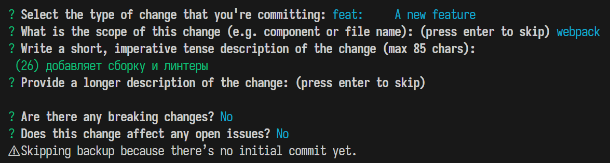

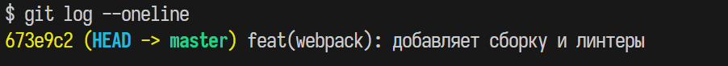

**Преимущества автоматизации версионирования**

Одним из ключевых преимуществ использования структурированных коммитов и Commitizen является возможность автоматического версионирования.

Инструмент \[standard-version\](https://www.npmjs.com/package/standard-version) позволяет автоматизировать процесс обновления версий, основываясь на типах изменений в коммитах. Установите его:


 

    npm install --save-dev standard-version

После установки используйте npx standard-version для автоматического обновления версии, создания тега и обновления файла CHANGELOG.md.

**Заключение**

Использование Commitizen и Conventional Commits — это мощный способ внедрить структурированные коммиты в ваш проект, повысив ясность, согласованность и автоматизацию процессов. Эти инструменты облегчают поддержку проекта, улучшая взаимодействие между членами команды и упрощая отслеживание изменений в истории проекта.

Вы справились со второй темой — невероятно объёмной, но очень важной. Теперь вы сможете эффективно собирать свои проекты, используя подходящие инструменты, а также автоматизировать свою работу. Пора идти дальше — и освоить самое важное из инструмента React.


[Далее](Спринт11-3.md).