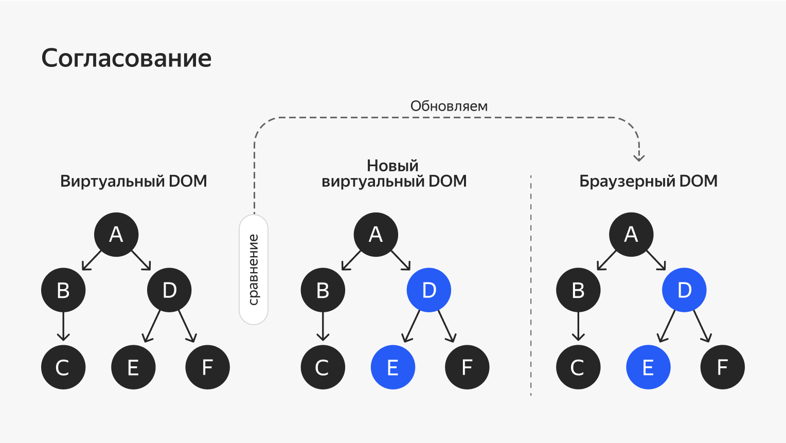
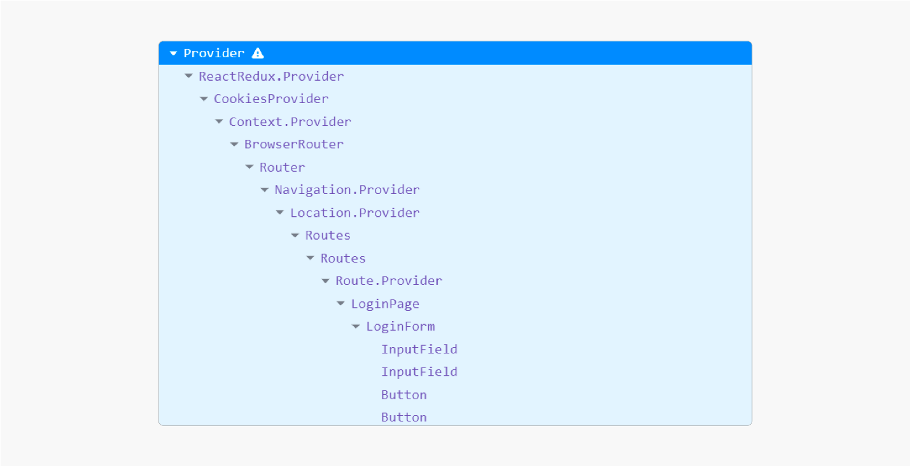
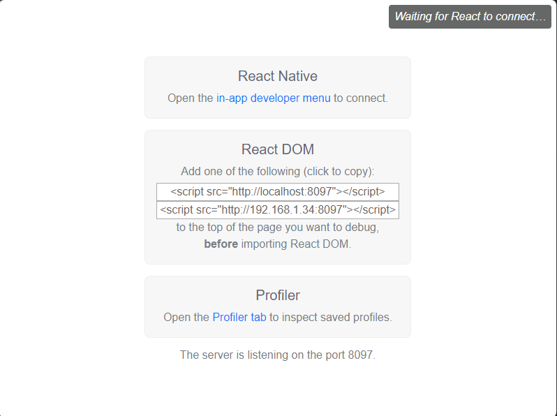
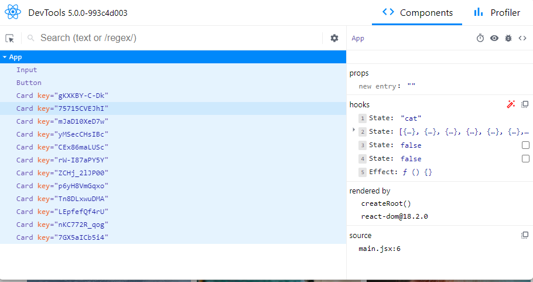
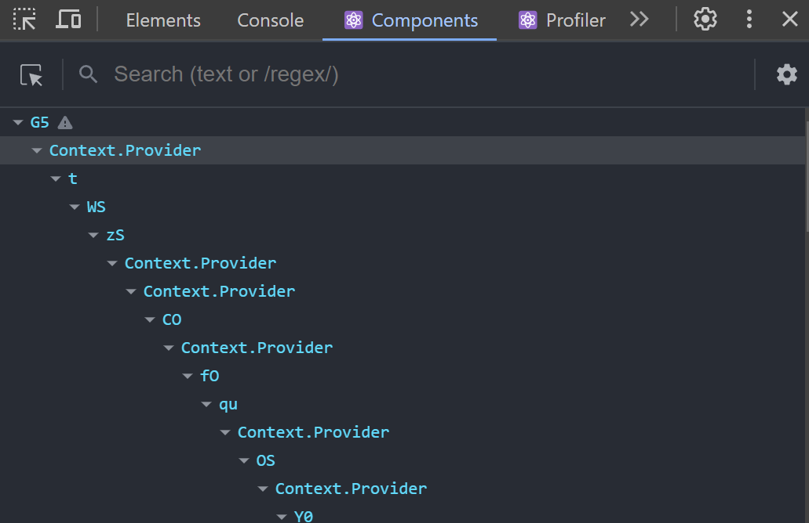
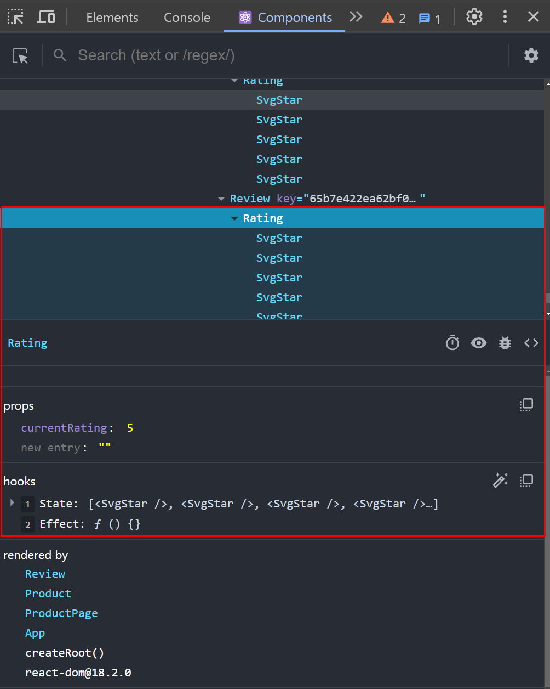
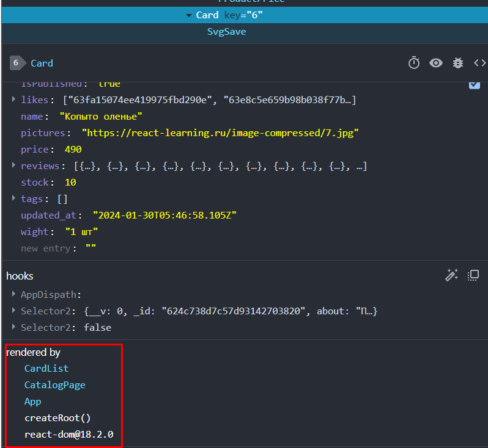
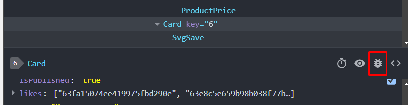
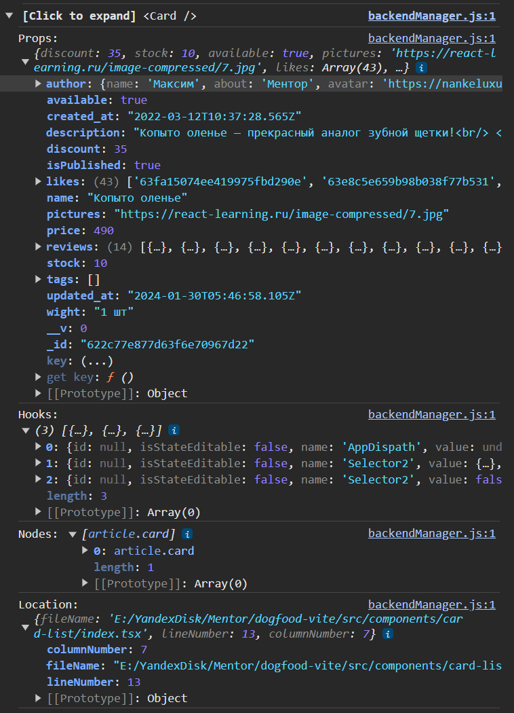

**Как устроен React и VirtualDOM**

В этой теме перейдём к основам React. Как мы уже упоминали в интро, React применяется почти везде в веб-разработке.

React — JavaScript-библиотека для разработки интерфейсов, то есть той части сайтов и приложений, с которой взаимодействует пользователь.

**Как начать работу с библиотекой React**

Для начала работы с библиотекой React нужно добавить «точку входа», или «корневой узел». Так называют DOM-узел, в котором React управляет содержимым. Не удивляйтесь, что в HTML-документе этот узел пустой. Дело в том, что React использует концепцию Virtual DOM, то есть определяет структуру HTML в недрах JavaScript, а не напрямую в HTML-документе.

Теперь пришло время что-то написать на React. Взгляните на код ниже:

Скопировать код

```HTML

...

\<body\>

\<div id="root"\>\</div\>

\<script\>

const root = ReactDOM.createRoot(document.querySelector('\#root')\!);

root.render(

React.createElement("h1", null, "Привет, React\!")

);

\</script\>

\</body\>

...
```
Этот код выведет заголовок «Привет, React\!». Разберёмся, что здесь происходит:

1.  Любое React-приложение начинается с создания корня. Для этого мы используем метод ReactDOM.createRoot и первым аргументом передаём ему указатель на DOM-элемент, в котором будем отображать наш интерфейс.

2.  После этого уже можно вызвать метод корня render. Он принимает один аргумент — разметку, которую мы хотим поместить в корневой узел, обрабатывает её и отрисовывает результат в DOM.

Более детально разберём аргумент метода render. Это вызов ещё одной функции React.createElement. Она вызывается с тремя аргументами:

1.  Названием результирующего HTML-тега.

2.  Дополнительными свойствами, которые прикреплены к этому тегу. Это может быть CSS-идентификатор class или id либо другие свойства.

3.  Содержимым, которое попадёт в HTML-тег. В данном случае это строка "Привет, React\!". Содержимым может быть не только текст, но и другие элементы.

После третьего аргумента могут идти и другие. Все они будут добавлены друг за другом внутрь создаваемого элемента, как если бы мы использовали метод appendChild.

Рассмотрим чуть более сложный пример:

Скопировать код

```TYPESCRIPT

const root = ReactDOM.createRoot(document.getElementById('root')\!);

function timer() {

const element = React.createElement(

"div",

null,

React.createElement("h1", null, "Текущее время:"),

React.createElement("h2", null, new Date().toLocaleTimeString())

);

root.render(element);

}

setInterval(timer, 1000);
```
Теперь раз в секунду будет вызываться функция timer, задача которой — рендерить DOM-дерево из нескольких узлов. Кажется, будто все элементы дерева будут отрендерены заново, раз в секунду, но это не так.


Вот что происходит на самом деле:

  - обновляется только элемент h2, который содержит в себе new Date().toLocaleTimeString(),

  - остальные элементы дерева не перерисовываются.

Чтобы разобраться, почему так происходит, познакомимся с Virtual DOM.

**Virtual DOM**

Начнём объяснение издалека. Мы обязательно дойдём до того, что такое Virtual DOM, следите за руками.

Элемент в React — простой объект. Так выглядит дерево элементов в React:

Скопировать код

```JAVASCRIPT

React.createElement(

"section",

null,

\[

React.createElement(

"div",

null,

\[

React.createElement("h1", null, "Заголовок"),

React.createElement("h2", null, "Подзаголовок")

\]

),

React.createElement(

"div",

null,

React.createElement("p", null, "Параграф")

)

\]

)
```
Этот код можно представить в упрощённом виде:

Скопировать код

```JAVASCRIPT

{

element: "section",

children: \[

{

element: "div",

children: \[

{

element: "h1",

children: "Заголовок"

},

{

element: "h2",

children: "Подзаголовок"

}

\]

},

{

element: "div",

children: \[

{

element: "p",

children: "Параграф"

}

\]

}

\]

}
```
Здесь представлена древовидная структура объектов. В ней один корневой объект section содержит несколько дочерних — они указаны у него в children. А дочерние элементы тоже содержат свои children. У дерева объектов может быть огромное количество уровней вложенности. Именно такая структура передаётся в метод render, где и происходит магия Virtual DOM.

React использует эту структуру данных для двух целей:

1.  На её основе строятся и вставляются на страницу реальные DOM-элементы (с помощью document.createElement и appendChild), а также вызывается рендер компонентов. В результате рендера компонентов «дерево», а с ним и реальный DOM «обрастают» дополнительными ветвями, структура которых была описана в компонентах.

2.  React хранит в ней виртуальный DOM (англ. Virtual DOM) — виртуальную копию текущей структуры DOM. При последующих рендерах обновлённая структура поэлементно сравнивается с последней сохранённой копией. Это позволяет React определять нужное количество изменений и применять их в реальном DOM.

Такой подход к созданию разметки сложнее, чем написание HTML в файлах .html. Но он необходим, потому что большинство операций с реальным DOM трудозатратны для браузера и пользовательских устройств. Алгоритм React, который называется reconciliation (англ. «согласование»), сводит количество таких операций к минимуму. Сравнение двух даже сложных JavaScript-объектов во много раз быстрее, чем аналогичные операции над DOM-деревом.



Такой алгоритм позволяет React сохранить высокую скорость работы в приложениях с большим количеством меняющихся данных.

Виртуальное дерево в памяти содержит структуру компонентов и связано с реальным DOM через файберы (fibers) — двусторонние элементы, которые отслеживают изменения с одной из сторон. Когда происходит изменение, файбер добавляет задачу в очередь для устранения различий или исполнения зависимого кода, который может породить новые различия.

**Дерево компонентов**

Дерево компонентов помогает проследить зависимости и наследственность компонентов. Например, на скриншоте показано дерево формы входа:



Виртуальный DOM — не исключительно внутренняя механика React. Много фреймворков построено по схожей технологии. Например, у другого популярного фронтенд-фреймворка Vue тоже есть [<span class="underline">виртуальный DOM</span>](https://vuejs.org/guide/extras/rendering-mechanism).

**JSX и HTML — такие похожие, но разные**

В предыдущем уроке вы подробно познакомились с функцией React.createElement. Но когда в коде много вложенных компонентов, его становится сложно читать. Да и в целом такое описание интерфейса больше похоже на императивный подход. В нём мы фокусируемся на описании последовательности шагов, которые нужно совершить, чтобы достичь результата. Но React славится своей декларативностью — подходом, при котором нам важно создать элемент, но нам неважно, как именно он будет создаваться. В этом уроке рассмотрим общепринятый способ описывать интерфейсы декларативно с помощью JSX.

JSX — расширение языка JavaScript. С помощью babel оно преобразуется в стандартный JavaScript. [<span class="underline">В онлайн-версии</span>](https://babeljs.io/repl#?browsers=defaults%2C%20not%20ie%2011%2C%20not%20ie_mob%2011&build=&builtIns=false&corejs=3.21&spec=false&loose=false&code_lz=DwCwjAfI-CCAIggcIIJhBCsIIIRAA0ACASgUwIYDGALgITAD04EQA&debug=false&forceAllTransforms=false&modules=false&shippedProposals=false&circleciRepo=&evaluate=false&fileSize=false&timeTravel=false&sourceType=script&lineWrap=true&presets=env%2Creact&prettier=false&targets=&version=7.13.9&externalPlugins=%40babel%2Fplugin-transform-react-jsx%407.23.4&assumptions=%7B%7D) [<span class="underline">babel</span>](https://babeljs.io/repl#?browsers=defaults%2C%20not%20ie%2011%2C%20not%20ie_mob%2011&build=&builtIns=false&corejs=3.21&spec=false&loose=false&code_lz=DwCwjAfI-CCAIggcIIJhBCsIIIRAA0ACASgUwIYDGALgITAD04EQA&debug=false&forceAllTransforms=false&modules=false&shippedProposals=false&circleciRepo=&evaluate=false&fileSize=false&timeTravel=false&sourceType=script&lineWrap=true&presets=env%2Creact&prettier=false&targets=&version=7.13.9&externalPlugins=&assumptions=%7B%7D) можно наглядно увидеть, как происходят такие изменения. [<span class="underline">Загляните по ссылке</span>](https://babeljs.io/repl#?browsers=defaults%2C%20not%20ie%2011%2C%20not%20ie_mob%2011&build=&builtIns=false&corejs=3.21&spec=false&loose=false&code_lz=DwCwjAfI-CCAIggcIIJhBCsIIIRAA0ACASgUwIYDGALgITAD04EQA&debug=false&forceAllTransforms=false&modules=false&shippedProposals=false&circleciRepo=&evaluate=false&fileSize=false&timeTravel=false&sourceType=script&lineWrap=true&presets=env%2Creact&prettier=false&targets=&version=7.13.9&externalPlugins=%40babel%2Fplugin-transform-react-jsx%407.23.4&assumptions=%7B%7D), а затем продолжите чтение.

Вот так это можно представить:

Скопировать код

```JAVASCRIPT

// Создание элемента без использования JSX

const element = React.createElement("h1", null, "Привет, React\!");

// Эквивалентная запись с использованием JSX

const element = \<h1\>Привет, React\!\</h1\>
```
JSX позволяет создавать гибкие шаблоны и описывать все возможные состояния интерфейса. В этом уроке рассмотрим основные конструкции, которые используются в JSX.

**Встраивание выражений**

В примере мы объявляем переменную folderName и используем её внутри JSX, обрамляя фигурными скобками:

Скопировать код

```JAVASCRIPT

const folderName = "Папка всем папкам папка";

const root = ReactDOM.createRoot(document.querySelector('\#root'));

root.render(

\<h1\>

{folderName}

\</h1\>,

);
```
Выражение может дополнять уже cуществующий контент:

Скопировать код

```JAVASCRIPT

const person = "Арамишка";

const root = ReactDOM.createRoot(document.querySelector('\#root'));

root.render(

\<span\>

Поздоровайся, это моя подружка {person}

\</span\>

);
```
Часто вы будете видеть подобные конструкции. Свойство элемента в этом примере — константа onlyGoodNewsClassName:

Скопировать код

```JAVASCRIPT

const onlyGoodNewsClassName = "good-news post only-good pet-news"

const root = ReactDOM.createRoot(document.querySelector('\#root'));

root.render(

\<section className={onlyGoodNewsClassName}\>

Блок хороших новостей

\</section\>

);
```
Использование возможности писать произвольный код внутри скобок ограничено только фантазией разработчика.

JSX позволяет вызывать функции внутри разметки. Такие функции должны возвращать разметку или null и быть синхронными:

Скопировать код

```TYPESCRIPT

const renderAddress = (street: string, house: string): JSX.Element =\> {

return (

\<div\>

\<p\>Улица {street}\</p\>

\<p\>Дом {house}\</p\>

\</div\>

)

}

const root = ReactDOM.createRoot(document.querySelector('\#root'));

root.render(

\<section\>

\<p\>Я проживаю по адресу:\</p\>

{renderAddress("Пушкина", "Колотушкина")}

\</section\>

);
```
**Фрагменты**

Иногда в JSX используется тег \<React.Fragment\>...\</React.Fragment\> или его более ёмкий вариант \<\>...\</\>. Дело в том, что блок JSX-кода по правилам должен содержать только один элемент верхнего уровня.

Взгляните на пример ниже:

Скопировать код

```JAVASCRIPT

const root = ReactDOM.createRoot(document.querySelector('\#root'));

root.render(

\<\>

\<div id="myElement"\>Click me\!\</div\>

\<div id="myAnotherElement"\>It was clicked\!\</div\>

\</\>

);
```
В примере используются сразу два элемента, которые находятся рядом: \#myElement и \#myAnotherElement. Чтобы JSX-код работал правильно, мы оборачиваем эти два элемента во фрагмент.

Фрагменты не обладают дополнительной функциональностью и могут восприниматься как своеобразные обрамляющие скобки в JSX-коде. Вместо них вы можете использовать обычный \<div\>, но это создаст лишние элементы в DOM. А это уже напрасная трата ресурсов, которая может вызывать дополнительные сложности с вёрсткой. Например, если в коде выше у элемента \#root есть свойство display: flex, дочерние элементы встанут в строку. А вот если вместо \<\> использовать \<div\>, элементы выстроятся в колонку, так как на них будет распространяться позиционирование div, в который они обёрнуты.

**Условная логика**

Одна из самых частых задач в построении динамического интерфейса (да и вообще в программировании) — реализация условной логики, когда в зависимости от действий пользователя показывается разный интерфейс. Например, переключение тёмной и светлой тем на сайте. В JSX внутри фигурных скобок можно писать любые JavaScript-выражения, поэтому мы можем использовать операторы ?: и &&.

Тернарный оператор ?: — сокращённый аналог if/else:

Скопировать код

```JAVASCRIPT

const root = ReactDOM.createRoot(document.querySelector('\#root'));

root.render(

\<div\>

{isDaylight ? (

\<h2\>Добрый день\!\</h2\>

) : (

\<h2\>Спокойной ночи\!\</h2\>

)}

\</div\>

);
```
Бывает, что в таких конструкциях возвращают null, в этом случае в DOM ничего не попадёт:

Скопировать код

```JAVASCRIPT

const root = ReactDOM.createRoot(document.querySelector('\#root'));

root.render(

\<React.Fragment\>

{userName ? (

\<h2\>Добро пожаловать, {userName}\!\</h2\>

) : null}

\</React.Fragment\>

);
```
Оператор && (логическое И) — аналог if, но без else — используется, если нужно отобразить часть JSX-разметки только при определённом условии, а в противном случае вообще ничего не отображать:

Скопировать код

```JAVASCRIPT

const root = ReactDOM.createRoot(document.querySelector('\#root'));

root.render(

\<div\>

{isLunchTime && \<h2\>Время обеда\!\</h2\>}

\</div\>

);
```
Оба оператора могут содержать составные условия:

Скопировать код

```JAVASCRIPT

const root = ReactDOM.createRoot(document.querySelector('\#root'));

root.render(

\<div\>

{isThursday && wasRaining && \<h2\>Пора вернуть долг\!\</h2\>}

\</div\>

);
```
Скопировать код

```JAVASCRIPT

const root = ReactDOM.createRoot(document.querySelector('\#root'));

root.render(

\<div\>

{(isFrost && isSun) ? (

\<h2\>День чудесный\</h2\>

) : (

\<h2\>День обычный\</h2\>

)}

\</div\>

);
```
Составные условия используются, когда результат зависит от нескольких факторов:

  - в первом примере: если сегодня четверг и шёл дождь, возвращаем долг, в противном случае — ничего.

  - во втором: если сегодня мороз и солнце, то день чудесный; если только мороз или только солнце, или ни мороза, ни солнца, день обычный.

**Свойства элементов**

JSX очень похож на HTML. Но есть некоторые важные отличия, которые нужно запомнить. Начнём с того, что для задания CSS-класса вместо class используется атрибут className:

Скопировать код

```JAVASCRIPT

const root = ReactDOM.createRoot(document.querySelector('\#root'));

root.render(

\<div\>

\<div className="proletariat"\>

Шаг держи революционный\!

Близок враг неугомонный\!

Вперёд, вперёд, вперёд,

Рабочий народ\!

\</div\>

\<div className="bourgeoisie"\>

Ешь ананасы, рябчиков жуй,

День твой последний приходит, буржуй.

\</div\>

\</div\>

);
```
Ещё в JSX отличается атрибут for у label. В JSX варианте требуется писать htmlFor вместо for:

Скопировать код

```JAVASCRIPT

const root = ReactDOM.createRoot(document.querySelector('\#root'));

root.render(

\<div\>

\<label htmlFor="title"\>

\<input id="title" type="text" /\>

\</label\>

\</div\>

);
```
Для всех остальных свойств в JSX используется стиль camelCase вместо обычных имён HTML-атрибутов:

Скопировать код

```JAVASCRIPT

onclick -\> onClick

tabindex -\> tabIndex

fill-rule -\> fillRule

overline-thickness -\> overlineThickness

stroke-width -\> strokeWidth

onmouseover -\> onMouseOver
```
**Стили**

Одна из фич JSX — возможность задавать значения style в виде JavaScript-объектов. Свойства объекта можно менять динамически, что позволяет делать стили динамическими. В названиях CSS-свойств тоже используется camelCase:

Скопировать код

```JAVASCRIPT

const planet = 'Земля';

const styles = {

width: 6792,

height: 6752,

borderRadius: '50%',

background: 'white',

color: 'black',

};

styles.background = planet === 'Земля' ? 'blue' : 'red';

const root = ReactDOM.createRoot(document.querySelector('\#root'));

root.render(

\<div style={styles}\>Какая я планета?\</div\>

);
```
Значение можно задать сразу без промежуточной переменной. Для этого используются двойные фигурные скобки {{...}}: внешние означают подстановку значения, а внутренние относятся к объекту, который описывает набор стилей:

Скопировать код

```JAVASCRIPT

const root = ReactDOM.createRoot(document.querySelector('\#root'));

root.render(

\<div style={{

width: 3475,

height: 3472,

borderRadius: '50%',

background: '\#d0d5d2',

color: '\#444444',

}}\>

Я тоже хочу быть планетой\!

\</div\>

);
```
Ещё один плюс: можно не указывать размерность для значений в пикселях — React сделает это сам.

**Самозакрывающиеся теги**

Любой открывающий тег должен иметь свою пару — закрывающий тег. Если у элемента нет внутреннего содержимого, то тег должен быть самозакрывающимся. Для этого ставят слеш / перед его закрывающей скобкой:

Скопировать код

```JAVASCRIPT

\
```
**Комментарии в JSX**

Как и в обычном JavaScript, в JSX можно оставлять комментарии. Для этого используется такая конструкция: {/\* Это элемент \*/}. Фигурные скобки помогают babel понять, что это не обычная строка, которую нужно поместить в DOM, а комментарий. В коде это может выглядеть так:

Скопировать код

```JAVASCRIPT

const root = ReactDOM.createRoot(document.querySelector('\#root'));

root.render(

\<div\>

{/\* Это комментарий к элементу label \*/}

\<label htmlFor="title"\>

{/\*

Этот комментарий многострочный,

в нём можно написать подсказку для коллег.

\*/}

\<input id="title" type="text" /\>

\</label\>

\</div\>

);
```
**Преобразование HTML в JSX**

Теперь, когда вы познакомились с JSX и основными его особенностями, посмотрим, как HTML-код преобразуется в JSX:

Скопировать код

```HTML

\<div class="question" style="border: 1px solid red"\>

\<label for="flower"\>Ваш любимый цветок: \</label\>

\<input type="text" id="flower" /\>

\</div\>

\<p\>Ваш любимый цветок: \<span class="answer"\>\</span\>\</p\>
```
Соблюдая все особенности, которые вы сегодня узнали о JSX, получим:

Скопировать код

```HTML

\<\>

\<div className="question" style={{ border: "1px solid red" }}\>

\<label htmlFor="flower"\>Ваш любимый цветок: \</label\>

\<input type="text" id="flower" /\>

\</div\>

\<p\>

Ваш любимый цветок: \<span className="answer" /\>

\</p\>

\</\>
```
В некоторых компаниях, верстальщик — это отдельная профессия и обычно он переводит макет в html-страницу. А вот уже html-страницу, придётся оживлять вам и соответственно переводить её в JSX.

Некоторые IDE, преобразовывают html в jsx автоматически, например WebStorm. VS Code, к примеру, по умолчанию не преобразовывает html в jsx, но можно установить плагин, например [<span class="underline">html to JSX</span>](https://marketplace.visualstudio.com/items?itemName=riazxrazor.html-to-jsx). Также существуют онлайн-конвертеры HTML в JSX, например [<span class="underline">transform.tools</span>](https://transform.tools/html-to-jsx).

**Подведём итог**

В этом уроке вы познакомились с JSX. Это расширение языка JavaScript позволяет декларативно описывать пользовательский интерфейс.

React основан на принципе, что логика рендеринга неразрывно связана с прочей логикой пользовательского интерфейса: обработкой событий, изменением состояния и подготовкой данных к отображению. JSX призван во всём соответствовать этому принципу. На этом способы применения JSX не заканчиваются: ещё больше вы узнаете по мере прохождения курса.

[Практика2](project2.zip)

Конвертировать HTML в JSX вы научились, отлично\! Основная прелесть JSX в том, что можно работать динамически в вёрстке с данными.

Здесь вам необходимо:

  - создать 2 переменные: name, profession;

  - присвоить этим переменным значения из вёрстки;

  - заменить статические значения из вёрстки на переменные.

Скопировать код

```JAVASCRIPT

const root = ReactDOM.createRoot(document.querySelector('\#root'));

root.render(

\<\>

\<p\>Привет, меня зовут \<span className='name'\>Проша\</span\>\!\</p\>

\<p\>Скоро я стану крутым \<span className='profession'\>frontend-разработчиком\</span\>\!\</p\>

\</\>

);
```
**Первый компонент**

Вы узнали, как устроен React, и познакомились с синтаксисом JSX. Пришло время написать первый компонент на React.

Чтобы компонент заработал, нужно подключить 2 пакета:

  - react — универсальна и предназначена не только для веб-проектов,

  - react-dom отвечает исключительно за взаимодействие с DOM.

В этом уроке вы приготовите сырные палочки… ой, то есть напишете первый компонент, отображающий рецепт сырных палочек.

В предыдущей теме в уроке [<span class="underline">Сборка проекта на Webpack</span>](https://practicum.yandex.ru/trainer/frontend-developer/lesson/c0435f31-4ab7-44f5-a782-4dff69543448/) вы настроили сборку для проектов на React с использованием TypeScript, пришло время ею воспользоваться.

Для начала заглянем в файл src/index.tsx и настроим входной файл для правильной работы React:

Скопировать код

```TYPESCRIPT

import { createRoot } from 'react-dom/client';

import { App } from './app';

import { StrictMode } from 'react';

const domNode = document.getElementById('root') as HTMLDivElement;

const root = createRoot(domNode);

root.render(

\<StrictMode\>

\<App /\>

\</StrictMode\>

);
```
Здесь происходит монтирование приложения в DOM. Теперь приступим к написанию своего первого компонента.

Создайте в папке src/app/ новую папку components/ . А внутри этой папки — файл Recipe.tsx. Именно так будет называться первый компонент.

Начнём с самого простого — с функционального компонента, который задаётся простой функцией, принимающей пропсы и возвращающей то, что React может отрисовать:

  - JSX-элементы,

  - строки,

  - null,

  - HTML-элементы.

Скопировать код

```TYPESCRIPT

import { ReactElement } from "react";

// типизируем props компонента

type RecipeProps = {

name: string

};

// указываем тип props и возвращаемое значение - ReactElement

export default function Recipe(props: RecipeProps): ReactElement {

return (

\<section\>

\<h1\>{props.name}\</h1\>

\<h2\>Ингредиенты:\</h2\>

\<ul className="ingredients"\>

\<li\>Сыр твёрдый - 300 г\</li\>

\<li\>Яйцо - 1 шт.\</li\>

\<li\>Мука - 30 г (1 ст. ложка с горкой)\</li\>

\<li\>Масло растительное - 70 мл\</li\>

\</ul\>

\<h2\>Инструкция по приготовлению\</h2\>

\<ol className="instruction"\>

\<li\>Подготовить продукты\</li\>

\<li\>Сыр натереть на мелкой тёрке\</li\>

\<li\>Добавить муку, яйцо\</li\>

\<li\>Всё перемешать\</li\>

\<li\>Обжарить в растительном масле до золотистого цвета\</li\>

\<li\>Палочки готовы\!\</li\>

\</ol\>

\</section\>

)

}
```
Отдельно про возвращаемые значения: они могут быть разными, обычно используется три:

  - **ReactElement** — это интерфейс в React. Он определен в самой библиотеке React. Это виртуальное представление элемента в DOM. Он включает в себя информацию о типе элемента, его свойствах (props), дочерних элементах.

  - JSX.Element — это аналог ReactElement, но предоставляется TypeScript, а не React.

  - ReactNode — это тип, представляющий любой узел в дереве React, включая ReactElement, строку, фрагмент, массив и т. д.

Первый компонент написан, осталось проверить его работоспособность. Для этого перейдём в файл src/app/index.txs. Заменим содержимое компонента App на следующее:

Скопировать код

```TYPESCRIPT

import Recipe from './components/Recipe';

export const App = () =\> {

return (

// компонент Recipe принимает пропс с названием блюда

\<Recipe name='Сырные палочки' /\>

)

};
```
Перейдите в браузер и проверьте, что рецепт отображается в браузере.

На этом уроке вы реализовали первый реакт-компонент, поздравляем\!

[Практика3](project3.zip)

В уроке был реализован компонент «рецепт». Отойдём немного от кулинарии и реализуем компонент «приветствие».

Вам необходимо:

  - передать в компонент 2 пропса: userName (имя пользователя) и welcomText (текст приветствия). Сами тексты могут быть любыми.

  - вывести компонент на web-страницу.

Скопировать код

```TYPESCRIPT

// src/index.txs

import { createRoot } from 'react-dom/client';

import { App } from './app';

import { StrictMode } from 'react';

const domNode = document.getElementById('root') as HTMLDivElement;

const root = createRoot(domNode);

root.render(

\<StrictMode\>

\<App /\>

\</StrictMode\>

);
```
Скопировать код

```TYPESCRIPT

// src/app/index.txs

export const App = () =\> {

return ()

};
```
Скопировать код

```TYPESCRIPT

// src/app/Components/Welcome.tsx

import { ReactElement } from "react";

type WelcomeProps = {};

export default function Welcome(props): ReactElement {

return (

\<div className="name"\>\</div\>

\<div className="welcomText"\>\</div\>

)

}
```
**Использование пропсов**

В предыдущем уроке мы немного коснулись темы пропсов. В этом уроке остановимся на них подробнее.

Пропсы — это аргументы функции, которые позволяют влиять на рендеринг элементов внутри компонентов и логику их работы. Как и аргумент, пропс может быть чем угодно:

  - функцией,

  - объектом,

  - массивом,

  - строкой,

  - числом,

  - другим компонентом,

  - элементом.

React при работе с компонентами объединяет JSX-атрибуты в один объект — props.

В качестве имени аргумента принято использовать props. Рекомендуем называть аргумент именно так: это упростит восприятие вашего кода другими разработчиками, ведь многие из них тоже следуют этому принципу.

Пропсов может быть несколько, а их структура допускает вложенность:

Скопировать код

```TYPESCRIPT

type ProductProps = {

productData: {

name: string,

price: number

}

}

const Product = (props: ProductProps): ReactElement =\> (

\<div\>

\<p\>{props.productData.name}\</p\> {/\* Гидрокостюм для дайвинга \*/}

\<span\>{props.productData.price}\</span\> {/\* 14299 \*/}

\</div\>

);

const ShoppingCart = (): ReactElement =\> (

\<\>

\<h1\>Корзина товаров\</h1\>

\<Product productData={{ name: "Гидрокостюм для дайвинга", price: 14299 }} /\>

\</\>

);
```
В этом примере компонент ShoppingCart «рендерит» другой компонент — Product. В качестве аргументов (пропсов) ему передаётся объект с двумя значениями: name и price.

Код, использующий этот компонент, выглядит сложно, а внутренняя реализация требует большой внимательности от разработчика.

Чтобы сделать код более читаемым, стоит упростить структуру передаваемых в компонент пропсов и использовать в качестве аргументов примитивы. Едва ли это отразится на производительности, ведь React очень быстрый, но работать с примитивами проще.

Давайте упростим этот компонент:

Скопировать код

```TYPESCRIPT

// изменилось описание пропса

type ProductProps = {

name: string,

price: number

}

const Product = (props: ProductProps): ReactElement =\> (

\<div\>

\<p\>{props.name}\</p\> {/\* Гидрокостюм для дайвинга \*/}

\<span\>{props.price}\</span\> {/\* 14299 \*/}

\</div\>

);

const ShoppingCart = (): ReactElement =\> (

\<\>

\<h1\>Корзина товаров\</h1\>

// изменился способ передачи пропсов

\<Product name="Гидрокостюм для дайвинга" price={14299} /\>

\</\>

);
```
Из примера видно, что реализация упростилась, из-за меньшей вложенности пропсов, а использование компонента стало более декларативным.

**Пропсы можно только читать**

Чтобы разработка на React оставалась предсказуемой и удобной, пропсы должны быть доступны только для чтения. Поэтому React-компоненты обязаны вести себя как «чистые» функции по отношению к своим пропсам вне зависимости от того, функциональные они или классовые. Это означает, что компоненты не должны что-то записывать в свои пропсы.

Разберём примеры «чистой» и «нечистой» функций.

Функция formatPrice — «чистая», потому что не изменяет входные данные и предсказуемо возвращает одинаковый результат для одних и тех же аргументов:

Скопировать код

```TYPESCRIPT

function formatPrice(price: number): string {

return price + '₽';

}
```
А вот функция notificationSettings — «нечистая», так как записывает данные в свой же аргумент — объект user:

Скопировать код

```TYPESCRIPT

type userType = {

name: string,

notifications: string

}

function notificationSettings(user: userType, notificationValue: string) {

user.notifications = notificationValue;

}
```
В следующих уроках мы расскажем, как повлиять на props компонента изнутри этого компонента.

**JavaScript-выражения как пропсы**

В качестве пропсов можно передавать любые JavaScript-выражения. Для этого нужно обернуть их в {}. К примеру, в этом JSX:

Скопировать код

```JAVASCRIPT

\<MusicGenreItem genre={'rock' + '&' + 'roll'} /\>
```
В компоненте MusicGenreItem значение props.genre равно rock\&roll, потому что выражение 'rock' + '&' + 'roll' будет вычислено. То же самое справедливо для функций:

Скопировать код

```TYPESCRIPT

function sayHi(name:string): string {

return \`Привет, ${name}\!\`

}

\<WelcomeComponent textToRender={sayHi('React')} /\>
```
В этом примере в пропс textToRender попадёт результат выполнения функции sayHi('React'), то есть строка "Привет, React\!".

Обратите внимание: мы используем TypeScript, поэтому выражения, передаваемые в пропсы, должны возвращать нужный тип данных под каждый пропс.

Операторы if, switch и цикл for не являются выражениями в JavaScript. Из-за этого их невозможно напрямую применять в JSX. Чтобы их использовать, необходимо сначала получить результат работы этих операторов, а затем этот результат поместить в JSX-код:

Скопировать код

```TYPESCRIPT

type TrafficLightComponentProps = {

color: string

}

function TrafficLightComponent(props: TrafficLightComponentProps ): ReactElement {

let action: HTMLElement;

switch (props.color) {

case "red":

action = \<b\>Стоять\</b\>

case "yellow":

action = \<i\>Завершайте манёвр\</i\>

case "green":

action = \<strong\>Проезжайте\</strong\>;

default:

action = \<span\>Будьте внимательны, светофор не работает\</span\>

}

return \<div\>Светофор рекомендует: {action}\</div\>;

}
```
**Строковые литералы как пропсы**

Строковые литералы также могут быть использованы в качестве пропсов. Это полезно при создании встроенных HTML-элементов. К примеру, эти компоненты эквивалентны:

Скопировать код

```JAVASCRIPT

\<WelcomeComponent name="Екатерина" /\>

\<WelcomeComponent name={'Екатерина'} /\>

\<WelcomeComponent name={\`Екатерина\`} /\>

\<WelcomeComponent name='Екатерина' /\>
```
Если передавать строковый литерал в компонент, то все его возможные символы будут преобразованы в соответствующие HTML-сущности. Оба этих компонента эквивалентны:

Скопировать код

```JAVASCRIPT

\<FavoritePet pet="&\#128008;" /\>

\<FavoritePet pet={'🐈'} /\>
```
**Значение пропсов по умолчанию равно true**

Если не передать значение в пропс, по умолчанию значение равно true. Эти два JSX-выражения эквивалентны:

Скопировать код

```JAVASCRIPT

\<TextInput disabled /\>

\<TextInput disabled={true} /\>
```
Такое поведение пропсов в React-компонентах существует, чтобы соответствовать поведению обычного HTML.

Лучше не полагаться на такую особенность и указывать значения props в явном виде, ведь иначе такая запись может быть интерпретирована React как короткая нотация свойств объекта:

Скопировать код

```JAVASCRIPT

const title = "Автостопом по галактике"

{ title }
```
Такая запись эквивалентна объекту { title: "Автостопом по галактике" }, но точно не объекту { title: true }.

Указывайте значение props в явном виде:

Скопировать код

```TYPESCRIPT

const title = "Автостопом по галактике"

{ title: title } // если хотите, передать "Автостопом по галактике"

{ title: true } // если необходимо передать булево значение
```
**Атрибуты расширения**

Вложенная структура пропсов — частое явление, особенно при работе с сервером, который возвращает многоуровневый JSON. Чтобы сделать код более компактным и читаемым, можно использовать деструктуризацию. В этом примере оба компонента идентичны:

Скопировать код

```JAVASCRIPT

type CustomerPageProps = {

profileData: {

firstName: string,

lastName: string

}

}

function CustomerPage(props: CustomerPageProps): ReactElement {

return (

\<ProfileInfo

firstName={props.profileData.firstName}

lastName={props.profileData.lastName}

/\>

);

}

function CustomerPage(props: CustomerPageProps): ReactElement {

return \<ProfileInfo {...props.profileData} /\>;

}
```
Деструктуризация помогает отсеивать нужные пропсы и передавать в целевой компонент только необходимые данные:

Скопировать код

```TYPESCRIPT

type InputProps = {

size: string,

type: string,

disabled: boolean,

userId: number

}

const Input = (props: InputProps): ReactElement =\> {

const { size, userId, ...otherProps } = props;

const className = size === "default" ? "DefaultInput" : "SmallInput";

return \<input className={className} {...otherProps} /\>;

};

const LandingPage = (): ReactElement =\> {

return (

\<\>

\<b\>Введите промокод:\</b\>

\<Input size="default" type="text" disabled={false} userId={1112983} /\>

\</\>

);

};
```
В этом примере в компонент Input передаются такие пропсы:

Скопировать код

```JAVASCRIPT

{

size: "default",

type: "text",

disabled: false,

userId: 1112983

}
```
При этом:

  - пропсы size и userId используются безопасно и не передаются в DOM-элемент \<input/\>

  - пропс size используется внутри для вычисления класса, а userId не задействован вовсе.

Поэтому в объекте otherProps остаются только нужные DOM-элементу пропсы — type и disabled.

Атрибуты расширения могут быть полезны и сокращают код, но есть риск передать лишние пропсы в компоненты или невалидные HTML-атрибуты в DOM. Используйте этот инструмент с осторожностью.

**Пропсы: коротко о главном**

В этом уроке мы погрузились в возможности пропсов React-компонентов. Напомним самое главное:

  - пропсы можно только читать;

  - пропсами могут быть JavaScript-выражения;

  - по умолчанию значения пропсов выставляются в true;

  - пропсы можно передать пачкой с помощью оператора расширения.

React-разработчик применяет эти навыки регулярно, а умение правильно «приготовить» пропсы сильно влияет на качество и надёжность кода. В следующем уроке расскажем о внутреннем состоянии и разберём, как применять его вместе с пропсами.

практика4[project4.zip](project4.zip)

Урок подошёл к концу, а значит, самое время попрактиковаться.

Вам дан компонент карточки товара Card, необходимо:

  - разбить компонент на 3 компонента: Card, CardTitle и CardBody;

  - передать CardTitle и CardBody в Card как пропсы.

Скопировать код

```TSX

function Card() {

return (

\<div className="card"\>

\<h5 className="card-title "\>Звезда Сириус\</h5\>

\<div className="card-body"\>

\<p\>

Звезда созвездия Большого Пса.

Звезда главной последовательности, спектрального класса A1.

Ярчайшая звезда ночного неба; её светимость в 25 раз превышает светимость Солнца,

при этом не является рекордной в мире звёзд —

высокий видимый блеск Сириуса обусловлен его относительной близостью к Земле.

\</p\>

\<div className='price'\>Цена: oоооочень много\</div\>

\</div\>

\<button type="button"\>В корзину\</button\>

\</div\>

)

}

export const App = () =\> {

return (

\<Card title={title} body={body} /\>

)

};
```
**Дочерние элементы Children**

Вы уже знаете, что JSX очень похож на HTML: большинство элементов могут иметь открывающий и закрывающий теги. В случае с JSX всё, что написано между открывающим и закрывающим тегами, попадает в пропсы элемента. React использует специальный ключ в объекте props — children.

Разберём на примере:

Скопировать код

```TYPESCRIPT

type FancyParagraphProps = {

children: ReactNode

}

const FancyParagraph = (props: FancyParagraphProps): ReactElement =\> (

\<p className={"text-beautiful"}\>

{props.children}

\</p\>

);

const CoolShinySwagText = (): ReactElement =\> (

\<\>

\<h1\>Вау\! Какой красивый текст:\</h1\>

\<FancyParagraph\>Этот параграф выглядит очень красиво.\</FancyParagraph\>

\<FancyParagraph\>А этот параграф ничуть не хуже предыдущего.\</FancyParagraph\>

\</\>

);
```
React помещает текст, который написан между \<FancyParagraph\> и \</FancyParagraph\>, в children. А обратиться к значению этого пропса можно уже в дочернем компоненте через props.children.

Что будет, если children указать как props у компонента, а не описывать внутри тега?

mgppu

Узнать ответ\!

Если так сделать — ничего страшного не произойдёт. Но children, описанный между тегами элемента, будет приоритетнее, чем children, который задан как props:

Скопировать код

```JAVASCRIPT

// Будет выведено: Пицца с ананасами прекрасна\!

\<FancyParagraph children={"Пицца с ананасами ужасна\!"}\>

Пицца с ананасами прекрасна\!

\</FancyParagraph\>

// Будет выведено: Пицца с ананасами ужасна\!

\<FancyParagraph children={"Пицца с ананасами ужасна\!"} /\>
```
В некоторых случаях props.children помогает упростить код и сделать его более читаемым. Посмотрим на пример, в котором используется notificationText в пропсах для отображения предупреждающего сообщения в компоненте Notification:

Скопировать код

```TYPESCRIPT

type NotificationProps = {

notificationText: string

}

// Компонент

const Notification = (props: NotificationProps): ReactElement =\> (

\<div className="Notification"\>

\<p\>{props.notificationText}\</p\> {/\* Внимание\! Обнаружено повышение радиации в 4-м блоке \*/}

\</div\>

);

// Использование компонента

\<Notification

notificationText="Внимание\! Обнаружено повышение радиации в 4-м блоке"

/\>
```
В этом примере нет ничего плохого (кроме радиации), но нужно помнить, что компонент ожидает на вход notificationText. Это создаёт дополнительную когнитивную нагрузку и отнимает время — вам приходится держать в голове дополнительную.

Вместо этого можно воспользоваться props.children и сделать код более читаемым:

Скопировать код

```TYPESCRIPT

type NotificationProps = {

children: ReactNode

}

// Компонент

const Notification = (props: NotificationProps): ReactElement =\> (

\<div className="Notification"\>

\<p\>{props.children}\</p\> {/\* Внимание\! Обнаружено повышение радиации в 4-м блоке \*/}

\</div\>

);

// Использование компонента

\<Notification\>

Внимание\! Обнаружено повышение радиации в 4-м блоке

\</Notification\>
```
Этот вариант выглядит естественнее, так как больше походит на HTML. В каких случаях использовать такой подход? Поделимся небольшой рекомендацией:

Любое свойство, которое не обрабатывается напрямую внутри компонента, мы рассматриваем как дочернее — пропускаем сквозь компонент без изменений.

Если такое свойство одно, указываем children, если несколько — пропсы, а также в самом компоненте расставляем пропсы в нужных местах.

**Ещё немного о props.children**

Обратите внимание: в children попадает всё, что расположено между открывающим и закрывающим тегами элемента. Это предоставляет дополнительные возможности для создания UI:

Скопировать код

```TYPESCRIPT

type DropDownMenuProps = {

heading: string,

children: ReactNode

}

const DropdownMenu = (props: DropDownMenuProps): ReactElement =\> (

\<div className="DropdownMenu"\>

\<span className="DropdownMenu-heading"\>{props.heading}\</span\>

\<div className="DropdownMenu-items"\>

{props.children}

\</div\>

\</div\>

);

const NavBar = (): ReactElement =\> (

\<nav\>

\<Logo /\>

\<DropdownMenu heading={"Меню"}\>

\<ul\>

\<li className="DropdownMenu-item"\>О магазине\</li\>

\<li className="DropdownMenu-item"\>Доставка\</li\>

\<li className="DropdownMenu-item"\>Оплата\</li\>

\</ul\>

\<hr /\>

\<ul\>

\<li className="DropdownMenu-item"\>Оставить отзыв\</li\>

\<li className="DropdownMenu-item"\>Политика конфиденциальности\</li\>

\</ul\>

\</DropdownMenu\>

\</nav\>

)
```
В этом примере:

1.  Меню на сайте формируется в компоненте NavBar.

2.  Затем с соблюдением HTML-разметки рендерится в компоненте DropdownMenu с помощью props.children.

Такое меню можно использовать в разных местах сайта с разным содержимым и быть уверенным, что оно будет вести себя одинаково.

**Children — функция?**

Children может быть функцией. Умение пользоваться props.children позволяет создавать более податливый к кастомизации пользовательский интерфейс, т.е. более гибко настраивать компоненты:

Скопировать код

```TYPESCRIPT

type NotificationProps = {

children: Function,

a: number,

b: number

}

const Notification = (props: NotificationProps): ReactElement =\> (

\<div className="Notification"\>

\<p\>Сумма {props.a} и {props.b} равна {props.children(3, 5)}\</p\>

\</div\>

);

// Использование компонента

\<Notification a={4} b={8}\>

{(a:number, b:number) =\> a + b}

\</Notification\>
```
В этом примере children является функцией {(a:number, b:number) =\> a + b}, функция с нужными параметрами вызывается внутри компонента {props.children(3, 5)}.

**Дополнительные возможности: модификация компонентов**

Помимо прямого использования компонентов с использованием JSX, React предоставляет удобные методы для модификации компонентов при их передаче через переменные или пропсы.

Один из подходов - использование **React.cloneElement** или оператора spread (**...**) для добавления или изменения пропсов компонента. Это позволяет вам повысить уровень переиспользуемости и гибкости ваших компонентов.

Скопировать код

```TYPESCRIPT

type ButtonProps = {

onClick: () =\> void;

}

// Пример: Использование React.cloneElement для добавления стилей к компоненту Button

const StyledButton = ({ children, ...props }: React.PropsWithChildren\<ButtonProps\>) =\> {

return React.cloneElement(

\<Button\>{children}\</Button\>,

props

);

};

// Использование StyledButton в другом компоненте

const App = () =\> {

return (

\<StyledButton onClick={() =\> console.log('Button clicked')}\>Click me\</StyledButton\>

);

};
```
Так вы можете изменять стили, добавлять обработчики событий и многое другое, не изменяя сам компонент. Рекомендуем использовать этот приём, когда нужно сохранить базовую функциональность компонента, но при этом внести лёгкие изменения во внешний вид или поведение в различных частях вашего приложения.

Если подводить итог, можно сказать, что в специальный ключ children пропса попадает всё, что написано между открывающим и закрывающим тегами элемента. При этом значения или данные в children можно передать напрямую в пропс, а не только между тегами элемента. Но стоить помнить, что у значения между тегами приоритет выше.

Children — это ещё один способ создавать более универсальные компоненты.

**Вывод списков. Свойство key**

Если вы это читаете, значит, вы проделали колоссальный путь. Вы уже многое знаете о компонентах и пропсах в React, но кое-что осталось за скобками. В предыдущих уроках мы показывали, как массивы хранятся во внутреннем состоянии или передаются как пропсы. Но не объяснили, как рендерить элементы массива в JSX. Чтобы это понять, нужно изучить списки.

**Что такое список**

Список — набор однородных и соседствующих элементов. То есть это любые однотипные данные, которые повторяются более одного раза:

  - меню сайта,

  - перечень пользователей,

  - галерея изображений.

В JSX можно использовать метод массивов map. Применим его и создадим компонент, который отображает список сообщений:

Скопировать код

```TYPESCRIPT

class ChatRoom extends React.Component {

state = {

messages: \[{

id: 1,

user: 'Ольга',

text: 'Привет\! Можешь помочь со списками в React?',

}, {

id: 2,

user: 'Николай',

text: 'Здравствуй\! Конечно, это проще простого\! Какой у тебя вопрос?',

}, {

id: 3,

user: 'Ольга',

text: 'Спасибо\! Как они попадают в JSX?',

}\];

}

render(){

return (

\<div className="ChatRoom"\>

{this.state.messages.map((message)=\>(

\<div className="Message"\>

\<span className="Message-user"\>{message.user}\</span\>

\<span className="Message-text"\>{message.text}\</span\>

\</div\>

))}

\</div\>

);

}

}
```
Вот и всё — так просто. Код будет работать, но в консоли отобразится предупреждение о необходимости использовать пропс key для каждого элемента списка.

Разберём, что это за пропс и как им пользоваться.

**Свойство key**

Как мы уже рассказывали, React рекурсивно сравнивает дерево компонентов до изменений с деревом компонентов после них. Он смотрит на изменение:

  - props,

  - state,

  - компонентов и их потомков.

React вызывает перерисовку всех потомков обновившегося компонента там, где находятся несоответствия. По логике, при изменении содержимого списка React должен перерисовать его весь, даже если изменения коснулись только одного элемента.

Все элементы в React поддерживают пропс key. Указывать это свойство нужно у первого элемента разметки внутри цикла. Если задать это свойство элементу, то при изменении его соседей в списке сам элемент не перерисуется:

Скопировать код

```JAVASCRIPT

...

render(){

return (

\<div className="ChatRoom"\>

{this.state.messages.map((message)=\>(

{/\* Добавили проп key \*/}

\<div className="Message" key={message.id}\>

\<span className="Message-user"\>{message.user}\</span\>

\<span className="Message-text"\>{message.text}\</span\>

\</div\>

))}

\</div\>

);

}

...
```
Свойство key всегда обязательно применять для рендеринга списков. Даже фрагменты поддерживают это свойство (и оно единственное у фрагментов):

Скопировать код

```JAVASCRIPT

...

{this.state.messages.map((message)=\>(

\<React.Fragment key={message.id}\>

\

\<div className="Message"\>

\<span className="Message-user"\>{message.user}\</span\>

\<span className="Message-text"\>{message.text}\</span\>

\</div\>

\</React.Fragment\>

))}

...
```
Свойство key должно быть уникальным для каждого элемента в списке. Повторение ключей элементов списка может привести к непредсказуемой работе и ошибкам рендеринга. Ключи могут повторяться только в том случае, если используются двумя разными списками.

Если у элементов списка отсутствуют уникальные идентификаторы, например id, можно воспользоваться вторым аргументом из метода map — индексом элемента массива. Индекс уникален для каждого из элементов, расположенных в одном массиве.

Это решение подходит только в том случае, если вы уверены, что порядок элементов не поменяется:

Скопировать код

```JAVASCRIPT

...

render(){

return (

\<div className="ChatRoom"\>

{this.state.messages.map((message, index)=\>(

{/\* Используется индекс элемента в качестве key \*/}

\<div className="Message" key={index}\>

\<span className="Message-user"\>{message.user}\</span\>

\<span className="Message-text"\>{message.text}\</span\>

\</div\>

))}

\</div\>

);

}

...
```
Иногда в качестве данных приходят массивы с неодинаковыми объектами, например, название книги будет обязательным, а вот описание — уже нет. К какой-то книге оно есть, к какой-то — нет. В этом случае лучше вывести эти элементы, используя фрагмент и условный рендеринг:

Скопировать код

```TYPESCRIPT

type BookProps = {

article?: number,

title: string,

description?: string

}

function Book(props: BookProps): ReactElement {

return (

\<\>

\<h2\>{props.title}\</h2\>

{props.description && \<p\>{props.description}\</p\>}

\</\>

)

}

const books = \[

{

article: 1,

title: 'Русские народные сказки',

}, {

article: 2,

title: 'Энциклопедия о животных',

description: 'Много интересных фактов о животных'

}

\]

export const App = () =\> {

return (

\<\>

{books.map((book: BookProps) =\> (

\<Book key={book.article} title={book.title} subtitle={book.description} /\>

))}

\</\>

)

};
```
В этом примере description встречается не у всех элементов, поэтому div в компоненте Book будет загрязнять вёрстку. Чтобы этого не случилось, используем фрагмент.

Списки — довольно частое явление во фронтенде: список чатов, список товаров в корзине, список ингредиентов. React умеет их эффективно перерисовывать, но для этого ему нужно помогать, используя key.

[Практика6](project6.zip)

Давайте вернёмся в школу и посмотрим, какие учебники сейчас актуальны =)

Дан массив listTextbooks со списком учебников.

Необходимо:

  - создать компонент списка List, принимающий в качестве пропс list — массив строк;

  - создать компонент Item, принимающий item — строковое значение;

  - в List вывести все значения массива listTextbooks с помощью Item.

Скопировать код

```TSX

function Item(props: ItemProps): ReactElement {

return (

\<li\>\</li\>

)

}

function List(props: ListProps): ReactElement {

return(

\<ul\>

{props.list}

\</ul\>

)

}

const listTextbooks = \[

'Русский язык - Гусарова И.В.',

'Литература (в 2 частях) - Лебедев Ю.В.',

'Черчение - Преображенская Н.Г., Кодукова И.В.',

'Химия - Габриелян О.С., Остроумов И.Г., Сладков С.А.',

'Информационная безопасность. Кибербезопасность. - Цветкова М.С., Хлобыстова И.Ю.',

\];

export const App = () =\> {

return (

\<List list={listTextbooks} /\>

)

};
```
**Обработка событий: клик**

Часто в приложении требуется реагировать на пользовательский ввод или другие события в браузере. Вы уже знаете, как добавлять обработчики событий в JS, — мы рассматривали это раньше. В этом уроке расскажем о событиях и их обработке в React — эти процессы несколько различаются.

**Прекрасный мир событий в React**

Перед погружением в события React важно узнать, что все они всплывают. И даже те события, которые не всплывают в JS, например mouseenter. Это удобно для реализации паттернов делегирования событий. Есть лишь одно исключение — событие onScroll. В новых версиях React оно не всплывает из-за возможных коллизий в коде.

Все слушатели событий в React начинаются с ключевого слова on и записываются в нотации camelCase. Рассмотрим основные события, с которыми можно столкнуться в повседневной работе.

**События мыши**

Это большая группа событий, из которых выделим три наиболее используемых:

  - onMouseEnter — мышка наводится на элемент;

  - onMouseLeave — мышка перестала наводиться на элемент;

  - onClick — на элемент кликнули.

На примере рассмотрим типизацию наведения мышки на элемент:

Скопировать код

```TYPESCRIPT

type TitleProps = {

title: string

}

function Title(props: TitleProps): ReactElement {

const handleMouseEnter = (e: React.MouseEvent) =\> {

// будут выведены координаты курсора, где сработало событие

console.log(e.clientX, e.clientY);

};

return (

\<h1 onMouseEnter={handleMouseEnter}\>{props.title}\<h1\>

)

}
```
**Обработка событий в классовых компонентах**

Добавлять обработчики событий в классовых компонентах можно несколькими способами:

  - объявить обработчик как метод класса,

  - использовать синтаксис общедоступных полей класса,

  - применить стрелочную функцию в колбэке слушателя события.

Объявление хендлеров в качестве методов класса — самый распространённый способ обработки событий. Однако в нём есть единственный недостаток — дополнительный код с явным указанием контекста.

Но при использовании колбэков возникает проблема: с каждым рендером создаётся новый экземпляр функции. При передаче такого колбэка дочернему компоненту может произойти повторная отрисовка компонента — поведение, которое разработчик умышленно не закладывает в компонент.

Поэтому мы рекомендуем использовать первые два способа обработки событий:

  - метод .bind() для явной привязки контекста,

  - общедоступные поля класса.

[Практика7](project7.zip)

В этом задании есть кнопка, которая много знает. Ваша задача — не дать ей проговориться.

Вам необходимо:

  - Типизировать event.

  - Сделать так, чтобы в консоль выводилось только одно сообщение: «Я ничего не знаю\!».

  - Удалять ничего не нужно, if и тому подобное здесь тоже не нужны.

Скопировать код

```TSX

function Button(): ReactElement {

const handleClick = (event) =\> {

console.log('Я ничего не знаю\!');

}

const handleClickDiv = (event) =\> {

console.log('Я очень много знаю\!');

}

return (

\<div onClick={handleClickDiv}\>

\<span\>

\<button onClick={handleClick}\>Очень любопытная кнопка\</button\>

\</span\>

\</div\>

)

}

export const App = () =\> {

return (

\<Button /\>

)

};
```
**Работа с CSS: className и инлайн стили**

В React-приложениях стили могут быть глобальными и локальными. В этом уроке разберём, как подключить стили глобально и локально, а также рассмотрим библиотеку clsx, которая упрощает работу со стилями и css-классами.

**Подключение CSS и SCSS**

Для добавления глобальных стилей соответствующий файл следует импортировать в корневой index.js или index.css. Туда уместно поместить нормализацию, шрифты, подключённые стилевые библиотеки и общие глобальные свойства.

Такие стили будут применяться ко всем страницам и компонентам в приложении.

При сборке приложения все стили объединяются в один минифицированный CSS-файл.

Чтобы использовать стили в компонентах, необходимо создать файл стилей и импортировать его непосредственно в компонент. Потом сборщик соберёт все стили в один файл, причём механизм tree-shaking оптимизирует окончательную сборку ресурсов. Если мы будем переиспользовать компонент, дважды они подключены не будут.

Также можно использовать механизм модулей, но о них мы поговорим позже.

**Библиотека clsx**

Мы рассмотрели, как подключать стили к приложению. Но как более эффективно управлять css-классами? Что, если нам необходимо добавить какой-то класс в зависимости от определённых условий? Можно воспользоваться, к примеру, тернарным оператором, но это приведёт к лишним символам в вёрстке, в данном случае к пробелу. Не сказать, что это самый плохой вариант, но есть что-то получше — и это clsx.

clsx обычно используется для условного применения заданного className.

Этот синтаксис означает, что некоторый класс будет применяться только в том случае, если заданное условие оценивается как true:

Скопировать код

```TYPESCRIPT

const menuStyle = clsx({

\[classes.root\] : true, // будет добавлен всегда

\[classes.menuOpen\] : open // будет добавлен только когда open === true

})

function Menu(): ReactElement {

return (

\<div className={menuStyle}\>Пункты меню\</div\>

)

}
```
**Стили**

Одна из фич JSX — возможность задавать значения style в виде JavaScript-объектов. В названиях CSS-свойств тоже используется camelCase:

Скопировать код

```JAVASCRIPT

const styles = {

width: 6792,

height: 6752,

borderRadius: '50%',

background: '\#934838',

color: 'black',

};

const root = ReactDOM.createRoot(document.querySelector('\#root'));

root.render(

\<div style={styles}\>Какая я планета?\</div\>

);
```
Есть даже готовые библиотеки (например, [<span class="underline">styled-components</span>](https://styled-components.com/)), позволяющие удобно создавать простые стилизованные компоненты.

Значение можно задать сразу без промежуточной переменной. Для этого используются двойные фигурные скобки {{...}}: внешние означают подстановку значения, а внутренние относятся к объекту, который описывает набор стилей:

Скопировать код

```JAVASCRIPT

const root = ReactDOM.createRoot(document.querySelector('\#root'));

root.render(

\<div style={{

width: 3475,

height: 3472,

borderRadius: '50%',

background: '\#d0d5d2',

color: '\#444444',

}}\>

Я тоже хочу быть планетой\!

\</div\>

);
```
Ещё один плюс: можно не указывать размерность для значений в пикселях: React сделает это сам.

**Подключение изображений**

Изображения в React могут быть подключены через стили, но, помимо этого, они могут напрямую импортироваться и подключаться в src-атрибут:

Скопировать код

```TYPESCRIPT

import logo from "./logo.jpg";

function Child(): ReactElement {

return (

\<div\>

\

\</div\>

);

}
```
Мы рассмотрели различные варианты стилизации компонентов, впереди нас ждут знания о css-модулях и конечно, много практики.

[Проект8](project8.zip)

Пропал элемент\! Необходимо, чтобы на экране отобразился небольшой красный элемент.

Скопировать код

```TSX

import clsx from 'clsx';

import './styles.css';

const isRed = true;

const isBig = false;

const className = clsx('height', {

'width-big':isBig,

'width-small': isBig,

'background-red':isRed,

'background-blue':isRed

});

export const App = () =\> {

return (

\<div className={className}\>\</div\>

)

};
```
**Инструментарий: ReactDevTools**

ReactDevTools — это расширение, созданное командой React. Оно позволяет разработчикам отлаживать свой код внутри Developer Tools.

**Установка**

Расширение можно скачать для всех популярных браузеров:

  - [<span class="underline">Установка для Chrome и Yandex Browser</span>](https://chrome.google.com/webstore/detail/react-developer-tools/fmkadmapgofadopljbjfkapdkoienihi?hl=en)

  - [<span class="underline">Установка для **Firefox**</span>](https://addons.mozilla.org/en-US/firefox/addon/react-devtools/)

  - [<span class="underline">Установка для **Edge**</span>](https://microsoftedge.microsoft.com/addons/detail/react-developer-tools/gpphkfbcpidddadnkolkpfckpihlkkil)

Для Safari и других браузеров расширений нет, но вы можете выполнить следующую инструкцию.

Необходимо установить глобально npm-пакет react-devtools:

Скопировать код

```BASH

npm install -g react-devtools
```
Затем откройте терминал и выполните команду:

Скопировать код

```BASH

react-devtools
```
После запуска вы увидите диалоговое окно с дальнейшими инструкциями:



Подключите в ваш HTML-файл в блок head указанный скрипт:

Скопировать код

```HTML

\<html\>

\<head\>

\<script src="http://localhost:8097"\>\</script\>

...
```
После перезагрузки в открытом диалоговом окне вы увидите интерфейс для отладки.



\<html\>

\<head\>

\<script src="[<span class="underline">http://localhost:8097"\></span>](http://localhost:8097%22%3e/)\</script\>

После добавления расширения в DevTools появятся две новые вкладки с названиями Components и Profiler.



Чтобы использовать всю функциональность расширения, вы должны находиться в режиме разработки. Это связано с тем, что в продакшн-режиме имена компонентов меняются на буквы (как видно на скриншоте выше) и вы не сможете понять, где какой компонент.

**Как использовать вкладку Components**

Вкладка Components позволяет просмотреть:

  - дерево компонентов,

  - вложенность компонентов,

  - пропсы,

  - стейт,

  - хуки компонента.



Эта вкладка поможет вам найти компонент и проверить его соответствующие props/state, без необходимости выводить их в консоль по отдельности.

Также вы можете редактировать props/state прямо в панели разработчика:

На видео видно как при изменении стейта темы приложение в режиме реального времени меняет свой внешний вид.

Вы можете легко найти компонент, набрав его название в строке поиска. Он покажет вам все связанные компоненты с введенными ключевыми словами. Затем вы можете перемещаться между результатами поиска;

Выбрав компонент в дереве компонентов Вы можете анализировать этапы рендера.



При отладке важно понимать, какие родительские компоненты вызвали повторное отображение дочернего компонента. Проверять это в коде утомительно. Раздел "rendered by" облегчает эту задачу, показывая все родительские компоненты в одном месте.

Если вы любите работать в консоли, эта функция будет вам по душе. Она позволяет одним щелчком мыши вывести все данные компонента в консоль:



Показывается вся необходимая информация о компоненте: полученные пропсы, хуки, ссылка на DOM-узел, а также местоположение файла в проекте:



**Подсветка рендера**

Ещё одна полезная функция — подсветка рендера. Чтобы её включить, необходимо нажать на шестерёнку на вкладке Components и поставить галочку у Highlight updates when components render:

Подсветка рендера помогает писать более производительные компоненты за счёт того, что показывает, как они перерисовываются: все сразу или по отдельности.

**Заключение**

React Dev Tools — отличное расширение, которое необходимо использовать при работе с React-приложениями. Оно поможет вам легко отладить код и найти узкие места в производительности вашего приложения.

Обязательно попробуйте функциональность React Dev Tools в своём проекте.

[Далее](Спринт11-4.md).