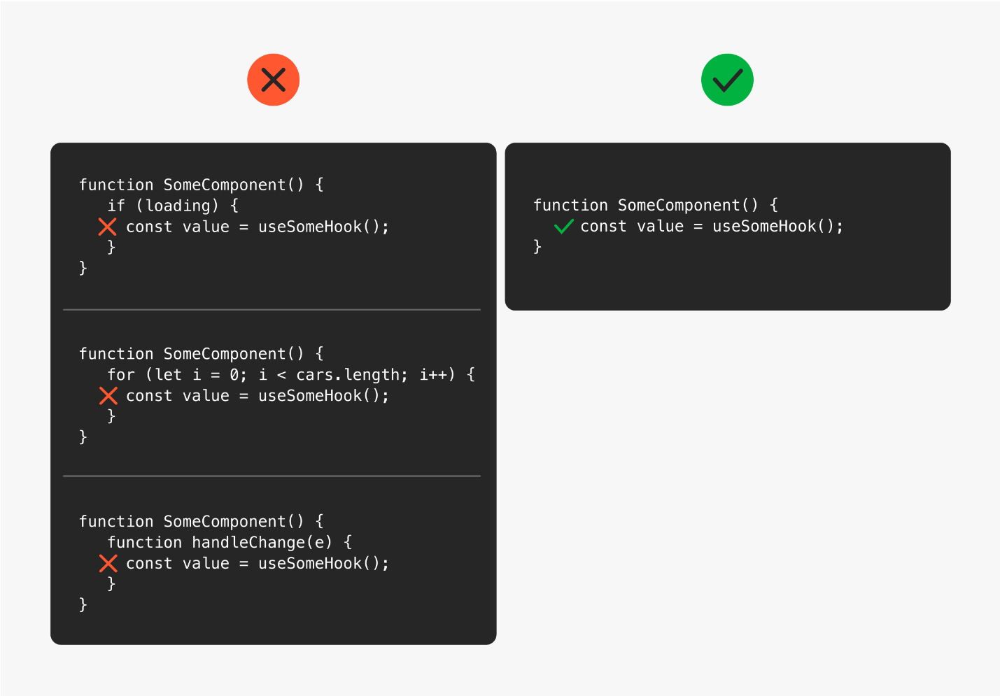
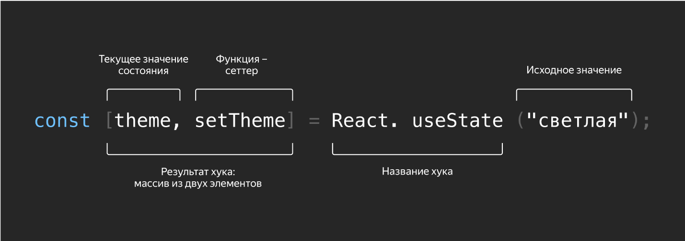
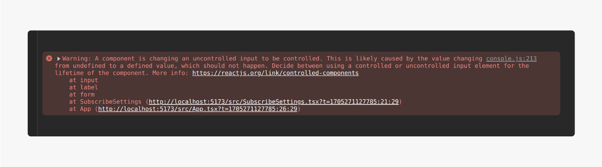
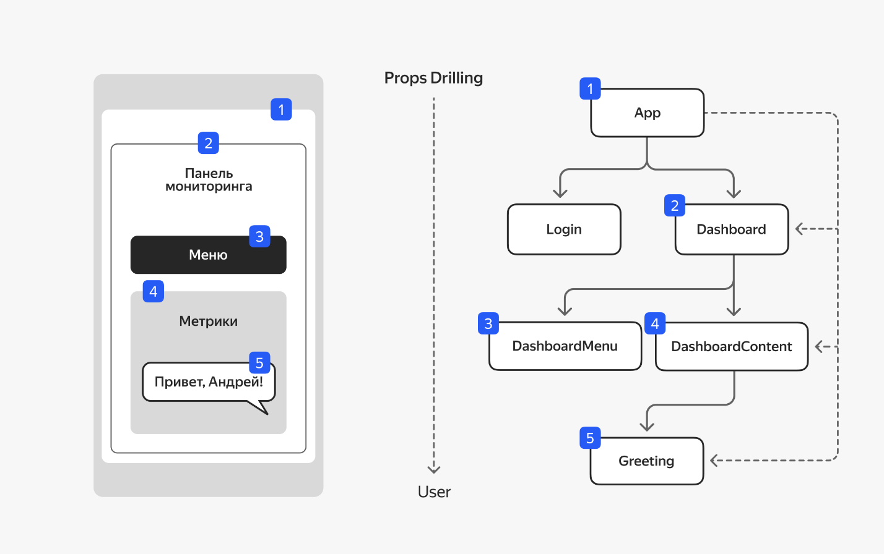

**Введение в хуки**

С этого урока вы начнёте изучать хуки — один из основных инструментов в React. Сам по себе функциональный компонент может только выводить разметку на страницу, используя данные, полученные из пропсов. Чтобы функциональные компоненты умели делать что-то ещё, необходимо использовать хуки.

Хук — это специальная функция, использующая данные, которые должны сохраняться между перерендерами компонента. С помощью хуков мы можем наделить наши компоненты дополнительной функциональностью. Например:

позволить функциональным компонентам сохранять данные между перерендерами,

вызывать различные эффекты при монтировании и размонтировании компонентов,

получать доступ к DOM-элементам.

Работать без хуков — всё равно что делать бургер без котлеты. Вроде бы можно, но как-то странно, и это будет уже не бургер. Поэтому знать их и уметь использовать важно каждому разработчику, который работает с React.

**Правила использования хуков**

При использовании хуков необходимо придерживаться следующих правил:

Названия хуков всегда начинаются с приставки use (например, useState).

Хуки можно использовать только внутри функциональных компонентов или внутри кастомных (самостоятельно написанных) хуков.

Хуки нельзя вызывать внутри условных конструкций, циклов или функций, определённых внутри компонента.



Для работы каждого хука необходимо какое-то состояние, и React внутри себя использует порядковый номер вызова каждого хука, чтобы ассоциировать с ним данные в хранилище.

Поэтому обычно все необходимые компоненту хуки вызываются в самом начале его кода, до остальной логики и разметки.

**Стандартные хуки библиотеки React**

Библиотека React предоставляет набор готовых для использования хуков. Рассмотрим кратко основные хуки из этого набора.

**useState**

Хук useState позволяет наделить функциональный компонент состоянием. При изменении этого состояния компонент будет перерендериваться, а само состояние будет сохраняться между этими перерендерами. Этот хук мы рассмотрим подробнее в следующем уроке.

**useEffect**

Хук useEffect позволяет выполнять различные эффекты при монтировании, размонтировании и изменении состояния функционального компонента. Он выполняется сразу после того, как компонент будет отрисован браузером. Этот хук мы рассмотрим подробно в пятом уроке.

**useLayoutEffect**

Хук useLayoutEffect похож на хук useEffect, но он выполняется после того, как React выполнит все необходимые изменения в DOM, и до того, как компонент будет отрисован. Более подробно этот хук будет рассмотрен в седьмом уроке.

**useRef**

Хук useRef используется для хранения ссылки на DOM-элемент или для хранения данных между перерендерами компонента, изменения которых не должны приводить к перерисовке компонента. Этот хук будет рассмотрен подробнее в шестом уроке.

**useReducer**

Этот хук — альтернатива хуку useState. В качестве дополнительного аргумента он принимает функцию вида (state, action) => newState, что позволяет производить более сложные вычисления при изменении состояния.

**useCallback**

Хук useCallback позволяет мемоизировать ссылку на функцию, которая изменяется только если изменяется значение одной из зависимостей данного хука. Этот хук будет рассмотрен подробнее при обсуждении темы оптимизации в 12 спринте.

**useMemo**

Хук useMemo позволяет мемоизировать результат некоторых вычислений. Повторное вычисление результата производится только если изменяется одна из зависимостей данного хука. Это хук будет рассмотрен подробнее при обсуждении темы оптимизации в 12 спринте.

**useContext**

Хук useContext позволяет нескольким компонентам совместно использовать некоторое состояние, не прибегая при этом к прокидыванию его через пропсы.

О том, какие ещё есть стандартные хуки в библиотеке React, можно почитать [<span class="underline">тут</span>](https://react.dev/reference/react/hooks).


    Какой хук нужно использовать для хранения состояния, изменение которого не вызывает перерендер компонента?

 - useState


useRef

Верно\! В этом случае мы можем модифицировать состояние напрямую и это не будет вызывать перерисовку компонента.


useMemo

Неверно. Этот хук используется для оптимизации, а не для хранения состояния компонента.


 

    Какой хук нужно использовать, чтобы выполнить запрос на сервер при монтировании компонента?

- useLayoutEffect

 - useCallback

Правильный ответ

- useEffect

Верно\! Запрос на сервер будет выполнен сразу после отображения компонента.

 

Помимо использования стандартных хуков, можно создавать собственные. Это позволит вынести переиспользуемую логику из компонента. Код компонента станет проще и понятнее, его будет удобнее поддерживать и развивать. О написании кастомных хуков подробно поговорим в последнем уроке этого спринта.

При написании кода следует всегда помнить о правилах использования хуков и о том, какие именно хуки предоставляет в наше распоряжение библиотека React. Это позволит при необходимости сразу воспользоваться нужным хуком.

**Внутреннее состояние useState**

Хук useState позволяет добавить в функциональный компонент состояние, которое будет сохраняться при его перерендерах. При изменении этого состояния компонент будет перерисовываться. Наличие такого состояния позволяет реализовывать динамические компоненты, содержимое которых будет изменяться, например, при взаимодействии с ним пользователя.

Рассмотрим пример. Реализуем простое переключение между светлой и тёмной темами:


```TYPESCRIPT

function ThemeToggle() {

// Начальное состояние компонента и функция для изменения состояния

const [theme, setTheme] = useState("светлая");

// Обработчик клика на кнопку

const toggleTheme = () => {

// Вызов функции для изменения состояния

setTheme(theme === "светлая" ? "тёмная" : "светлая");

}

const themeClass = theme === "светлая" ? "th-light" : "th-dark";

const buttonImage = theme === "светлая" ? "🌚" : "🌞";

return (

<div className={themeClass}>

<p>Включена {theme} тема</p>

<button onClick={toggleTheme}>

{buttonImage}

</button>

</div>

);

}
```
Объявление двух локальных переменных происходит с помощью деструктурирующего присваивания из возвращаемого массива следующим образом:



Хук useState принимает единственный аргумент — начальное значение какой-либо переменной состояния, и сохраняет его в своём внутреннем хранилище. Взамен он возвращает пару сущностей в виде массива:

текущее значение, которое при первом вызове совпадает с начальным значением;

функцию-сеттер, с помощью которой его можно изменить.

Изменение состояния с помощью функции-сеттера гарантирует, что все, кто зависит от этого состояния, получат обновлённое значение.

Когда произойдёт вызов функции setTheme с новым значением, React обновит это значение в своём хранилище и инициирует перерисовку компонента, то есть вызовет саму функцию-компонент. В нашем случае ThemeToggle.

При этом повторный вызов хука useState вернёт уже другой массив: первый элемент в нём будет содержать новое значение, а функция-сеттер останется прежней.

**Мутации сложных объектов**

Если для стейта используются массивы или объекты с полями, важно избегать их изменений напрямую — всегда нужно передавать в функцию-сеттер новый объект. В противном случае React не сможет понять, что состояние компонента изменилось и нужно его перерисовать. Для создания нового объекта удобно использовать spread-оператор ..., который создаёт изменённую копию исходного объекта.

Если мы храним в стейте массив, то обновление стейта будет выглядеть так:


```TYPESCRIPT

const [array, setArray] = useState(["Раз", "Два", "Три" ]);

// Так нельзя\!

array.push("Четыре");

setArray(array);

// Нужно делать так:

setArray([...array, "Четыре"]);
```
Если в стейте хранится объект, то обновить состояние можно следующим образом:


```TYPESCRIPT

type TPerson = {

name: string,

surname: string

};

const [person, setPerson] = useState<TPerson>({

name: "Василий",

surname: "Свиридов"

});

// Так нельзя\!

person.name = "Иван";

setPerson(person);

// Нужно делать так

setPerson({

...person,

name: "Иван"

});
```
**Вычисление начального состояния**

Аргумент хука useState — это начальное состояние, которое используется только во время начального рендеринга. Если начальное состояние является результатом каких-то вычислений, можно вместо него предоставить функцию, которая будет выполняться только при начальном рендеринге. Рассмотрим пример:


```TYPESCRIPT

const [storedValue, setStoredValue] = useState(() => {

try {

const item = localStorage.getItem("item");

return item ? JSON.parse(item) : "";

} catch {

return "";

}

});
```
Здесь мы пытаемся получить начальное состояние из локального хранилища по ключу item и распарсить его прежде, чем использовать. Если данных в локальном хранилище нет или их не удалось распарсить, возвращаем в качестве начального значения пустую строку.

**Использование предыдущего значения состояния**

Иногда для вычисления нового значения состояния нам нужно знать текущее. В этом случае мы можем передать в функцию-сеттер другую функцию, которая получает на вход текущее значение состояния и возвращает новое:


```TYPESCRIPT

const [count, setCount] = useState(0);

function handleClick() {

setCount(prevCount => prevCount + 1);

}
```
Это может быть полезно, когда текущее значение состояния нам недоступно — например, когда мы передали функцию-сеттер в дочерний компонент. Или для того, чтобы избежать запоминания стейта в замыкании.

Также это может помочь произвести несколько обновлений состояния за один раз. Представим, что функция handleClick в приведённом выше примере выглядела бы так:


```TYPESCRIPT

function handleClick() {

setCount(count + 1);

setCount(count + 1);

setCount(count + 1);

}
```
Тогда после одного клика значение счётчика стало бы равно 1. Так произойдёт потому, что функция-сеттер не обновляет значение состояния сразу в текущем коде, а только при перерисовке компонента после завершения выполнения функции handleClick.

Перепишем функцию handleClick следующим образом:


```TYPESCRIPT

function handleClick() {

setCount(prevCount => prevCount + 1);

setCount(prevCount => prevCount + 1);

setCount(prevCount => prevCount + 1);

}
```
Теперь после одного клика значение состояния count будет равно 3. React поместит эти три функции prevCount => prevCount + 1 в очередь, и они будут последовательно вызваны для обновления состояния при следующей перерисовке компонента.

Вы познакомились с хуком useState, который позволяет наделять функциональные компоненты собственным состоянием. При использовании этого хука со сложными объектами необходимо помнить об особенностях мутации таких объектов, чтобы не столкнуться с трудными для отладки ошибками.

[Практика4-2](project42.zip)

Перед вами функциональный компонент, отображающий на странице кнопку. Текст на кнопке показывает значение счетчика. Сейчас счетчик всегда равен нулю. Нужно сделать так, чтобы при нажатии на кнопку значение счетчика увеличивалось на единицу, и текст на кнопке обновлялся соответствующим образом.

Вам необходимо:

Добавить в компонент состояние для хранения значения счетчика.

Добавить обработчик клика на кнопку.

**Эффективный useEffect**

В этом уроке вы узнаете, как выполнять побочные эффекты в функциональных компонентах.

Побочные эффекты — это различные действия, которые требуется произвести при монтировании или размонтировании компонента или при изменении его состояния. Например, запросы данных с сервера или подписка на события и отписка от них.

Для выполнения побочных эффектов используется хук useEffect.

**Массив зависимостей хука useEffect**

Хук useEffect принимает два параметра. Первый аргумент — функция обратного вызова, в которой мы будем выполнять побочные эффекты. Второй — массив зависимостей, он необязательный.

Если не передать второй аргумент, побочный эффект в функции обратного вызова будет запускаться снова после каждой отрисовки компонента:


```TYPESCRIPT

function SomeComponent() {

useEffect(() => {

// Этот побочный эффект будет выполняться после каждой отрисовки компонента

});

}
```
Если мы передаём второй аргумент в виде пустого массива, побочный эффект в функции обратного вызова сработает только один раз после первого рендера компонента.


```TYPESCRIPT

function SomeComponent() {

useEffect(() => {

// Этот побочный эффект будет выполнен только один раз

// после первого рендера компонента

}, []);

}
```
  Можно передать во втором аргументе пропсы и состояния. Тогда побочный эффект в функции обратного вызова будет выполняться после первого рендера компонента и после последующих перерендеров, вызванных изменениями значений пропсов или переменных состояния.


```TYPESCRIPT

function SomeComponent({prop}: TSomeType) {

const [state, setState] = useState("");


useEffect(() => {

// Этот побочный эффект будет выполняться после первого рендера

// и после последующих перерендеров, вызванных изменениями значений

// пропса prop или состояния state

}, [prop, state]);

}
```
  Стоит отметить, что useEffect использует только поверхностное (shallow) сравнение значений зависимостей. Если значение зависимости представляет собой массив или объект, то эффект будет вызван повторно только тогда, когда в зависимость будет передан новый массив или объект. Изменения элементов массива или полей объекта хук useEffect обнаружить не сможет.

  **Функция очистки хука useEffect**

   Второй аргумент хука useEffect позволяет запускать побочные эффекты после первого рендера компонента и **после** каждого обновления значения его пропса или состояния.

   Однако иногда бывает нужно запустить побочные эффекты тогда, когда компонент размонтируется или **перед** изменением значения его пропса или состояния. Для этого можно воспользоваться функцией очистки. Эту функцию нужно вернуть из колбэка, переданного в хук useEffect:

   

```TYPESCRIPT

function SomeComponent() {

useEffect(() => {

// Этот побочный эффект выполняется после первого рендера компонента

return () => {

// Этот побочный эффект выполняется при размонтировании компонента

}

}, []);

}
```
   Рассмотрим примеры реального использования.

   В качестве первого примера возьмём компонент, отображающий модальное окно. Мы хотим, чтобы была возможность закрывать это окно по нажатию на клавишу Esc. Чтобы реализовать такую функциональность, необходимо подписаться на событие нажатия на клавишу Esc при монтировании компонента, а при размонтировании компонента мы должны отписаться от этого события:


```TYPESCRIPT

type TModalProps = {

onClose: () => void

}


function Modal({onClose}: TModalProps) {

useEffect(() => {

const handleEscape = (e: KeyboardEvent) => {

e.key == "Escape" && onClose();

};


document.addEventListener("keydown", handleEscape);


return () => {

document.removeEventListener("keydown", handleEscape);

};

}, []);

}
```
   Рассмотрим другой пример. Предположим, что пользователь вводит некоторый текст и необходимо отправить на сервер поисковый запрос с этим текстом:


```TYPESCRIPT

function SearchForm() {

const [query, setQuery] = useState("");

const [result, setResult] = useState("");


useEffect(() => {

if (\!query) {

setResult("");

return;

}


const controller = new AbortController();

const signal = controller.signal;


fetch(API, {

signal,

body: JSON.stringify({query})

})

.then(response => response.json())

.then(response => setResult(response.data))


return () => {

// Отменяем запрос

controller.abort();

}

}, [query]);

}
```
В стейте query хранится текст, по которому нужно осуществлять поиск, а в стейт result записываются результаты запроса.

При монтировании компонента оба значения пустые, и useEffect не выполняет никаких полезных действий. Когда пользователь вводит текст для поиска, изменяется значение стейта query, после чего useEffect выполняет свой колбэк.

Колбэк отправляет запрос на сервер с введённым текстом и возвращает функцию очистки. Если до завершения этого запроса пользователь изменит текст, то, прежде чем выполнять новый запрос с новым текстом, нужно сначала отменить старый запрос.

Перед тем как перерисовывать компонент с новым значением стейта query и выполнять колбэк хука useEffect ещё раз, будет вызвана функция очистки, которая и отменит предыдущий запрос.

Использование большого количества хуков useEffect с различными зависимостями в одном компоненте — признак плохого кода. Логику работы компонента, распределённую по этим хукам, будет очень сложно воспринимать и прослеживать.

[Проект43](project43.zip)

Перед вами компонент, отображающий электронные часы. Необходимо сделать так, чтобы время на часах обновлялось каждую секунду.

Вам нужно добавить в компонент:

Состояние для хранения текущего значения времени.

Эффект, создающий таймер для обновления времени.

**useRef и работа с DOM**

В этом уроке расскажем о хуке useRef из библиотеки React. Этот хук позволяет компоненту взаимодействовать с DOM-элементами или запоминать данные, изменение которых ему не требуется отслеживать.

Вот так выглядит вызов этого хука:


```TYPESCRIPT

const ref = useRef<TSomeType>(initialValue)
```
Хук useRef возвращает объект, у которого есть только одно поле current. Изначально значение current равно initialValue. Возвращаемый объект будет существовать в течение всей жизни компонента, поэтому в нём можно хранить какие-то данные между перерендерами компонента, не используя при этом стейт.

**Сохранение значений между перерендерами компонента**

Хук useState возвращает функцию-сеттер для изменения хранящегося в нём значения, и вызов этой функции приводит к перерендеру компонента. В отличие от хука useState, присваивание нового значения полю current того объекта, что нам возвращает хук useRef, не приводит к перерендерам компонента.

Рассмотрим пример:


```TYPESCRIPT

type TExchangeRateProps = {

rate: number;

}

const ExchangeRate = ({ rate }: TExchangeRateProps) => {

const rateRef = useRef<number | null>(null);

const [color, setColor] = useState('gray');

useEffect(() => {

const oldRate = rateRef.current;

if (rate > oldRate) {

setColor('green');

} else if (rate < oldRate) {

setColor('red');

} else {

setColor('gray');

}

// Не забываем обновить значение вручную

rateRef.current = rate;

}, [rate]);

return <div style={{ color }}>{rate}</div>;

}
```
Компонент ExchangeRate выводит курс валюты. При этом мы хотим, чтобы при росте курса значение выводилось зелёным цветом, при падении курса — красным, а если курс не изменился — серым.

Значение курса передаётся в компонент через пропс rate. Каждый раз, когда значение в этом пропсе изменяется, запускается колбэк, переданный в хук useEffect. В этом колбэке для вычисления корректного цвета текста нам нужно знать также предыдущее значение пропса rate. В этом нам и помогает хук useRef.

В начале колбэка мы извлекаем из объекта, хранимого в useRef, предыдущее значение курса. В конце колбэка записываем в него текущее значение курса, чтобы использовать это значение в качестве предыдущего при следующем изменении курса.

**Сохранение ссылки на DOM-элемент**

Иногда нам может потребоваться обратиться к некоторому DOM-элементу из функционального компонента напрямую. Например, чтобы переместить на него фокус ввода или проскроллить до него.

Поскольку до обработки компонента библиотекой React и его монтирования никакие его дочерние DOM-элементы ещё не существуют, мы не можем получить доступ к ним обычными средствами. Здесь нам тоже может помочь хук useRef.

Рассмотрим пример:


```TYPESCRIPT

const TextInput = () => {

const inputRef = useRef<HTMLInputElement | null>(null);

useEffect(() => {

inputRef.current\!.focus();

}, []);

return (

<div>

<label htmlFor="name">Name</label>

<input id="name" ref={inputRef} />

</div>

);

};
```
Здесь нам требуется выставить фокус ввода на поле ввода при отображении компонента. Мы создаём новый реф inputRef и привязываем его к атрибуту ref поля ввода. После того как компонент TextInput будет смонтирован, React поместит ссылку на DOM-элемент, соответствующий полю ввода, в inputRef.current. После этого будет вызван колбэк, переданный в useEffect, и в нём с помощью вызова метода focus() будет выставлен фокус на поле ввода.

**ref Callback**

В предыдущем примере мы передавали в атрибут ref DOM-элемента реф, который нам вернул хук useRef.

Вместо этого мы можем передать в атрибут ref колбэк, который принимает единственный аргумент — ссылку на соответствующий DOM-элемент.

Этот колбэк будет вызван сразу же после создания DOM-элемента, с которым он связан, и ещё раз с аргументом null, перед тем как этот элемент будет удалён.

Если колбэк определён как встроенная функция в месте привязки к атрибуту ref, он будет вызван два раза: сначала с аргументом, равным null, и потом уже со ссылкой на связанный с ним DOM-элемент.

Такой подход может оказаться полезным, если требуется выполнить какой-то побочный эффект, когда React присоединяет или отсоединяет реф от DOM-элемента.

В приведённом ниже примере мы выводим список данных и хотим, чтобы список автоматически проскролливался до последнего элемента, когда элемент добавляется в список:


```TYPESCRIPT

type TUser = {

id: string;

name: string;

}

type TUserListProps = {

users: Array<TUser>

}

function scrollTo(el: HTMLLIElement | null) {

// При первой отрисовке или при размонтировании

// el будет равен null, поэтому нужно добавить проверку

if (el) {

el.scrollIntoView({ behavior: "smooth" });

}

}

function UserList({ users }: TUserListProps) {

return (

<ul>

{users.map((user, i) => {

const isLast = i === users.length - 1;

// ref callback, осуществляющий скролл до последнего элемента

return (

<li

key={user.id}

ref={isLast ? scrollTo : undefined}

>

{user.name}

</li>

);

})}

</ul>

);
```
Повторим: хук useRef может быть полезным в следующих случаях:

Если нужно получить доступ к DOM-элементу из функционального компонента.

Если нужно сохранять какие-то данные между перерендерами функционального компонента и при этом иметь возможность изменять их напрямую, не вызывая при этом перерисовки компонента.

[Проект44](project44.zip)

На экране простой компонент: заголовок с текстом «Я меняю свой цвет» и кнопка «Изменить цвет». Необходимо сделать так, чтобы при нажатии на кнопку фон заголовка менялся на золотой (gold).

**Работа с формами**

В этом уроке вы разберёте, как работать с формами в React-приложениях. Формы часто используются для того, чтобы изменить или ввести какие-то данные перед отправкой на сервер (например, для авторизации или регистрации пользователя в приложении).

В React HTML-элементы формы ведут себя не так, как остальные DOM-элементы. Причина кроется в их собственном внутреннем состоянии. Рассмотрим, как работать с каждым элементом формы и как обрабатывать множество полей одним обработчиком.

**Управляемые компоненты**

Поля ввода, такие как input, textarea и select, обычно обладают собственным состоянием и обновляют его, когда пользователь вводит данные.

React позволяет связать события изменения и значение поля ввода в компоненте с кодом компонента, который содержит это поле ввода. Такие поля ввода называются «управляемые компоненты». Их значения синхронизируются с состоянием компонента. Это удобно, потому что позволяет управлять содержимым форм напрямую из JavaScript.

Вот пример управляемого компонента:


```TYPESCRIPT

function Input() {

// Состояние, в котором содержится значение поля ввода

const [value, setValue] = useState("");

// Обработчик изменения поля ввода обновляет состояние

function handleChange(e: ChangeEvent<HTMLInputElement>) {

setValue(e.target.value);

}

return (

// Значение элемента «привязывается» к значению состояния

<input type="text" value={value} onChange={handleChange} />

);

}
```
А вот похожий пример, только с textarea и кнопкой сброса введённого текста:


```TYPESCRIPT

function NewMessage() {

const [value, setValue] = useState('');

function handleChange(e: ChangeEvent<HMTLTextAreaElement>) {

setValue(e.target.value);

}

function resetValue() {

setValue('');

}

return (

<>

<textarea type="text" value={value} onChange={handleChange} />

<button onClick={resetValue}>Очистить</button>

</>

);

}
```
В этом примере нажатие на кнопку «Очистить» сбросит значение value.

**Неуправляемые компоненты**

Чтобы не создавать обработчик для каждого события, в React есть возможность использовать неуправляемые компоненты. Такие компоненты используют DOM как источник данных, доступ к которому можно получить через ref:


```TYPESCRIPT

function BlogpostTitleInput() {

const input = useRef<HTMLTextAreaElement|null>(null);

function handleSubmit(e: SyntheticEvent) {

alert("Заголовок поста в блоге: " + input.current.value);

e.preventDefault();

}

return (

<form onSubmit={handleSubmit}>

<label>

Заголовок:

<textarea ref={input} />

</label>

<button type="submit">Отправить</button>

</form>

);

}
```
Изменения в поле ввода здесь не соединены с компонентом и не влияют на его внутреннее состояние. Это делает код более производительным, но в большинстве случаев вы не заметите разницы.

Неуправляемые компоненты можно использовать при интеграции React с другим кодом. У неконтролируемых полей ввода есть дополнительная возможность — значение по умолчанию. Это специальный атрибут, который будет использован при первичном монтировании компонента для инициализации поля ввода, чтобы, например, заполнить форму для редактирования начальными данными. Особенность значения по умолчанию в том, что дальнейшие его изменения не повлекут за собой дополнительного рендеринга:


```TYPESCRIPT

<textarea ref={input} defaultValue="Привет, мир\!" />
```
Строка «Привет, мир\!» уже будет записана в textarea.

**Загрузка файлов**

Поле ввода <input type="file"> позволяет выбрать один или несколько файлов для загрузки с устройства на сервер:


```TYPESCRIPT

function AvatarInput() {

const fileInput = useRef<HTMLInputElement|null>(null);

function handleSubmit(e: SyntheticEvent) {

e.preventDefault();

alert(`Новый аватар - ${fileInput.current.files[0].name}`);

}

return (

<form onSubmit={handleSubmit}>

<label>

Выберите фото:

<input type="file" ref={fileInput} />

</label>

<button type="submit">Сохранить</button>

</form>

);

}
```
В React <input type="file"> всегда неуправляемый компонент: его значение нельзя установить средствами JS, это может сделать только пользователь.

**Работа с select**

В HTML выбранный пункт списка в <select> отмечается с помощью атрибута selected у тега <option>. В React для удобства используется атрибут value у тега select. Это позволяет обновлять значение только в одном месте, а не во всех <option>:


```TYPESCRIPT

const EmployeeRole = () => {

const [role, setRole] = useState('designer');

const handleChange = (event: ChangeEvent<HTMLSelectElement>) => {

setRole(event.target.value);

}

return (

<label>

Ваша роль в проекте:

<select value={role} onChange={handleChange}>

<option value="designer">Дизайнер</option>

<option value="developer">Разработчик</option>

<option value="teamlead">Тимлид</option>

<option value="project-manager">Руководитель проекта</option>

</select>

</label>

);

}
```
<select> можно использовать и для множественного выбора:


```TYPESCRIPT

<select multiple={true} value={['cheddar', 'mozzarella']}>

...

</select>
```
Поля ввода <input type="text">, <textarea> и <select> работают очень похоже. Они принимают атрибут value и позволяют получить доступ к значению в событии onChange через event.target.value.

**Работа с checkbox и radio**

Для <input type="radio"> необходимо проверять установленное значение на соответствие value и использовать результат этой проверки в атрибуте checked:


```TYPESCRIPT

const SelectAppearance = () => {

const [mode, setMode] = useState('dark');

const onValueChange = (e: ChangeEvent<HTMLInputElement>) => {

setMode(e.target.value);

}

const formSubmit = (e: SyntheticEvent) => {

e.preventDefault();

console.log(mode)

}

return (

<form onSubmit={formSubmit}>

<div>

<label>

<input

type="radio"

value="light"

checked={mode === "light"}

onChange={onValueChange}

/>

Светлая тема

</label>

</div>

<div className="radio">

<label>

<input

type="radio"

value="dark"

checked={mode === "dark"}

onChange={onValueChange}

/>

Тёмная тема

</label>

</div>

<button type="submit">

Submit

</button>

</form>

);

}
```
Этот тип поля также принимает атрибут value и позволяет получить доступ к значению в событии onChange через e.target.value. При этом атрибут checked должен быть булевого типа.

Для чекбоксов применяются те же правила, только в e.target будет не value, а checked:


```TYPESCRIPT

const RememberOnLogIn = () => {

const [checked, setChecked] = useState(true);

const onChange = (e) => {

// Тут у event.target используем свойство checked

setState(e.target.checked);

}

return (

<label>

Запомнить меня и больше не разлогинивать

<input

name="rememberMe"

type="checkbox"

checked={checked}

onChange={onChange}

/>

</label>

);

}
```
Как и у radio, у чекбоксов атрибут checked должен быть булевого типа.

**Обработка нескольких полей одним обработчиком**

Для обработки нескольких полей ввода одним обработчиком нужно назначить каждому полю атрибут name и подготовить структуру состояния так, чтобы ключи состояния совпадали с этими атрибутами полей.

В самом обработчике у нас есть доступ к событию, а в нём — к e.target.name. С использованием вычисляемых имён свойств и name мы можем адресно записывать изменения в состояние:


```TYPESCRIPT

const SubscribeSettings = () => {

const [state, setState] = useState({

// Соответствует полю ввода subscribed

subscribed: false,

// Соответствует полю ввода email

email: ''

})

const handleInputChange = (event: ChangeEvent<HTMLInputElement>) => {

const target = event.target;

// Определяем, откуда пришло событие: из чекбокса или текстового поля ввода

const value = target.type === 'checkbox' ? target.checked : target.value;

const name = target.name;

// Применяем вычисляемые имена свойств

setState({

...state,

[name]: value

});

}

return (

<form>

<label>

Получать уведомления

<input

name="subscribed"

type="checkbox"

checked={state.subscribed}

onChange={handleInputChange}

/>

</label>

<label>

E-mail:

<input

disabled={state.subscribed}

name="email"

type="text"

value={state.email}

onChange={handleInputChange}

/>

</label>

</form>

);

}
```
Для написания универсального обработчика события onChange полей ввода можно также использовать замыкания. Тогда этот пример можно переписать следующим образом:


```TYPESCRIPT

const SubscribeSettings = () => {

const [state, setState] = useState({

// Соответствует полю ввода subscribed

subscribed: false,

// Соответствует полю ввода email

email: ''

})

const handleInputChange =

(name: string) => (event: ChangeEvent<HTMLInputElement>) => {

const target = event.target;

// Определяем, откуда пришло событие: из чекбокса или текстового поля ввода

const value = target.type === 'checkbox' ? target.checked : target.value;

setState({

...state,

[name]: value

});

}

return (

<form>

<label>

Получать уведомления

<input

name="subscribed"

type="checkbox"

checked={state.subscribed}

onChange={handleInputChange("subscribed")}

/>

</label>

<label>

E-mail:

<input

disabled={state.subscribed}

name="email"

type="text"

value={state.email}

onChange={handleInputChange("email")}

/>

</label>

</form>

);

}
```
Использование универсального обработчика значительно экономит время по сравнению с написанием обработчиков для каждого поля.

**Ошибка смены режима**

При работе с управляемым компонентом нужно быть очень внимательными по отношению к тому, каким значением инициализируется стейт компонента, который связан с полем ввода.

Например, в предыдущем примере начальное значение поля email у объекта, переданного в хук useState, может оказаться равным null или undefined. Это случится, если данные для инициализации приходят с сервера. В результате React будет считать поле ввода, к которому привязан этот стейт, неуправляемым.

Но как только пользователь изменит значение в этом поле ввода, то в обработчике handleInputChange значение атрибута value будет обновлено. В него запишется строка, введённая пользователем, и React станет считать компонент управляемым.

При этом на консоль будет выведено предупреждение:



Чтобы не столкнуться с подобной ошибкой, нужно убедиться, что в поле ввода управляемого компонента всегда передаётся строка, хотя бы пустая.

В нашем примере это можно сделать, например, так:


```TYPESCRIPT

<label>

E-mail:

<input

disabled={state.subscribed}

name="email"

type="text"

value={state.email ?? ""}

onChange={handleInputChange("email")}

/>

</label>
```
Ошибка смены режима может приводить к другим ошибкам и потере информации при вводе, а также влияет на оптимизацию и управление ререндерами. В целом наличие такой ошибки свидетельствует о недостаточном проектировании.

Мы должны с самого начала принимать решение о том, в каком режиме должен работать компонент (управляемом или неуправляемом), и всё время его придерживаться. Это позволит библиотеке React выполнять свою работу наиболее оптимальным образом и поможет избежать появления дополнительных ошибок в остальном коде.

**Управляемые или неуправляемые**

Подведём итог:

Если для поля ввода задан атрибут value и его значение связано со стейтом компонента — этот компонент управляемый.

Если для поля ввода **не** задан атрибут value и задан атрибут ref — это неуправляемый компонент.

Управляемые компоненты предоставляют больше контроля и гибкости. Мы имеем возможность реагировать на изменение состояния немедленно, поскольку имеем к этому состоянию непосредственный доступ. Это делает их более подходящими для реализации сложной логики и валидации. Минус в том, что любое изменение значения в поле ввода вызывает перерендер компонента, поскольку связано с его состоянием.

Неуправляемые компоненты проще, и работа с ними очень похожа на работу с полями ввода в обычных веб-приложениях. Они могут быть лучшим выбором, если вы:

Переводите свою кодовую базу на React и хотите минимизировать изменения.

Работаете с простой формой, в которой не требуется немедленно реагировать на изменения в полях ввода.

[Проект45](project45.zip)

Перед вами компонент, отображающий форму с полем ввода имени пользователя и кнопкой отправки данных формы. Необходимо сделать поле ввода имени пользователя управляемым компонентом. А ещё дописать обработчики событий изменения значения в поле ввода и отправки формы так, чтобы при нажатии на кнопку введённое в поле имя пользователя выводилось в консоль.

**Подъём состояния через пропсы**

Иногда в нескольких компонентах требуется использовать одни и те же данные. Некоторые компоненты могут влиять на эти данные, а остальные должны моментально реагировать на изменения, перерисовывая разметку.

В таком случае удобно поднять состояние взаимосвязанных компонентов до общего родителя. Тогда во всех частях интерфейса всегда будут отображаться актуальные данные и появится возможность изменить состояние из любого дочернего компонента.

Рассмотрим пример. Допустим у нас есть компонент, который хранит данные о текущем пользователе и передаёт его вниз в дочерние компоненты:


```TYPESCRIPT

type TUser = {

name: string;

}

const App = () => {

const [user, setUser] = useState<TUser | null>(null);

const handleLogin = (user: TUser) => setUser(user);

return (

<div>

<Header />

{ user

? <Dashboard user={user} />

: <Login onLogin={handleLogin} />

}

<Footer />

</div>

);

};
```
Компоненту Dashboard требуются данные о пользователе, чтобы отобразить их на экране. Компонент Login изменяет эти данные, поэтому они и были подняты в родительский компонент App.

Этот подход довольно удобен, но, если данные прокидываются на несколько уровней вложенности, это может привести к проблеме.

Допустим, что компонент Dashboard реализован следующим образом:


```TYPESCRIPT

type TUserProps = {

user: TUser

};

const Dashboard = ({user}: TUserProps) => {

return (

<div>

<h2>Панель мониторинга</h2>

<DashboardMenu />

<DashboardContent user={user} />

</div>

);

};

const DashboardMenu = () => {

return (

<div>

<h2>Меню</h2>

</div>

);

};

const DashboardContent = ({user}: TUserProps) => {

return (

<div>

<h2>Метрики</h2>

<Greeting user={user} />

</div>

);

};

const Greeting = ({user}: TUserProps) => {

return <p>Привет, { user.name }\!</p>;

};
```
Обратите внимание, что данные пользователя нужны лишь в компоненте Greeting. Мы передаём пропс user на 4 уровня вниз по иерархии и при этом не используем в промежуточных компонентах.

Такая проблема носит название **Props Drilling**.



Важно понимать, что подобное решение противоречит принципу DRY и написанию компонентов простых и гибких для переиспользования. Кроме того, это может вызвать снижение производительности, так как лишние пропсы могут приводить к лишним перерендерам.

Решить эту проблему можно с помощью композиции, правильно реорганизовав компоненты:


```TYPESCRIPT

type TDashboardProps = {

children: ReactNode

};

const Dashboard = ({children}: TDashboardProps) => {

return (

<div>

<h2>Панель мониторинга</h2>

{children}

</div>

);

};

const DashboardMenu = () => {

return (

<div>

<h2>Меню</h2>

</div>

);

};

type TDashboardContentProps = {

children: ReactNode

};

const DashboardContent = ({children}: TDashboardContentProps) => {

return (

<div>

<h2>Метрики</h2>

{children}

</div>

);

};

type TGreetingProps = {

text: string;

};

const Greeting = ({text}: TGreetingProps) => {

return <p>{text}\!</p>;

};
```
Тогда компонент App примет следующий вид:


```TYPESCRIPT

const App = () => {

const [user, setUser] = useState<TUser | null>(null);

const handleLogin = (user: TUser) => setUser(user);

return (

<div>

<Header />

<>

{ user

? (

<Dashboard>

<DashboardMenu />

<DashboardContent>

<Greeting text={`Привет, ${ user.name }\!`} />

</DashboardContent>

</Dashboard>

)

: <Login onLogin={handleLogin} />

}

</>

<Footer />

</div>

);

};
```
Обратите внимание на компонент Dashboard — он стал более кастомизируемым. Теперь мы можем добавлять в него различные блоки или скрывать их с минимальными изменениями API-компонента. Например, скрыть DashboardMenu, если в другом кейсе на странице его нет.

Главное, что мы решили проблему с **Props Drilling**. Компонент Greeting стал максимально гибким, теперь можно его использовать и вне самого Dashboard.

Но у этого решения есть небольшой недостаток, так как не совсем очевидно, чем является children у компонента Dashboard.

Этот недостаток можно устранить двумя способами:

1.  Можно передавать в компонент Dashboard отдельные компоненты через пропсы:


```TYPESCRIPT

type TDashboardProps = {

menu: ReactNode;

content: ReactNode;

};

const Dashboard = ({ menu, content }: TDashboardProps) => {

return (

<div>

<h2>Панель мониторинга</h2>

{menu}

{content}

</div>

);

};

const App = () => {

const [user, setUser] = useState<TUser | null>(null);

const handleLogin = (user: TUser) => setUser(user);

return (

<div>

<Header />

<>

{user ? (

<Dashboard

menu={<DashboardMenu />}

content={

<DashboardContent>

<Greeting text={`Привет, ${user.name}\!`} />

</DashboardContent>

}

/>

) : (

<Login onLogin={handleLogin} />

)}

</>

<Footer />

</div>

);

};
```
2.  Можно передать в Dashboard в качестве children набор с именованными слотами:


```TYPESCRIPT

type TDashboardChildren = {

menu: ReactNode;

content: ReactNode;

};

type TDashboardProps = {

children: TDashboardChildren;

};

const Dashboard = ({ children }: TDashboardProps) => {

const { menu, content } = children;

return (

<div>

<h2>Панель мониторинга</h2>

{menu}

{content}

</div>

);

};

const App = () => {

const [user, setUser] = useState<TUser | null>(null);

const handleLogin = (user: TUser) => setUser(user);

return (

<div>

<Header />

<>

{user ? (

<Dashboard>

{{

menu: <DashboardMenu />,

content: (

<DashboardContent>

<Greeting text={`Привет, ${user.name}\!`} />

</DashboardContent>

),

}}

</Dashboard>

) : (

<Login onLogin={handleLogin} />

)}

</>

</div>

);

};
```
Мы рассмотрели, как поднимать общее состояние в родительский компонент. А также как наиболее эффективно решать проблему передачи некоторых пропсов через компоненты, которые не нуждаются в них, на множество уровней вниз (**Props Drilling**).

[Проект46](project46.zip)

В этом задании вы потренируетесь поднимать общее состояние в родительский компонент. В коде представлена заготовка конвертера температуры.

В файле src/components/temperature-input.tsx реализован компонент TemperatureInput, который позволяет вводить значение температуры в разных единицах измерения (градусах по Цельсию и по Фаренгейту). Единицы измерения, с которыми работает этот компонент, передаются в него через пропс scale.

В файле src/utils.ts содержатся вспомогательные функции для преобразования между единицами измерения температуры. Например, чтобы преобразовать строковое значение температуры в градусах по Фаренгейту в строковое значение температуры в градусах по Цельсию, можно использовать такой код:


```JSX

const celcius = tryConvert(fahrenheit, toCelsius);
```
В компоненте App отрисовываются два экземпляра компонента TemperatureInput: один для отображения температуры в градусах по Цельсию, второй — по Фаренгейту.

Необходимо поднять общее состояние этих компонентов в компонент App и дописать нужные обработчики событий так, чтобы при изменении значения температуры в одном поле ввода обновлялось значение температуры в другом поле ввода.

**Когда использовать useLayoutEffect**

Хук useEffect выполняет свой колбэк асинхронно и делает это уже после того, как компонент был отрисован. Это позволяет не опасаться, что выполнение колбэка может заблокировать отрисовку страницы в браузере.

Но из-за этого эффекты, которые влияют на расположение и внешний вид DOM-элементов на странице, не могут быть выполнены с помощью useEffect. Почему? Потому что это почти наверняка вызовет перемещение или мерцание элементов уже после их отображения на экране. Это будет выглядеть странно для пользователя приложения и неэффективно с точки зрения расходования ресурсов.


Эффект мерцания

Здесь на сцену выходит хук useLayoutEffect. Он очень похож на хук useEffect, но выполняет свой колбэк синхронно. То есть сразу после того, как React выполнит все изменения в DOM, и до того, как эти изменения будут отрисованы.


Без эффекта мерцания

В колбэке хука useLayoutEffect мы можем изменить расположение или внешний вид DOM-элемента. Но необходимо помнить, что длительные операции в его колбэке могут привести к блокировке отрисовки страницы.

Рассмотрим несколько примеров использования хука useLayoutEffect.

**1. Плавная прокрутка элемента**

Здесь хук useLayoutEffect используется для добавления плавной прокрутки для содержимого контейнера. Мы добавляем в качестве обработчика события прокрутки окна браузера функцию handleScroll. Эта функция плавно прокручивает содержимое контейнера вверх, используя метод scrollTo, в который передаётся объект { top: 0, behavior: 'smooth' } с опциями.


```TYPESCRIPT

function SmoothScrolling() {

const containerRef = useRef<HTMLDivElement | null>(null);

useLayoutEffect(() => {

const container = containerRef.current\!;

const handleScroll = () => {

// Плавная прокрутка содержимого контейнера вверх

container.scrollTo({

top: 0,

behavior: "smooth",

});

};

// Прокрутка содержимого контейнера вверх при монтировании компонента

handleScroll();

// Добавляем обработчик для прокручивания содержимого контейнера вверх

// при прокрутки пользователем самой страницы

window.addEventListener("scroll", handleScroll);

return () => {

window.removeEventListener("scroll", handleScroll);

};

}, []);

return (

<div ref={containerRef}>

{/* Содержимое контейнера */}

</div>

);
```
Хук useLayoutEffect выполняет первоначальную прокрутку при монтировании компонента и возвращает функцию очистки, в которой происходит отписка от события прокрутки окна браузера.

**2. Анимация DOM-элементов**

Этот блок кода показывает, как анимировать прозрачность элемента, используя хук useLayoutEffect. Начальное значения opacity устанавливается в 0 (элемент скрыт), а затем через 1 секунду меняется на 1, показывая элемент.


```TYPESCRIPT

function AnimatingElements() {

const elementRef = useRef<HTMLDivElement|null>(null);

useLayoutEffect(() => {

const element = elementRef.current;

// Анимируем прозрачность элемента при монтировании

element.style.opacity = 0;

setTimeout(() => {

element.style.opacity = 1;

}, 1000);

return () => {

// Очищаем анимацию при размонтировании

element.style.opacity = 0;

};

}, []);

return <div ref={elementRef}>Анимируй меня\!</div>;

};
```
useLayoutEffect применяет анимацию после того, как компонент будет смонтирован, а при размонтировании компонента значение opacity сбрасывается в 0.

**Итог**

Хук useLayoutEffect может помочь нам настроить внешний вид или расположение DOM-элементов перед их отрисовкой и избежать при этом нежелательных эффектов и мерцаний после отображения страницы в браузере.

[Проект47](project47.zip)

Перед вами кнопка с надписью «Показать всплывающую подсказку». При нажатии на эту кнопку происходит отображение всплывающей подсказки с текстом. При этом заметно мерцание: кнопка как бы перемещается из верхнего левого угла в нужное место. Чтобы этот эффект был более нагляден, в коде сделана искусственная задержка при отображении компонента Tooltip. В общем случае наличие и скорость мерцания зависит от используемого браузера, операционной системы и производительности компьютера.

Вам необходимо исправить код таким образом, чтобы этого мерцания не возникало.

**Кастомные хуки**

Иногда функциональности, предоставляемой стандартными хуками React, может оказаться недостаточно. В этом случае мы можем написать свой собственный (кастомный) хук. Это позволит вынести используемую в нескольких компонентах логику в одно место. Код станет проще для понимания и удобнее для использования и расширения в будущем. Рассмотрим несколько примеров.

**Рекомендации по созданию кастомных хуков**

Есть несколько рекомендаций, которые помогут сделать ваш код кастомных хуков более читаемым, модульным и удобным для использования. В целом стоит придерживаться правил и практик, используемых создателями библиотеки React в отношении своих собственных хуков.

**Не забывайте использовать приставку use в названиях своих хуков.** Например, useFetch. Это позволит отличить хук от обычных компонентов.

**Избегайте прямой работы с DOM.** Кастомные хуки должны избегать прямой работы с DOM-элементами и использовать для этой цели хук useRef.

**Не забывайте о правилах использования хуков.** Все хуки, которые вы используете при написании собственного хука, должны подчиняться общим правилам: не должны использоваться в условных операторах, циклах и вложенных функциях.

**Возвращайте массив или объект из кастомного хука.** Возвращайте массив или объект из кастомных хуков, как и в стандартных хуках. Если возвращается одно значение, массив или объект необязательны. Если возвращается два значения, массив будет достаточным. Если возвращается больше двух значений, лучше использовать объект.

**Документируйте свой код.** Хорошая документация помогает другим разработчикам понять, как использовать ваш хук и как он работает.

**Тестируйте свой код.** Тестирование помогает гарантировать, что ваш код работает должным образом и не приводит к ошибкам.

**useLocalStorage**

Напишем хук, который будет сохранять состояние компонента в локальном хранилище браузера. Это может оказаться полезным, например, для сохранения данных, введённых пользователем в поле ввода, при обновлении страницы.


```TSX

function useLocalStorage<T>(key: string, initialValue: T)

: [T, React.Dispatch<React.SetStateAction<T>>] {

const [value, setValue] = useState<T>(() => {

try {

const item = window.localStorage.getItem(key);

return item ? JSON.parse(item) : initialValue;

} catch {

return initialValue;

}

});

useEffect(() => {

try {

const item = JSON.stringify(value);

window.localStorage.setItem(key, item);

} catch (error: Error) {

console.log(error.message);

}

}, [value]);

return [value, setValue];

}
```
Хук принимает два параметра: key — ключ, под которым будут сохраняться данные в локальном хранилище, и initialValue — начальное значение произвольного типа.

При первом вызове хука useLocalStorage функция инициализации, переданная в хук useState, инициализирует стейт данными из локального хранилища. Если данных с указанным ключом key нет в локальном хранилище или их не удалось распарсить, стейт инициализируется переданным в хук useLocalStorage начальным значением initialState.

Хук возвращает массив, первый элемент которого — хранимое значение, а второй — функция-сеттер для его модификации. Если значение будет изменено с помощью возвращаемой функции-сеттера, вызовется колбэк, переданный в хук useEffect, и данные в локальном хранилище также обновятся.

**useUpdateEffect**

Напишем хук, который будет пропускать выполнение побочного эффекта при первом рендеринге компонента. Он может оказаться полезным, если мы хотим выполнять какую-то логику только после изменения зависимости:


```TYPESCRIPT

function useUpdateEffect(

cb: React.EffectCallback,

deps: unknown[] = []

) {

const firstRender = useRef(true)

useEffect(() => {

if (firstRender.current) {

firstRender.current = false

return

}

cb()

}, deps)

}
```
Хук useUpdateEffect принимает два параметра: колбэк cb, который должен вызываться при обновлении компонента, и массив зависимостей deps.

Флаг firstRender нужен, чтобы внутри колбэка, который передаётся useEffect, определить — в первый раз отрисовывается компонент или нет.

При первой отрисовке компонента этот флаг равен true, мы сбрасываем его в false и выходим из функции, не выполняя колбэк cb. При последующих отрисовках компонента мы просто вызываем колбэк cb, так как флаг уже равен false. Чтобы значение флага сохранялось при перерисовках компонента, используется хук useRef.

**Осторожность в использовании кастомных хуков**

Кастомные хуки — мощный инструмент, но необходимо помнить, что слишком большое количество хуков в компоненте может сделать логику его работы очень сложной для понимания и трудной для отладки.

При написании функциональных компонентов стоит тренировать своё воображение и стараться находить ситуации, когда кастомный хук может помочь скрыть сложную логику за простым интерфейсом или распутать большой компонент.

Если посмотреть на кастомный хук useLocalStorage, поначалу можно сказать, что его код занимает не так уж и много строк и их вполне можно разместить в самом компоненте. Но, глядя на такой компонент, легко представить себе, что логика сохранения стейта в локальном хранилище с большой вероятностью может потребоваться и в других компонентах и проектах. А если мы вынесем эту логику из компонента в хук и дадим ему описательное имя, то использование этого хука даже в одном компоненте сделает код гораздо красивее и удобнее.

[Проект48](project48.zip)

В этом задании вы потренируетесь писать кастомные хуки. Перед вами компонент c кнопкой, при нажатии на которую будет показываться и скрываться блок текста. Такая функциональность показа/скрытия контента на странице безусловно может пригодиться в разных компонентах и проектах. Давайте вынесем ее в отдельный хук.

Вам нужно:

В папке src создать папку hooks и в ней файл useDisclosure.ts , в котором вы будете писать хук.

В файле useDisclosure.ts cоздайте хук с названием useDisclosure .

Хук должен принимать 2 параметра:
    
    Параметр initialState со значением по умолчанию false задает начальное состояние контента. true — контент изначально отображается в открытом состоянии, false — контент изначально должен быть скрыт.
    
    Параметр {onOpen, onClose} задает колбеки, которые будут вызываться хуком при открытии контента и его скрытии соответственно. Колбеки не принимают никаких параметров и не возвращают никакого значения. Поля onOpen и onClose должны быть опциональны. Значение по умолчанию для данного параметра {} . То есть пользователь может не задавать никаких колбеков, если они ему не нужны, задать только один из них или оба.

Хук должен возвращать объект с полями:
    
    isOpen — состояние контента (true — отображен, false — скрыт);
    
    toggle — функция, которая изменяет состояние контента на противоположное;
    
    open — функция, которая раскрывает контент;
    
    close — функция, которая скрывает контент.

Нужно предусмотреть обновление состояния в хуке useDisclosure, если в вызывающем хук компоненте изменяется значение первого аргумента передаваемого в хук при вызове. Например, если начальное состояние контента берется из пропса того компонента, в котором вызывается хук useDisclosure, и значение этого пропса изменяется при перерисовке компонента.

Импортируйте созданный хук в компонент App и используйте его для управления отображением блока текста. При раскрытии блока текста в консоль должен выводиться текст Open , а при закрытии — Close.

[Далее](Спринт11-5.md).