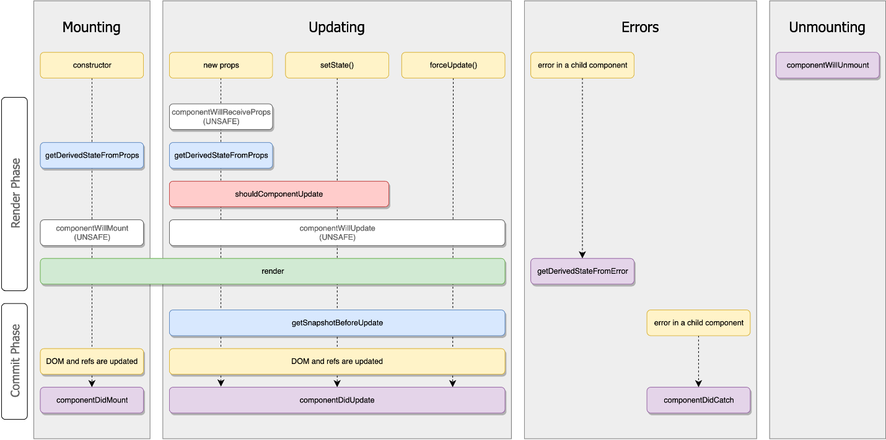
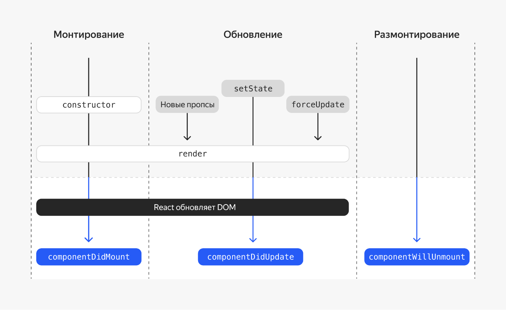
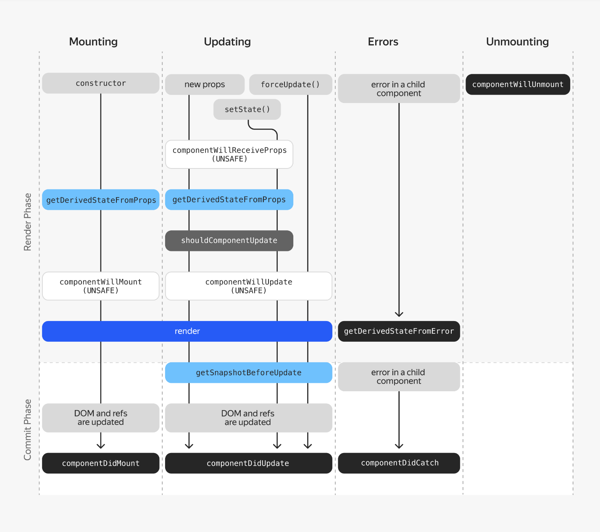

**Компоненты и их жизненный цикл**

Изначально в мире React все компоненты строились исключительно на классах. Это были мощные и многофункциональные конструкции, которые предоставляли разработчикам широкие возможности, в том числе жизненные циклы, состояния и методы управления рендерингом.

Вот пример простого классового компонента:

Скопировать код

> JAVASCRIPT

/\*\* Это тип параметров компонента,

наш компонент будет принимать один пропс - name \*/

type Props = { name: string };

/\*\* Это тип состояния нашего компонента,

так как состояния не будет, то тут у нас пустой объект \*/

type State = {};

// Чтобы определить класс компонента React, вам необходимо расширить класс React.Component, он также является дженериком, где первым параметром он принимает тип пропсов, а вторым тип состояния компонента

class HelloWorld extends React.Component\<Props, State\> {

// обратите внимание, что в классовых компонентах метод рендер отвечает за вёрстку, которую вернёт ваш компонент

render() {

// для обращения к параметрам компонента используется объект - this.props

return \<h1\>Привет, {this.props.name}\</h1\>;

}

}

Со временем стало ясно, что для многих задач такая функциональность избыточна и её можно эффективно заменить более простыми и легковесными функциональными компонентами. Поэтому современные React-разработчики предпочитают в большинстве случаев использовать именно их.

Здесь можно было бы поставить точку, но, конечно, всё не так просто…

Есть сценарии, в которых классовые компоненты остаются необходимым и ценным инструментом. К таким задачам можно отнести:

  - Обработку ошибок с помощью метода componentDidCatch.

  - Создание компонентов, которые требуют тонкой настройки процесса рендеринга. Например, оптимизацию производительности с помощью методов жизненного цикла shouldComponentUpdate и componentDidUpdate.

Рассмотрим эти и другие возможности классовых компонентов, чтобы вы смогли полноценно их применять в своих проектах.

**Ключевые особенности классовых компонентов**

**Конструктор (constructor)** используется для инициализации состояния и привязки методов обработки событий к экземпляру класса.

Скопировать код

> JAVASCRIPT

type Props = {};

type State = { counter: number }

class HelloWorld extends React.Component\<Props, State\> {

constructor(props) {

/\*

вызываем конструктор класса, от которого унаследовались

в нашем случае - React.Component

\*/

super(props);

/\*

Сохраняем какое-то состояние нашего компонента, пускай это будет счётчик

Учтите, что конструктор — это единственное место, где

вы должны напрямую присваивать this.state. Во всех других

местах компонента вам нужно использовать this.setState().

\*/

this.state = { counter: 0 };

// Сохраняем обработчик события клика

this.handleClick = this.handleClick.bind(this);

}

...

}

**Параметры компонента (props)** по мере необходимости передаются в качестве аргументов конструктора при создании его экземпляра и доступны по ссылке this.props.

**Состояние (state)** нашего компонента меняется со временем. Изменение состояния приводит к перерисовке компонента. В функциональных компонентах для хранения состояния вы пользовались хуком useState, в классовых компонентах для обращения к состоянию используется this.state.\[someProp\], а для изменения this.setState.

Скопировать код

> JAVASCRIPT

// state - текущее состояние компонента

this.setState((state) =\> {

return { counter: state.counter + 1 };

});

**Жизненный цикл (lifecycle methods).** Методы, которые вызываются на разных этапах жизненного цикла компонента. Их довольно много, и они вызываются в определённом порядке, подробнее об этом мы поговорим в следующем уроке. В функциональных компонентах для доступа к методам жизненного цикла вы пользовались хуком useEffect. Теперь обратите внимание на схему ниже. На ней обозначены основные методы жизненного цикла компонента и события, при которых они будут вызываться:

**Метод render** — единственный обязательный метод для классовых компонентов. Возвращает React-элемент, который необходимо отрисовать. В функциональных компонентах за это отвечало то, что вы возвращали в вашей функции.

Скопировать код

> JAVASCRIPT

render() {

return \<h1\>Счетчик: {this.state.counter}\</h1\>;

}

**События.** Методы класса, которые обрабатывают действия пользователя, например клики или ввод текста.

В React в классовых компонентах есть различные способы объявления методов. Один из них — локальный формат объявления метода, когда метод присваивается непосредственно экземпляру класса через свойства (properties). Это делается в конструкторе компонента или с использованием стрелочной функции в свойстве класса.

Пример с использованием конструктора:

Скопировать код

> JAVASCRIPT

class MyComponent extends React.Component {

constructor(props) {

super(props);

this.myMethod = this.myMethod.bind(this)

}

myMethod() {

// логика метода

}

render() {

return \<button onClick={this.myMethod}\>Нажми на меня\</button\>;

}

}

В данном случае myMethod становится свойством экземпляра, а не прототипа класса. Это означает, что, если бы был ещё один класс, который наследуется от MyComponent, он не смог бы обратиться к методу myMethod через super.myMethod() внутри своих методов. Так происходит потому, что super ссылается на прототип родительского класса, а myMethod теперь не является частью прототипа.

Вот пример с использованием стрелочной функции, которая создаёт метод так же, как свойство экземпляра:

Скопировать код

> JAVASCRIPT

class MyComponent extends React.Component {

myMethod = () =\> {

// логика метода

}

render() {

return \<button onClick={this.myMethod}\>Нажми на меня\</button\>;

}

}

В этом случае стрелочная функция гарантирует, что this внутри myMethod всегда будет указывать на текущий экземпляр компонента, и myMethod снова присваивается как свойство объекта, а не прототипа.

Если потребуется переопределить этот метод в дочернем классе, его придётся заново объявить полностью в дочернем классе, потому что через super к нему обратиться не получится.

Обратите внимание, что с приходом хуков в функциональных компонентах React такие паттерны наследования и объявления методов, как свойства экземпляра класса, используются реже. Хуки предоставляют более гибкий и удобный способ работы с состоянием и логикой компонентов.

Вот полезные ссылки из документации по каждой из особенностей:

  - [Конструктор](https://ru.react.js.org/docs/react-component.html#constructor).

  - [Состояние](https://ru.legacy.reactjs.org/docs/faq-state.html).

  - [Жизненный цикл](https://ru.react.js.org/docs/react-component.html#%D0%96%D0%B8%D0%B7%D0%BD%D0%B5%D0%BD%D0%BD%D1%8B%D0%B9-%D1%86%D0%B8%D0%BA%D0%BB-%D0%BA%D0%BE%D0%BC%D0%BF%D0%BE%D0%BD%D0%B5%D0%BD%D1%82%D0%B0).

  - [Метод render](https://ru.react.js.org/docs/react-component.html#render).

  - [События](https://ru.react.js.org/docs/handling-events.html).

**Пример функционального и классового компонентов**

Теперь давайте взглянем на пример простого каунтера на функциональном и классовом компоненте:

1.  **Для начала нам понадобится состояние счётчика.**

Функциональный компонент:

Скопировать код

> JAVASCRIPT

const \[counter, setCounter\] = useState(0);

Классовый компонент:

Скопировать код

> JAVASCRIPT

constructor(props) {

super(props);

this.state = { counter: 0 };

}

2.  **Теперь создадим функцию инкремента счётчика.**

Функциональный компонент:

Скопировать код

> JAVASCRIPT

const incrementCount = () =\> {

setCounter(counter + 1);

}

Классовый компонент:

Скопировать код

> JAVASCRIPT

// также не забываем добавить в конструктор привязку контекста

constructor(props: {}) {

super(props);

this.state = { counter: 0 };

// Это привязывание необходимо, чтобы работал объект this в колбэке

this.incrementCount = this.incrementCount.bind(this);

}

incrementCount() {

this.setState((state) =\> {

// Важно: используем state вместо this.state при обновлении.

return { counter: state.counter + 1 };

});

}

3.  **Осталось только отрендерить вёрстку, она в обоих случаях будет одинаковой. Вот что получается:**

> Скопировать код
> 
> JAVASCRIPT
> 
> export const Counter = () =\> {
> 
> // создаём состояние компонента и функцию, которая его меняет
> 
> const \[counter, setCounter\] = useState\<number\>(0);
> 
> // объявляем функцию для увеличения счётчика на единицу
> 
> const incrementCount = () =\> {
> 
> setCounter(counter + 1);
> 
> }
> 
> // рендерим кнопку со счётчиком
> 
> return (
> 
> \<button onClick={incrementCount}\>
> 
> Всего кликов: {counter}
> 
> \</button\>
> 
> )
> 
> }
> 
> Скопировать код
> 
> JAVASCRIPT
> 
> class Counter extends React.Component\<{}, { counter: number }\> {
> 
> constructor(props: {}) {
> 
> super(props);
> 
> this.state = { counter: 0 };
> 
> // Это привязывание необходимо, чтобы работал объект this в колбэке
> 
> this.incrementCount = this.incrementCount.bind(this);
> 
> }
> 
> incrementCount() {
> 
> this.setState((state) =\> {
> 
> // Важно: используем state вместо this.state при обновлении.
> 
> return { counter: state.counter + 1 };
> 
> });
> 
> }
> 
> render() {
> 
> return (
> 
> \<button onClick={this.incrementCount}\>
> 
> Всего кликов: {this.state.counter}
> 
> \</button\>
> 
> );
> 
> }
> 
> }

Как вы могли заметить, в функциональных компонентах код получился лаконичнее и короче. Нужно понимать, что и классовые, и функциональные компоненты способны выполнять практически одни и те же задачи. Однако классы предоставляют более детализированный контроль над процессом рендеринга и жизненным циклом компонентов.

Важно понимать сценарии, в которых каждый из подходов является более предпочтительным, и умело применять их для решения конкретных задач разработки.

[Проект51](project51.zip)

Перед вами классовый компонент App, который отображает на экране кнопку. При нажатии на кнопку происходит инкремент счётчика и новое значение счётчика отображается на кнопке. В зависимости от того, чётным или нечётным является значение счётчика, меняется цвет текста на кнопке.

Для хранения значения счётчика в компоненте используется стейт count, а для доступа к DOM-элементу кнопки — реф buttonRef.

Требуется преобразовать этот классовый компонент в эквивалентный ему функциональный компонент.

Обратите внимание, что для инициализации DOM-элемента кнопки (установки фокуса и цвета текста) используется метод жизненного цикла компонента componentDidMount. О методах жизненного цикла мы поговорим подробно в следующем уроке. Метод componentDidMount вызывается сразу после отрисовки компонента. Поскольку в данном примере он занимается настройкой внешнего вида DOM-элемента, то в функциональном компоненте эту логику можно эффективно выполнить, используя хук useLayoutEffect.

**Жизненный цикл**

Теперь углубимся в основные методы жизненного цикла компонентов в React-приложениях. Использование этих методов позволит «хирургически» контролировать логику работы и рендеринг.

Остановимся на методе render() компонента и разберёмся, как его вызывать только при наступлении определённых условий. Кроме этого, вы получите навык работы с обработчиками событий в React и узнаете, как не допустить утечек памяти.

**Что такое жизненный цикл**

Каждый классовый компонент проходит свой жизненный цикл. Чтобы понять, что это такое, представьте искусственную новогоднюю ёлку: в декабре её достают с антресоли, собирают (монтируют), наряжают игрушками, а после праздника разбирают до следующего Нового года. Похожим образом ведут себя и компоненты.

Каждый компонент в течение своего жизненного цикла может быть монтирован, обновлён и размонтирован. Библиотека React позволяет выполнять код на конкретном этапе этого процесса.

Таким образом, жизненный цикл компонентов React можно разделить на три основных этапа:

1.  Монтирование Mounting происходит, когда HTML-дерево компонента вставляется движком React в DOM.

2.  Обновление Updating осуществляется в одном из трёх случаев, если:
    
      - произошёл рендер родительского компонента,
    
      - изменилось внутреннее состояние в результате вызова this.setState,
    
      - обновление инициировано вызовом встроенного метода this.forceUpdate.

3.  Размонтирование Unmounting происходит, когда HTML-дерево компонента удаляется из DOM.

Можно [скачать интерактивный вариант схемы c GitHub](https://github.com/wojtekmaj/react-lifecycle-methods-diagram). Там отражены менее популярные методы работы с жизненным циклом компонентов и соответствующие ссылки на документацию React на русском языке.

Каждому этапу жизненного цикла соответствует один из трёх методов:

  - componentDidMount,

  - componentDidUpdate,

  - componentWillUnmount.

Как и render, это методы обратного вызова. В отличие от setState, их не нужно вызывать вручную, а достаточно описать внутри компонентов, чтобы в нужный момент они были вызваны изнутри движка React — как колбэки.

Чаще всего методы жизненного цикла применяют для описания сайд-эффектов. Этим понятием принято называть всю деятельность компонента, связанную с «внешним миром»:

  - взаимодействие с различными API,

  - подписка на события,

  - обращение к серверу за данными.

Разберём каждый этап жизненного цикла подробнее.

**Монтирование: componentDidMount**

Этот метод вызывается сразу после монтирования. Внутри componentDidMount можно подписываться на события:

Скопировать код

> JAVASCRIPT

class VirtualList extends React.Component\<{}, {offsetY: number}\> {

state = { offsetY: 0 }

componentDidMount() {

document.addEventListener(

'scroll',

() =\> this.setState({ offsetY: window.pageYOffset })

)

}

// ...

}

В этом примере компонент при монтировании добавляет на документ обработчик скролла и начинает записывать значение pageYOffset в своё внутреннее состояние.

Кроме этого, метод жизненного цикла componentDidMount отлично подходит для взаимодействия с сервером, например для запроса данных:

Скопировать код

> JAVASCRIPT

class Stories extends React.Component\<

{},

{

stories: any\[\];

loading: boolean;

hasError: boolean;

}

\> {

state = {

stories: \[\],

loading: true,

hasError: false,

};

componentDidMount() {

fetch('/stories/all')

.then((res) =\> res.json())

.then((data) =\> this.setState({ stories: data.stories, loading: false }))

.catch((e) =\>

this.setState({ ...this.state, loading: false, hasError: true })

);

}

// ...

}

В этом примере при монтировании компонента будет выполнен запрос на сервер. Результат запроса будет записан во внутреннее состояние компонента. Из состояния он впоследствии сможет быть использован для создания JSX-разметки.

Обратите внимание, что, кроме самих данных, в состоянии содержатся ключи hasError и loading. Используя эти ключи, можно показывать пользователям разную разметку с помощью условного рендеринга: компонент индикации загрузки или ошибку в случае, если ответ с сервера не пришёл в ожидаемом виде.

**Обновление: componentDidUpdate**

Метод componentDidUpdate() вызывается сразу после обновления внутреннего состояния или пропсов. Но его нельзя вызвать при монтировании.

В этом методе можно работать с реальным DOM-деревом при обновлении компонента. Также он подходит для взаимодействия с сервером, если:

  - Сетевой запрос зависит от пропсов компонента, например от идентификатора товара, то в componentDidUpdate можно сравнить предыдущие пропсы (prevProps) и обновившиеся (props).

  - Идентификаторы различаются, нужно запросить новые данные.

  - Пропсы не изменились, новый запрос может и не потребоваться.

Взгляните на такой пример:

Скопировать код

> JAVASCRIPT

type Props = { productId: number };

class Product extends React.Component\<Props, {}\> {

state = {

productData: null,

loading: true,

hasError: false,

};

getProductData = () =\> {

fetch(\`/api/v1/products/${this.props.productId}\`)

.then((res) =\> res.json())

.then((data) =\>

this.setState({ productData: data.productData, loading: false })

)

.catch((e) =\>

this.setState({ ...this.state, loading: false, hasError: true })

);

};

componentDidMount() {

this.getProductData();

}

componentDidUpdate(prevProps: Props, prevState: {}) {

// Сравниваем предыдущие пропсы с обновившимися.

// Если они отличаются, то делаем запрос:

if (this.props.productId \!== prevProps.productId) {

this.getProductData();

}

}

// ...

}

Кроме предыдущих пропсов, в замыкании метода доступно предыдущее состояние компонента (prevState). Сравнение состояний может быть полезным для реализации вариативной логики работы компонента.

В методе componentDidUpdate() можно воспользоваться методом setState(), но важно не забыть обернуть его в условие, чтобы не возник бесконечный цикл:

Скопировать код

> JAVASCRIPT

// ...

componentDidUpdate(prevProps: Props, prevState: {}) {

// Сравниваем предыдущее состояние с новыми

// Если нужные нам ключи отличаются, то делаем запрос:

if (this.props.productId \!== prevProps.productId) {

this.setState({ ...this.state, loading: true });

this.getProductData();

}

}

// ...

Вызов setState() влечёт за собой дополнительный рендер, который незаметен для пользователя, но может повлиять на производительность компонента.

**Проверка на необходимость повторного рендера: shouldComponentUpdate**

Метод shouldComponentUpdate позволяет повысить производительность кода компонента. Он сравнивает текущие значения props и/или state и решает, нужен ли повторный рендеринг:

  - Если метод возвращает true, то при изменении props или state произойдёт повторный рендеринг.

  - Если же он вернёт false, то, несмотря на изменения state и props, повторного рендеринга не произойдёт.

Метод shouldComponentUpdate позволяет оптимизировать производительность в тех местах приложения, где рендеринг происходит слишком часто.

Чтобы разобраться с этим методом, посмотрим на его аргументы и пример использования. В замыкании shouldComponentUpdate доступны два аргумента: nextProps и nextState — обновлённые объекты пропсов и состояния соответственно. Вот как выглядит применение этого метода:

Скопировать код

> JAVASCRIPT

type Props = { tagColor: string };

type State = { done: boolean };

class TodoItem extends React.Component\<Props, State\> {

constructor(props: Props) {

super(props);

this.state = { done: false };

}

shouldComponentUpdate(nextProps: Props, nextState: State) {

if (this.props.tagColor \!== nextProps.tagColor) {

// Если изменилось значение props.tagColor, то будет вызван повторный рендер

return true;

}

if (this.state.done \!== nextState.done) {

// Если изменилось значение state.done, то будет вызван повторный рендер

return true;

}

// Во всех остальных случаях повторного рендеринга не будет

return false;

}

toggleTodo = () =\> {

this.setState({ done: \!this.state.done });

};

render() {

const btnText = this.state.done ? 'Вернуть в работу' : 'Выполнено';

return (

\<\>

\<TodoTag tagColor={this.props.tagColor} /\>

\<button onClick={this.toggleTodo}\>{btnText}\</button\>

\</\>

);

}

}

В этом примере компонент TodoItem будет повторно рендериться, только если изменились значения props.tagColor или state.done. Компонент не будет повторно перерисован, даже если в него переданы другие пропсы, которые изменились. shouldComponentUpdate особенно эффективен в сложных компонентах, где рендеринг ощутимо бьёт по производительности.

Помимо этого метода жизненного цикла, в библиотеке React существуют дополнительные возможности для оптимизации производительности, к ним мы ещё вернёмся в рамках курса.

**Размонтирование: componentWillUnmount**

В предыдущих методах мы могли подписываться на событие или устанавливать соединение с сервером. Теперь расскажем, как отписываться от события, закрывать соединения и не допускать утечки памяти.

Для этого существует метод componentWillUnmount. Его нужно вызывать перед удалением компонента из DOM. Чтобы избежать утечек памяти, при размонтировании компонентов следует «прибраться»:

  - удалить таймеры,

  - отписаться от событий,

  - закрыть соединения с сервером.

Ведь если этого не сделать, то, когда произойдёт размонтирование компонента, JavaScript продолжит свою работу и память засорится.

В этом примере мы подписываемся на событие прокрутки в методе componentDidMount, а отписываемся от этого события в методе componentWillUnmount:

Скопировать код

> JAVASCRIPT

class VirtualList extends React.Component\<{}, { offsetY: number }\> {

state = { offsetY: 0 }

// Создадим отдельную функцию для того, чтобы слушатель событий можно было удалить

setOffset = () =\> {

this.setState({ offsetY: window.pageYOffset })

};

componentDidMount() {

document.addEventListener(

'scroll',

this.setOffset

)

}

componentWillUnmount() {

// Не забывайте отписываться от событий, чтобы не допустить утечек памяти

document.removeEventListenter(

'scroll',

this.setOffset

)

}

// ...

}

Удаление таймеров, очистка обработчиков событий, прерывание сетевых запросов и web-socket соединений — всё это следует делать именно в методе componentWillUnmount.

Но не стоит вызывать setState в этом методе. Изменения не применятся: компонент будет отмонтирован и отрисуется повторно. Когда компонент снова появится, его жизненный цикл начнётся сначала.

Также есть несколько методов для обработки ошибок, такие как: [getDerivedStateFromError()](https://ru.react.js.org/docs/react-component.html#static-getderivedstatefromerror), [componentDidCatch()](https://ru.react.js.org/docs/react-component.html#componentdidcatch). О них мы поговорим в следующих уроках.

В функциональных компонентах вы можете использовать хуки, такие как useLayoutEffect, useEffect, чтобы использовать методы жизненного цикла. Подробнее об этом — в следующем уроке.

[project52.zip](project52.zip)

Перед вами классовый компонент, отображающий электронные часы, время на которых должно обновляться каждую секунду.

В классе заготовлены методы:

  - startTimer — запускает таймер, обновляющий время каждую секунду.

  - stopTimer — останавливает этот таймер.

Вам нужно:

  - Добавить в классовый компонент нужные методы жизненного цикла

  - Вызвать в добавленных методах жизненного цикла методы startTimer и stopTimer так, чтобы при монтировании компонента таймер запускался, а при размонтировании — останавливался.

**Функциональные компоненты**

Итак, мы детально рассмотрели методы жизненного цикла в классовых react-компонентах. Теперь разберём, как эти методы вызываются в функциональных компонентах.

Для управления жизненным циклом **без** классовых методов в функциональных компонентах используются хуки useEffect и useLayoutEffect. Хук useEffect, как вы могли догадаться, содержит в себе три метода жизненного цикла:

  - componentDidMount,

  - componentDidUpdate,

  - componentWillUnmount.

Разобравшись, как жизненный цикл работает в функциональных компонентах, вы сможете:

  - писать более оптимизированные компоненты,

  - лучше разбираться, когда нужно использовать классовый компонент, а когда — функциональный,

  - понять, на каком конкретно этапе жизни компонента useEffect будет вызван ваш код.

Помните, что хук useLayoutEffect надо использовать осторожно и только в особенных случаях. Подробнее об этом говорили в предыдущей теме.

Для удобства продублируем схему из предыдущего урока:

**Действия при монтировании (единожды)**

Когда компонент вставляется в DOM (монтируется), useEffect можно использовать для выполнения кода, который должен запуститься один раз. Например, для выполнения fetch-запроса.

Это соответствует componentDidMount в классовых компонентах. Чтобы сделать это, вы передаёте пустой массив зависимостей \[\] вторым аргументом хука useEffect.

Скопировать код

> JAVASCRIPT

useEffect(() =\> {

// Ваш код для запуска один раз при монтировании

}, \[\]);

**Действия при обновлении**

useEffect также можно использовать для выполнения действий при обновлении компонента, что соответствует componentDidUpdate. Если в массиве зависимостей указать переменные состояния или пропсы, useEffect будет выполняться каждый раз, когда эти зависимости изменяются.

Скопировать код

> JAVASCRIPT

useEffect(() =\> {

// Код для выполнения при обновлении компонента,

// когда изменяются зависимости, указанные в массиве ниже

}, \[firstDependency, secondDependency\]);

Если вы опустите второй аргумент (массив зависимостей), то useEffect будет выполняться после каждого рендеринга компонента.

**Действия при размонтировании**

Для имитации componentWillUnmount и выполнения кода при размонтировании компонента, внутри функции, передаваемой в useEffect, возвращается функция очистки. Эта функция очистки будет вызвана перед тем, как компонент будет удалён из DOM. Здесь вы можете удалить все обработчики, которые были навешаны на компонент:

Скопировать код

> JAVASCRIPT

useEffect(() =\> {

// Код для запуска при монтировании

return () =\> {

// Код для выполнения при размонтировании

};

}, \[\]);

**Пример**

Теперь взгляните на пример использования хуков жизненного цикла в компоненте часов, обновляющихся каждую секунду. Обратите внимание, что функцию в componentDidMount мы положили в useEffect, а функцию из componentWillUnmount мы вернули из useEffect:

Скопировать код

> JAVASCRIPT

type Props = { children: React.ReactNode };

type State = { date: Date };

class Clock extends React.Component\<Props, State\> {

timerId: NodeJS.Timeout | undefined;

constructor(props: Props) {

super(props);

// в состоянии компонента храним текущую дату

this.state = { date: new Date() };

}

// Добавляем обработчик, который каждую секунду будет обновлять дату

componentDidMount() {

this.timerId = setInterval(() =\> this.tick(), 1000);

}

// Удаляем обработчик при размонтировании компонента

componentWillUnmount() {

clearInterval(this.timerId);

}

tick() {

this.setState({

date: new Date(),

});

}

render() {

return (

\<div\>

\<h1\>Привет, мир\!\</h1\>

\<h2\>Сейчас {this.state.date.toLocaleTimeString()}.\</h2\>

\</div\>

);

}

}

Такой же компонент на хуках:

Скопировать код

> JAVASCRIPT

function Clock() {

const \[timerId, setTimerId\] = useState\<NodeJS.Timeout\>();

const \[date, setDate\] = useState(new Date());

/\* функция в хуке будет вызываться на componentDidMount и componentDidUpdate методы жизненного цикла \*/

useEffect(() =\> {

setTimerId(setInterval(() =\> setDate(new Date()), 1000));

// функция, которую возвращает useEffect, будет вызвана при размонтировании компонента, то есть она соответствует методу жизненного цикла - componentWillUnmount

return () =\> clearInterval(timerId);

}, \[\]);

return (

\<div\>

\<h1\>Привет, мир\!\</h1\>

\<h2\>Сейчас {date.toLocaleTimeString()}.\</h2\>

\</div\>

);

}

**Подведём итог**

Жизненный цикл классовых компонентов в React предоставляет разработчикам детальный контроль над поведением компонента на разных этапах его существования. Используя методы жизненного цикла, такие как componentDidMount, componentDidUpdate и componentWillUnmount, можно точно настроить загрузку данных, подписки и другие эффекты, зависящие от состояния и свойств компонента.

В то же время, с появлением хуков в функциональных компонентах, React предоставил более простой и современный способ работы с побочными эффектами и состоянием компонентов через использование useState, useEffect, useContext и других хуков. Это позволило разработчикам писать компоненты в более декларативном и компактном стиле, делая код чище и понятнее.

Хотя классовые компоненты не устарели и по-прежнему могут использоваться в существующих проектах, функциональные компоненты с хуками становятся предпочтительным выбором в новых проектах благодаря их удобству и лаконичности. Таким образом, разработчики имеют возможность выбирать подход в зависимости от своих предпочтений, стиля программирования и требований проекта.

**Чистые компоненты**

Благодаря технологии Virtual DOM, тяжёлые операции в реальном DOM сведены к минимуму. Но в виртуальном DOM, наоборот, часто производится избыток лёгких операций, что может сказываться на производительности кода.

В предыдущих уроках мы рассмотрели метод жизненного цикла shouldComponentUpdate. Сейчас посмотрим, как он применяется на практике для оптимизации классовых компонентов и как оптимизировать функциональные компоненты.

**Проблема оптимизации: цепная реакция рендеров**

Если в каком-то месте виртуального дерева произошли изменения и был вызван рендер соответствующего компонента, это вызывает цепную реакцию рендеров для всех его дочерних компонентов. Часто это необязательно и даже избыточно. Например, если в исходном компоненте всего лишь поменялся CSS-класс.

Рассмотрим пример со списком чатов. Допустим, вы хотите, чтобы при наведении курсора отображалась панель действий с чатом: «Не беспокоить» и «Удалить».

Добавим внешний компонент ChatWithTools, который содержит Chat и реагирует на события мыши, чтобы отображать дополнительные элементы:

Скопировать код

> JAVASCRIPT

type Props = { children: React.ReactNode };

type State = { shouldShowTools: boolean };

class ChatWithTools extends React.Component\<Props, State\> {

constructor(props: Props) {

super(props);

this.state = {

shouldShowTools: false,

};

}

handleMouseEnter = () =\> {

this.setState({ shouldShowTools: true });

};

handleMouseLeave = () =\> {

this.setState({ shouldShowTools: false });

};

render() {

return (

\

\<Chat {...this.props} /\>

{this.state.shouldShowTools && (

\

\<button\>Не беспокоить\</button\>

\<button\>Удалить\</button\>

\</div\>

)}

\</div\>

);

}

}

const chats = /\* ... \*/

const root = ReactDOM.createRoot(document.querySelector('\#root'));

root.render(

\<\>

\<h2\>Чаты\</h2\>

{chats.map((chat) =\> (

\<ChatWithTools

id={chat.id}

name={chat.name}

lastMessageAt={chat.lastMessageAt}

/\>

))}

\</\>

);

Обратите внимание на «пробрасывание» пропсов: \<Chat {...props} /\>. С помощью такой конструкции можно копировать в дочерний компонент сразу все его пропсы. Так в этом примере мы смогли разом пробросить все пропсы ChatWithTools в дочерний Chat.

В таком коде есть потенциальная проблема. Как мы говорили в одном из предыдущих уроков, отрисовка компонента всегда вызывается при отрисовке его родительского компонента. Убедиться в этом можно, добавив в структуру дочернего компонента генератор случайных чисел — при каждом вызове рендера случайное число будет меняться, и мы заметим это в пользовательском интерфейсе:

Скопировать код

> JAVASCRIPT

type Props = { lastMessageAt: string; id: number };

const Chat = (props: Props) =\> {

return (

\

\

\<h2\>{Math.random()}\</h2\>

\
{props.lastMessageAt}\</div\>

\</div\>

);

};

Никаких изменений не произошло бы и рендер не вызвался бы напрасно, если бы не случайное число. С другой стороны, структура Chat могла быть сложнее и содержала бы в себе другие дочерние компоненты, которые, в свою очередь, содержали бы ещё компоненты. Для них рендер также был бы вызван напрасно.

Чтобы этого не происходило, нужно использовать специальный тип компонентов, отрисовка которых происходит не при любом рендере их родителей, а только тогда, когда меняются их собственные пропсы. Такие компоненты называются «чистыми».

В классовом и функциональном подходе чистые компоненты создают по-разному. Рассмотрим это подробнее.

**Создание чистого классового компонента: React.PureComponent**

Сделать чистым классовый компонент просто: надо лишь наследоваться не от React.Component, а от React.PureComponent:

Скопировать код

> JAVASCRIPT

type Props = { lastMessageAt: string; id: number };

class Chat extends React.PureComponent\<Props\> {

render() {

return (

\

\

\<h2\>{Math.random()}\</h2\>

\
{this.props.lastMessageAt}\</div\>

\</div\>

);

}

}

React.PureComponent очень похож на React.Component. Но есть небольшое отличие:

  - React.Component не реализует метод жизненного цикла shouldComponentUpdate() по умолчанию.

  - React.PureComponent реализует метод жизненного цикла shouldComponentUpdate() поверхностным сравнением пропсов и состояния.

Для решения большинства задач, связанных с производительностью, подойдёт React.PureComponent.

Есть более сложные сценарии (например, когда пропс — сложный тип данных и требуется глубокое сравнение, а не поверхностное), как в React.PureComponent. В таких случаях мы рекомендуем использовать метод жизненного цикла shouldComponentUpdate() внутри React.Component и самостоятельно реализовать функцию глубокого сравнения объектов.

React.memo и React.PureComponent работают по схожему принципу: они запоминают последние переданные пропсы и последний результат рендера своего дочернего компонента. При следующей попытке рендера, если пропсы не изменились, они просто возвращают закешированный результат. Если же пропсы изменились, вызывается рендер, после чего сохраняется новый кеш и последние пропсы.

Старайтесь всегда использовать чистые компоненты, кроме случаев, когда компоненты должны обновляться вместе со своими родителями. Иначе у вас будет вызываться цепная реакция рендеров и это может сильно сказаться на производительности вашего приложения.

**Создание чистого функционального компонента: React.memo**

Функциональные компоненты в React не имеют методов жизненного цикла, позволяющих контролировать процесс рендеринга компонента. Это означает, что каждый раз, когда происходит рендеринг, функциональный компонент исполняется полностью, включая все объявления переменных и хуки.

Такой подход может быть неэффективным, если:

  - компонент содержит дорогостоящие вычисления, например, очень большой массив, где для каждого элемента нужно посчитать какие-то данные и затем отрисовать их.

  - компонент рендерится без необходимости, когда его пропсы не изменились.

Чтобы решить эту проблему, React предоставляет хуки useMemo и useCallback, а также функцию React.memo для мемоизации компонентов и их пропсов.

React.memo — это компонент высшего порядка, который запоминает результат последнего рендеринга и использует его повторно, если пропсы не изменились. Это предотвращает ненужный рендеринг компонента. Чтобы сделать функциональный компонент чистым, достаточно обернуть его в этот метод:

Скопировать код

> JAVASCRIPT

const Chat = React.memo((props: Props) =\> {

return (

\

\

\<h2\>{Math.random()}\</h2\>

\
{props.lastMessageAt}\</div\>

\</div\>

);

});

Если пропсы компонента остаются теми же, React.memo предотвратит его рендеринг, тем самым увеличивая производительность приложения. Теперь при наведении мыши не происходит цепной реакции: она сразу «обрывается» на компоненте Chat, так как его пропсы не меняются:

Так мы используем ресурсы более разумно.

**Поверхностное сравнение**

React.memo и React.PureComponent определяют изменения в пропсах по алгоритму «поверхностного сравнения»: предыдущее значение каждого пропса сравнивается с новым значением с помощью оператора ===.

Поэтому нужно избегать ситуаций, когда значения пропсов со сложными типами создаются в момент передачи, например:

Скопировать код

> JAVASCRIPT

\<MyPureComponent

userNames={\['Gregory', 'James', 'Allison'\]}

onClick={() =\> console.log(1)}

/\>

При каждом рендере значения этих пропсов по сути не меняются, но в действительности они создаются заново, значит, фильтр чистого компонента просто не сработает. Это происходит потому, что в JavaScript сложные типы данных не эквивалентны друг другу:

Скопировать код

> JAVASCRIPT

\['Gregory', 'James', 'Allison'\] === \['Gregory', 'James', 'Allison'\] // =\> false\!

(() =\> console.log(1)) === (() =\> console.log(1)) // =\> false\!

Чистые компоненты, которым задаются пропсы таким образом, работать не будут. В будущем вы научитесь избегать подобных ситуаций.

**Обработка ошибок (Error Boundaries)**

Итак, вы написали приложение, в котором нет ошибок. Вообще ни одной. Приложение быстро работает и обладает безупречной отказоустойчивостью. Вы показали его другим разработчикам. Они в шоке. Мы — тоже. Джордан Валке жмёт вам руку и просит присоединиться к команде React…

…а потом вы просыпаетесь.

Реальность такова, что вероятность создать приложение, в котором не будет ни одной ошибки, стремится к нулю. В системе слишком много участников, и что-то может пойти не так.

В этом уроке разберём, как «ловить» и обрабатывать ошибки, которые могут возникнуть во время работы React-приложения. В этом нам сильно помогают два инструмента: Error boundaries и уже знакомая конструкция try...catch.

Посмотрите, где находится процесс «отлова ошибок» с точки зрения этапов жизненного цикла:

Error boundaries работают только для ошибок, которые произошли в методах жизненного цикла компонентов и внутри конструкторов дочерних компонентов. Они не ловят ошибки внутри обработчиков событий. Обработка ошибок в обработчиках событий требует использования обычных конструкций try...catch в JavaScript.

Отличие от конструкции try...catch в том, что try...catch используется для перехвата ошибок в императивном коде, а Error boundaries — в декларативных компонентах React во время рендеринга, в методах жизненного цикла и в конструкторах компонентов.

Кроме того, Error boundaries позволяют вам перехватывать ошибки в любом месте дерева компонентов, тогда как try...catch перехватывает ошибки только в блоке кода, где он написан. Это делает Error boundaries мощным инструментом для обработки и изоляции ошибок в React-приложениях, предотвращая полный «крах» приложения и улучшая пользовательский опыт.

**Обработка ошибок**

Ранее мы рассматривали методы жизненного цикла и обещали вам позже рассказать про два метода жизненного цикла, которыми можно воспользоваться для обработки возникших ошибок во время отрисовки. Вот они:

  - getDerivedStateFromError(). Этот метод вызывается после того, как любой потомок данного компонента выдал ошибку. Метод получает саму ошибку, выданную в качестве параметра, и должен вернуть новое значение для state компонента.

  - getDerivedStateFromError вызывается на этапе рендеринга, поэтому сайд-эффекты ещё не отработали. Так что если нужно отловить ошибку после рендера и во время применения сайд-эффектов, то можно воспользоваться методом componentDidCatch.

**Подход Error boundary**

Подход Error boundary помогает «поймать» ошибки, которые возникают в приложении на этапе рендеринга или в методах жизненного цикла компонентов, а затем отреагировать на них.

Если в приложении возникает ошибка, вы можете отправить её детальное описание в сервис логирования ошибок. Одновременно с этим пользователь увидит страницу с указанием на проблему и инструкцией по дальнейшим действиям.

Разберём это на примере одноимённого компонента — ErrorBoundary:

Скопировать код

> JAVASCRIPT

class ErrorBoundary extends React.Component\<

{ children: React.ReactNode },

{ hasError: boolean }

\> {

constructor(props: { children: React.ReactNode }) {

super(props);

this.state = { hasError: false };

}

// с помощью этого метода меняем стейт компонента при возникновении ошибки:

static getDerivedStateFromError(error: Error) {

return { hasError: true };

}

// с помощью этого метода логируем информацию об ошибке:

componentDidCatch(error: Error, info: ErrorInfo) {

console.log('Возникла ошибка\!', error, info);

}

render() {

if (this.state.hasError) {

// если возникла ошибка, сообщаем об этом пользователю в специальном компоненте:

return (

\<section\>

\<h1\>Что-то пошло не так :(\</h1\>

\<p\>

В приложении произошла ошибка. Пожалуйста, перезагрузите страницу.

\</p\>

\</section\>

);

}

// если всё работает штатно, рендерим дочерние компоненты

return this.props.children;

}

}

Компонент ErrorBoundary состоит из трёх методов:

  - getDerivedStateFromError отвечает за изменение стейта компонента при появлении ошибки;

  - componentDidCatch нужен, чтобы удобно логировать ошибки;

  - render — стандартный рендер-метод. Используется в ErrorBoundary для отображения компонента с сообщением об ошибке.

Метод жизненного цикла getDerivedStateFromError вызывается сразу после того, как в одном из дочерних компонентов возникает ошибка. Этот метод в параметрах получает информацию об ошибке — error. Благодаря тому, что getDerivedStateFromError возвращает значение обновлённого стейта, его удобно применять для управления условным рендерингом: сразу после возникновения ошибки вы можете показать пользователю компонент, который сообщит об этом.

Метод componentDidCatch — ещё один метод жизненного цикла, который также вызывается после возникновения ошибки. Получает в параметрах информацию об ошибке — error и информацию о компоненте, в котором возникла ошибка, — info. Эти параметры отлично подходят для логирования.

Метод render применяется так же, как и в любом другом классовом компоненте. Как правило, ErrorBoundary рендерит либо страницу с сообщением об ошибке, либо children, если ошибок нет.

Сейчас не существует способа вызвать методы жизненного цикла getDerivedStateFromError и componentDidCatch в функциональном компоненте, поэтому ErrorBoundary возможно создать только с применением классового подхода.

Компонент ErrorBoundary применяется как обёртка: методы getDerivedStateFromError и componentDidCatch срабатывают при возникновении ошибки в дочерних компонентах на любом уровне вложенности. Например, вы можете использовать ErrorBoundary прямо в корневом компоненте App — в таком случае будут отслеживаться все возможные ошибки:

Скопировать код

> JAVASCRIPT

export default function App() {

return (

\

\<ErrorBoundary\>

{/\* если в компоненте RestOfTheApp или любом его дочернем компоненте \*/}

{/\* возникнет ошибка, она будет обработана в ErrorBoundary \*/}

\<RestOfTheApp /\>

\</ErrorBoundary\>

\</div\>

);

}

Подход Error boundary отлично подходит для реагирования на проблемы с рендерингом компонентов, но методы getDerivedStateFromError и componentDidCatch никак не отвечают на ошибки, которые возникают в обработчиках событий. Это обусловлено спецификой React. Обработчики вызываются вне этапов рендеринга компонента. Даже если в обработчике возникнет ошибка, это не помешает React, ведь ему уже известно, что показывать на экране.

Если вам нужно следить за ошибками в обработчиках и реагировать на них, можно воспользоваться стандартной конструкцией JavaScript — try...catch.

**Конструкция try...catch**

Для начала вспомним, как работает эта конструкция. В блок try помещается код, во время выполнения которого может возникнуть ошибка. А в блоке catch описывается логика обработки этой ошибки.

А вот пример, как try...catch можно применять в обработчиках событий:

Скопировать код

> JAVASCRIPT

function ComponentWithError() {

const \[error, setError\] = useState\<string | null\>(null);

const handleClick = () =\> {

try {

// В этом случае в хэндлере точно возникнет ошибка

throw new Error("Simple error");

} catch (err: any) {

// Обычно ошибки логируются или обрабатываются дополнительной логикой,

// но для наглядности мы просто кладём ошибку в стейт

setError(err.message);

}

};

return (

\

\<h1\>{error}\</h1\>

\<button onClick={handleClick}\>

Make a mistake

\</button\>

\</div\>

);

}

Если в обработчике handleClick возникнет ошибка, ErrorBoundary её проигнорирует. Но благодаря try...catch эту ошибку можно поймать и обработать в блоке catch.

Подробнее с особенностями работы [try...catch вы можете ознакомиться на MDN.](https://developer.mozilla.org/en-US/docs/Web/JavaScript/Reference/Statements/try...catch)

mgppu

А что делать с «пойманными» ошибками?

В утопическом мире с идеальными приложениями ошибок не бывает. Но пока такого мира и таких приложений создать не удалось и с ошибками нужно что-то делать.

Обычно ошибки просто логируются в специальных документах или сервисах, например [в Sentry](https://sentry.io/). После чего можно изучить эти ошибки и устранить причины их возникновения.

В некоторых случаях ошибки обрабатываются прямо на клиенте, но тут всё индивидуально. Например, если «упал» запрос, можно попробовать отправить его ещё раз.

Но самое важное — не забывать о пользователях. Если какая-то функциональность приложения нарушилась, нужно сообщить об этом пользователю с помощью всплывающего окна или иным способом. Здесь вам поможет try...catch.

Если возникшая ошибка может привести к поломке всего приложения, важно не допускать полного падения. В этом случае следует применить подход ErrorBoundary и показать пользователю информацию об ошибке, а также подсказать, что делать дальше.

Эти два способа удобно использовать вместе: Error boundary применить для отлова ошибок рендеринга, а в try...catch обернуть любые другие уязвимые места в коде.

[project55.zip](project55.zip)

В этом задании вы потренируетесь обрабатывать ошибки, которые могут возникать при рендеринге компонентов.

Перед вами компонент App, который отображает список пользователей. В примере этот список просто хранится в виде массива в коде. Но в реальности приложение может получать его с сервера, делая запрос. Если сервер вернет нам некорректные данные, то во время выполнения приложения этот массив может оказаться равным undefined. Тогда при попытке его отрисовать возникнет ошибка.

Чтобы перехватить такую ошибку, необходимо добавить в приложение компонент ErrorBoundary .

Заготовка для компонента ErrorBoundary описана в файле src/components/error-boundary.tsx.

В коде также представлен компонент ErrorMessage , который компонент ErrorBoundary должен отображать при возникновении ошибки.

Вам нужно:

  - Дописать компонент ErrorBoundary :
    
      - Напишите код статического метода getDerivedStateFromError так, чтобы компонент ErrorBoundary мог перехватывать ошибки разметки и сохранять их в своем состоянии.
    
      - Напишите код метода render так, чтобы в случае ошибки компонент ErrorBoundary выводил компонент errorComponent , а если ошибки нет — свои дочерние компоненты.

  - Добавить компонент ErrorBoundary в разметку компонента App в то место, которое отмечено комментариями, и передать ему в качестве пропса errorComponent компонент ErrorMessage .

**Особенности работы useRef**

В предыдущих темах вы узнали, что React-компоненты могут взаимодействовать с дочерними элементами с помощью пропсов. Чтобы дочерний элемент изменился, вам необходимо изменить его пропсы.

Однако существуют исключения. Иногда необходимо изменить состояние дочернего DOM-элемента или React-компонента, не меняя его пропсы. В React для таких целей есть механизм **рефов.** [В официальном руководстве React](https://ru.reactjs.org/docs/refs-and-the-dom.html) приводятся ситуации, в которых использование рефов для работы с DOM-элементами оправдано:

  - управление фокусом, выделение текста или воспроизведение медиа;

  - **императивный вызов анимаций;**

  - **интеграция со сторонними DOM-библиотеками.**

Ref является мутабельным объектом, что означает, что его можно изменять. В React ref создаётся с помощью React.createRef() для классовых компонентов или useRef() для функциональных компонентов с хуками. Как только ref привязан к элементу через prop ref, вы сможете получить доступ к этому элементу напрямую.

Важно понимать, что изменение текущего значения ref, то есть ref.current, не приведёт к повторному рендеру компонента, так как refs не являются частью потока данных React (не влияют на состояние или пропсы компонента). Это делает refs подходящими для хранения любых значений, которые вы хотите изменять без необходимости рендеринга, но при этом оставлять их доступными в любой момент времени в том же экземпляре компонента.

Кроме того, ref-объект сохраняет постоянную ссылку в течение всего времени жизни компонента. Это означает, что React будет поддерживать один и тот же ref-объект между рендерами, в отличие от состояний и пропсов, которые могут изменяться.

Refs не следует использовать излишне, поскольку они могут нарушить нормальный поток данных в React и сделать компоненты менее предсказуемыми. Однако, когда необходим прямой доступ к DOM или к экземпляру компонента, refs — это именно то средство, которое вам нужно.

**Создание Ref**

Для создания Ref в React есть метод React.createRef(). Он создаёт объект с полем current: null.

Создавать Ref необходимо внутри конструктора компонента:

Скопировать код

> JAVASCRIPT

import React from 'react';

class VideoPlayer extends React.Component {

videoPlayerRef: RefObject\<string\>;

constructor(props: {}) {

super(props);

this.videoPlayerRef = React.createRef();

}

render() {

console.log(this.videoPlayerRef);

return \<div\>Скоро тут будет видео :)\</div\>;

}

}

export default VideoPlayer;

// console.log(this.videoPlayerRef)

// {current: null}

Можно менять состояние ключа current у Ref в любое время, и это не приведёт к дополнительным ре-рендерам. Например:

Скопировать код

> JAVASCRIPT

import React from 'react';

class VideoPlayer extends React.Component {

videoPlayerRef: RefObject\<string\>;

constructor(props: {}) {

super(props);

this.videoPlayerRef = React.createRef();

this.onButtonClick = this.onButtonClick.bind(this);

}

onButtonClick() {

//@ts-ignore Так делать нельзя. Тут для примера кладём в readonly объект другое значение

this.videoPlayerRef.current = 'Скоро тут будет ссылка на DOM-элемент';

console.log('Поменяли значение this.videoPlayerRef.current');

}

render() {

console.log(

'Был рендер и значение this.videoPlayerRef',

this.videoPlayerRef

);

return (

\<div\>

Скоро тут будет видео :)

\<button onClick={this.onButtonClick}\>▶️ \</button\>

\</div\>

);

}

}

export default VideoPlayer;

// console.log('Был рендер и значение this.videoPlayerRef', this.videoPlayerRef);

// Был рендер и значение this.videoPlayerRef {current: null}

В результате можно нажимать на нашу кнопку сколько угодно раз. Состояние this.videoPlayerRef.current будет меняться. Но ре-рендеры происходить не будут. Это может привести к тому, что актуальные данные не будут отрисованы в интерфейсе. Поэтому рефы стоит использовать только при необходимости.

**Как работает атрибут ref**

Атрибут ref принимает колбэк-функцию или объект рефа. Под капотом у ref лежит условие. Если передали колбэк-функцию, то она будет вызвана после монтирования компонента, а в её аргументы положат созданный DOM-элемент. Если же был передан объект рефа, то в его ключ current будет положен созданный DOM-элемент.

Звучит сложно, разберём это на практике.

Сначала рассмотрим вариант с функцией:

Скопировать код

> JAVASCRIPT

import React from 'react';

import videoItem from '../images/sky.mp4';

import playerStyles from './video-player.module.css';

class VideoPlayer extends React.Component {

render() {

return (

\

\<video

className={playerStyles.video}

src={videoItem}

ref={element =\> console.log(element)}/\>

{/\* Используем атрибут ref и выведем аргумент element \*/}

\</div\>

)

}

}

export default VideoPlayer;

// console.log(element)

// \<video class="video-player\_video\_\_1fULr" src="/static/media/sky.59e75226.mp4"\>\</video\>

В функции мы получили ссылку на DOM-элемент video. Этот способ удобен, когда элемент не потребуется в будущем. Например, так можно запускать видео, как только оно будет создано. Для этого достаточно вызвать у элемента метод play:

Скопировать код

> JAVASCRIPT

import React from 'react';

import videoItem from '../images/sky.mp4';

import playerStyles from './video-player.module.css';

class VideoPlayer extends React.Component {

render() {

return (

\

\<video

className={playerStyles.video}

src={videoItem}

ref={element =\> element.play()}/\>

{/\* Используем атрибут ref и запускаем наш плеер \*/}

\</div\>

)

}

}

export default VideoPlayer;

Теперь рассмотрим вариант использования атрибута ref с объектом рефа. Сделаем кнопку, которая будет запускать видео по клику. Для этого создадим поле videoPlayerRef в конструкторе компонента и передадим его в соответствующий атрибут DOM-элемента, ссылку на который нам необходимо сохранить:

Скопировать код

> JAVASCRIPT

import React from 'react';

import videoItem from '../images/sky.mp4';

import playerStyles from './video-player.module.css';

class VideoPlayer extends React.Component {

videoPlayerRef: RefObject\<HTMLVideoElement\>;

constructor(props: {}) {

super(props);

// Создадим реф-объект

this.videoPlayerRef = React.createRef();

this.onButtonClick = this.onButtonClick.bind(this);

}

onButtonClick() {

this.videoPlayerRef.current.play();

// Обратимся к полю current поля videoPlayerRef - там хранится HTML-элемент.

}

render() {

return (

\

\<video

className={playerStyles.video}

src={videoItem}

ref={this.videoPlayerRef}

/\>

{/\* Передадим атрибуту ref наш объект this.videoPlayerRef \*/}

\<button className={playerStyles.button} onClick={this.onButtonClick}\>

{' '}

▶️{' '}

\</button\>

\</div\>

);

}

}

export default VideoPlayer;

Теперь при нажатии на кнопку будет вызываться метод onButtonClick. В нём будет проходить обращение к this.videoPlayerRef.current. Там лежит DOM-элемент video, у которого будет вызван метод play.

**Добавление ref классовому компоненту**

Последнее, что важно попробовать в работе с рефом, — добавить его к классовому компоненту. Мы уже делали это выше: выделяли элемент \<video /\> в отдельный компонент. Сейчас попробуем изменить код: при монтировании компонента VideoPlayer будем автоматически проигрывать видео.

Создадим компонент AutoPlay:

Скопировать код

> JAVASCRIPT

import React from 'react'

import VideoPlayer from '../video-player/video-player';

class AutoPlay extends React.Component {

videoPlayerRef: RefObject\<HTMLVideoElement\>;

constructor(props: {}) {

super(props);

this.videoPlayerRef = React.createRef();

// Создаём реф

}

componentDidMount() {

this.videoPlayerRef.current.onButtonClick();

// Вызываем метод onButtonClick компонента VideoPlayer

}

render() {

return (

\<VideoPlayer ref={this.videoPlayerRef} /\>

// Получаем экземпляр компонента

)

}

}

export default AutoPlay;

В компоненте AutoPlay мы также создаём реф. В рефе компонента AutoPlay будет экземпляр компонента VideoPlayer. После монтирования компонента при обращении к полю current мы получим доступ к методу onButtonClick компонента VideoPlayer.

Способ выше не всегда бывает удобен. Вызывая метод onButtonClick, мы можем вызвать сторонние эффекты. Например, этот метод может изменять внутреннее состояние объекта. Нам же надо запустить только метод play у элемента video.

Есть альтернативный способ — передать вложенному компоненту пропс с рефом. Тогда появится возможность получить доступ не к экземпляру компонента, а сразу к DOM-элементу. Это удобно: передав реф-объект пропсом, мы сможем вызвать метод play у this.videoPlayerRef.current:

Скопировать код

> JAVASCRIPT

// video-player.js

import React from 'react';

import videoItem from '../images/sky.mp4';

import playerStyles from './video-player.module.css';

class VideoPlayer extends React.Component {

constructor(props: {}) {

super(props);

this.onButtonClick = this.onButtonClick.bind(this)

}

onButtonClick() {

this.props.videoRef.current.play();

}

render() {

return (

\

\<video

className={playerStyles.video}

autoplay={true}

src={videoItem}

ref={this.props.videoRef}/\>

{/\* Передадим атрибуту ref пропс videoRef из компонента AutoPlay \*/}

\<button

className={playerStyles.button}

onClick={this.onButtonClick}

\> ▶️ \</button\>

\</div\>

)

}

}

export default VideoPlayer;

// auto-play.js

import React from 'react'

import VideoPlayer from '../video-player/video-player';

class AutoPlay extends React.Component {

constructor(props: {}) {

super(props);

this.videoPlayerRef = React.createRef();

// Создаём реф

}

componentDidMount() {

this.videoPlayerRef.current.play();

// Вызовем метод play() на элементе \<video /\>

}

render() {

return (

\<VideoPlayer videoRef={this.videoPlayerRef} /\>

// Передадим реф videoPlayerRef в качестве пропса videoRef

)

}

}

export default AutoPlay;

Очень важно научиться работать с рефами. В следующих уроках мы будем неоднократно возвращаться к ним. А пока — перейдём к практике.

**Ref как аргумент компонента. React.forwardRef**

Бывают случаи, когда вам может понадобиться передать реф из родительского компонента в качестве параметра. Например, если вы создаёте компонент-обёртку над стандартным DOM-элементом. Это можно сделать с помощью специального метода forwardRef. Как мы упомянули вначале, refs не являются частью потока данных React, поэтому учитывайте, что при изменении объекта ref, переданного в дочерние компоненты, их перерисовка не вызовется. Теперь разберём, как его применять.

Сперва создадим компонент кнопки:

Скопировать код

> JAVASCRIPT

function UIButton(props) {

return (

\<button onClick={props.onClick}\>

{props.content}

\</button\>

);

}

Пока это обычный элемент кнопки, который обёрнут в компонент. Чтобы добавить его существованию немного смысла, используем компонент UIButton в форме пользовательского соглашения:

Скопировать код

> JAVASCRIPT

function AgreementForm() {

function handleNo() {

console.log("Нет");

}

function handleYes() {

console.log("Да");

}

return (

\<div\>

\<p\>Добавить существованию немного смысла.\</p\>

\<UIButton content={"No"} onClick={handleNo} /\>

\<UIButton content={"Yes"} onClick={handleYes} /\>

\</div\>

);

}

Обычно при рендере таких форм один из вариантов ответа выделяется с помощью фокуса.

Вызвать событие фокуса у элемента можно с помощью рефа:

Скопировать код

> JSX

function AgreementForm() {

const yesButtonRef = useRef\<HTMLButtonElement | null\>(null);

useEffect(() =\> {

if (yesButtonRef.current) {

yesButtonRef.current.focus();

}

}, \[\]);

// ...

}

Но если вы попробуете просто создать реф в компоненте AgreementForm, передать его компоненту UIButton и вызвать у него событие focus(), то ничего не получится. Причина в том, что для корректной работы событие фокуса должно вызываться у элемента button, а не у его компонента-обёртки UIButton.

Чтобы решить эту проблему, можно воспользоваться специальным методом forwardRef, который позволяет «пробросить» реф через пропсы компонента до нужного элемента:

Скопировать код

> JAVASCRIPT

const UIButton = React.forwardRef((props, ref) =\> {

return (

// ref прямо из параметра вкладывается в аргумент кнопки

\<button ref={ref} onClick={props.onClick}\>

{props.content}

\</button\>

);

});

Как вы могли заметить, способ создания компонента немного изменился. Теперь UIButton — это не функция, которая возвращает React-компонент, а результат выполнения метода forwardRef. Но если разобраться, концептуально ничего не поменялось: UIButton — всё такой же компонент-обёртка над элементом button, просто создаётся немного по-другому.

В качестве аргументов метод forwardRef получает не только пропсы, но и ref, который ему передают. Затем этот реф можно передать необходимому DOM-элементу.

После применения forwardRef нужная кнопка автоматически подсвечивается при монтировании компонента. Форма стала удобнее, пользователям нужно совершать меньше действий, а вы можете добавить ещё один полезный метод в свой инструментарий.
