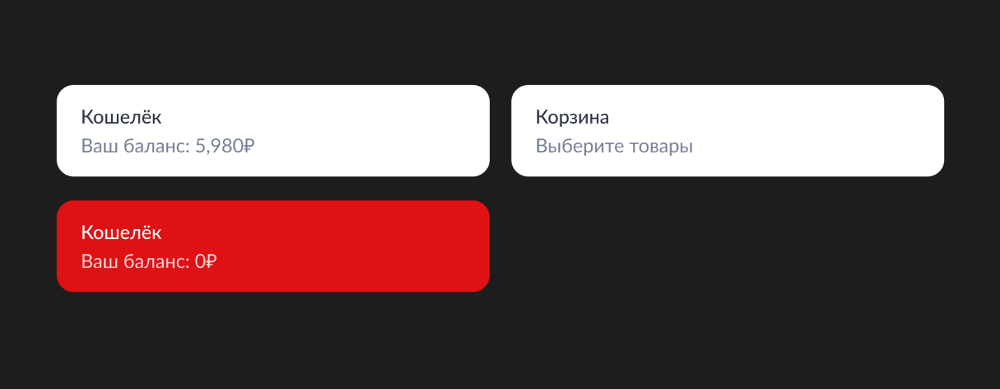
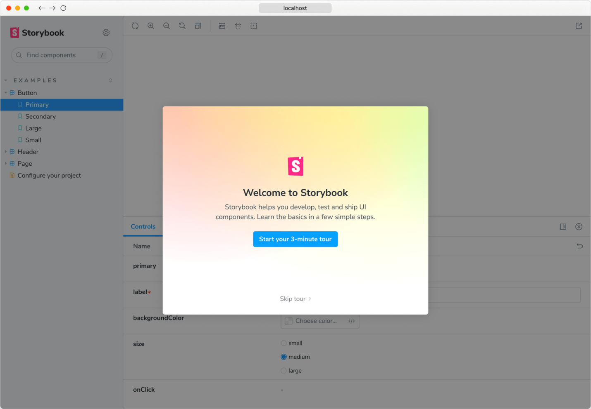
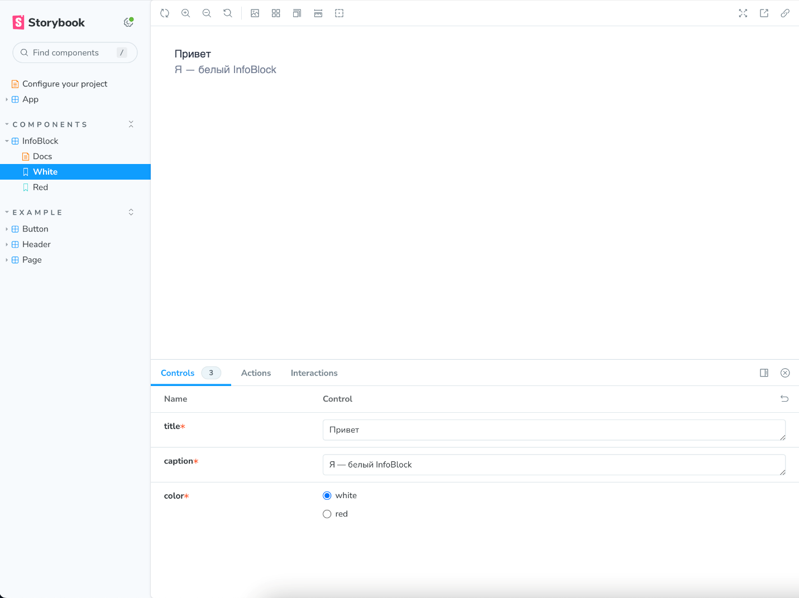
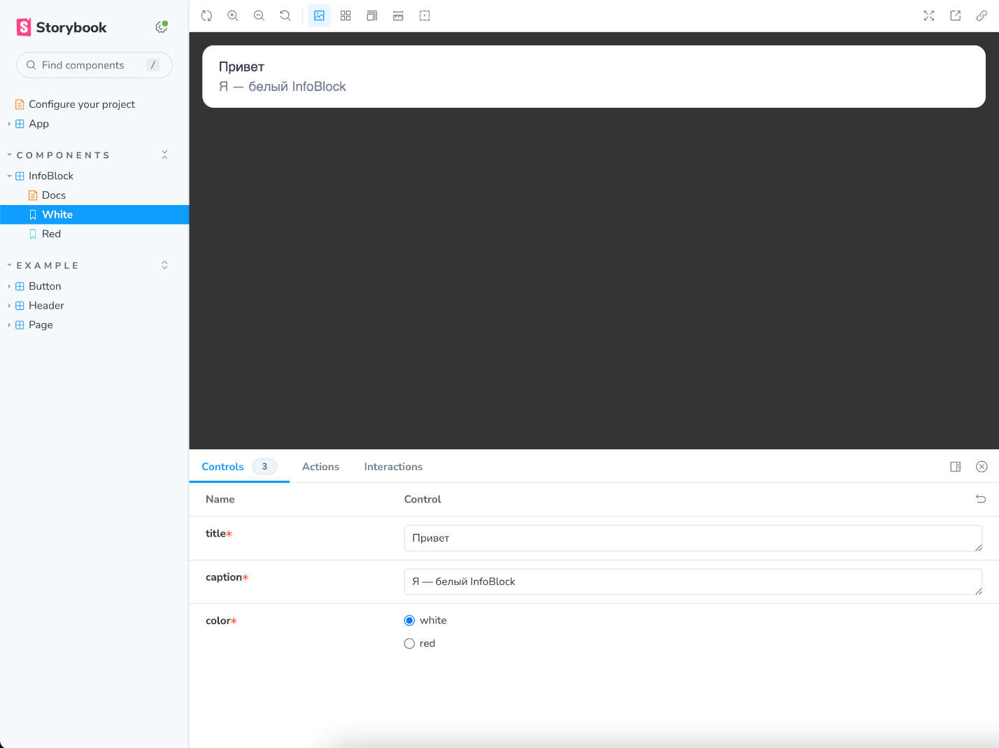
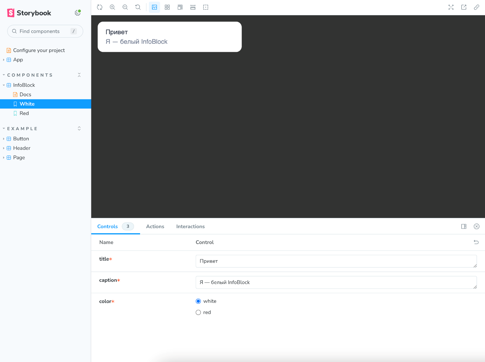
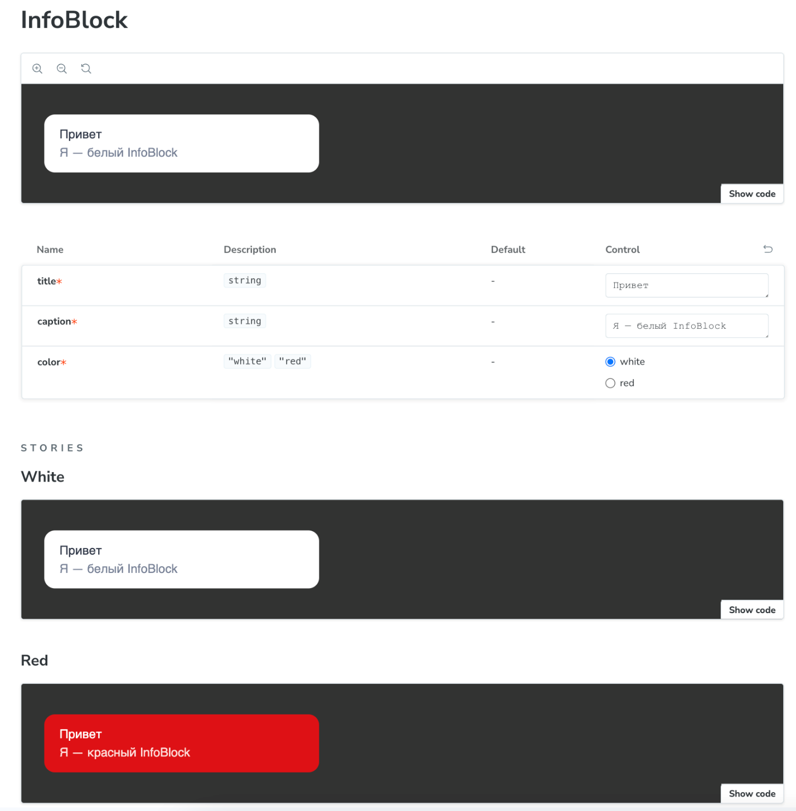

**Концепция изоляции**

Такие библиотеки, как React, дают возможность делить интерфейс на компоненты и разрабатывать их по отдельности: сначала маленькие, а затем из них — компоненты побольше.

Основные плюсы компонентного подхода:

  - возможность переиспользовать компоненты;

  - возможность тестировать их по отдельности — в изоляции, что повышает надёжность всего приложения.

**Переиспользуемость**

Разбить интерфейс на компоненты — это первый и очень важный шаг. А дальше нужно подумать: какие ещё варианты отображения могут быть у конкретного компонента.

Хороший дизайнер нарисует компонент отдельно и отобразит все его возможности, но так бывает не всегда. Зачастую в готовом макете страницы компоненты используются только в нескольких состояниях и задача разработчика — определить остальные.

Необходимо думать о компоненте как о чём-то независимом, имеющем свою задачу и зону ответственности. Компонент должен быть максимально универсальным и подходить для повторного использования в другом месте, с другими входными данными. За таким универсальным компонентом намного легче следить, чем за несколькими похожими компонентами.

Взгляните на такой компонент:



Его можно реализовать так (но не стоит):


```TYPESCRIPT

import React, { FC } from 'react';

import cn from 'classnames';

export interface InfoBlockProps {

/** Непонятные и специфичные свойства */

isWallet: boolean;

balance: number;

}

export const InfoBlock: FC<InfoBlockProps> = props => {

const { isWallet, balance } = props;

/** Логика родительского компонента */

const title = isWallet ? 'Кошелёк' : 'Корзина';

const caption = isWallet ? `Ваш баланс: ${balance}₽` : 'Выберите товары';

const color = isWallet && balance === 0 ? 'red' : 'white';

return (

<div className={cn('wrapper', color)}>

<p className="title">{title}</p>

<p className="caption">{caption}</p>

</div>

);

};
```
Если думать о компоненте InfoBlock как о независимом и универсальном, то сразу захочется задать несколько вопросов:

  - Компонент называется InfoBlock — блок для вывода любой информации, а свойства у него имеют конкретную предметную область. Как они относятся к компоненту, который должен отображать две строчки текста на цветном фоне?

  - Свойство isWallet ограничивает использование компонента только для кошелька и корзины. Почему бы не расширить возможности и не сделать компонент более универсальным?

  - Заголовок, текст и цвет определяются внутри общего компонента. Не лучше ли перенести эту логику в родительский компонент и задать данные свойствами?


Как же исправить код?

Например, вот так:


```TYPESCRIPT

import React, { FC } from 'react';

import cn from 'classnames';

export interface InfoBlockProps {

/* Свойства относятся к самому компоненту и не зависят от места использования */

title: string;

caption: string;

color: 'white' | 'red';

}

export const InfoBlock: FC<InfoBlockProps> = props => {

const { title, caption, color } = props;

/* Внутри компонента логика самого компонента, а не родительская */

return (

<div className={cn('wrapper', color)}>

<p className="title">{title}</p>

<p className="caption">{caption}</p>

</div>

);

};
```
Этот пример довольно прост, но хорошо демонстрирует, как в компонент может проникать ненужная логика, делая его зависимым от места использования.

Старайтесь этого избегать: рассматривайте компонент отдельно от макета и думайте о том, в каких вариациях он ещё может появиться на странице.

**Изоляция**

Когда вы разрабатываете переиспользуемый компонент интерфейса, важно делать так, чтобы он выглядел везде одинаково и не зависел от изменчивых внешних данных. По большей части это касается стилей: как отделить их друг от друга?

Также при разработке полезно отрендерить компонент отдельно от всего интерфейса и посмотреть, как он будет работать самостоятельно. Это поможет убедиться в правильной работе и внешнем виде компонента до его интеграции на страницу.

А ещё было бы здорово открыть какую-нибудь страницу, на которой все компоненты будут видны как на витрине. Тогда можно было бы:

  - понять, что уже реализовано в проекте, а что — нет;

  - сравнить с макетами;

  - отдать дизайнеру на проверку.

Такие возможности особенно важны при разработке библиотеки компонентов.

Спешим вас обрадовать\! Все описанные выше задачи решаются достаточно легко. Для изоляции стилей есть CSS-модули, а витрину компонентов умеет делать такой инструмент, как Storybook. Именно их вы изучите в следующих уроках.

**Storybook**

Процесс вёрстки интерфейса начинается с написания компонентов: от маленьких до больших. Увидеть результат можно только в самом конце, когда приложение будет готово и его можно будет запустить.

Однако куда более удобно было бы отрендерить компонент отдельно и посмотреть, как он ведёт себя в отрыве от всего интерфейса. Вот какие возможности мы бы тогда получили:

  - повзаимодействовать с компонентом,

  - увидеть все его состояния,

  - проверить, правильно ли он работает.

Конечно, такое можно провернуть, если подставить компонент вместо App и запускать с разными данными. Но это не тот подход, которым можно гордиться. В отличие от использования Storybook.

**Что такое Storybook**

Storybook позволяет отрендерить компоненты по отдельности и в разных состояниях. Эти состояния называются stories — истории, почти как в социальных сетях. Они выглядят так:

Получается, Storybook — это целая витрина компонентов вашего проекта. Вот какие возможности она даёт:

  - Во время разработки компонента можно сразу видеть, как он будет выглядеть.

  - Можно подключить дополнительные инструменты для тестирования, которые будут делать скриншоты всех ваших историй и проверять, не сломалось ли что-то.

  - На витрине компонентов можно легко найти нужный компонент или, посмотрев на неё, понять, что он ещё не реализован.

  - Storybook можно показать дизайнеру, чтобы он посмотрел результат вашей вёрстки. Часто бывает, что дизайн меняется или содержит элементы, которые сложно реализовать. Storybook поможет наладить коммуникацию с дизайнером и обсудить такие моменты.

Давайте освоим этот мощный, но в то же время простой в использовании инструмент.

**Настройка**

Storybook умеет работать со многими фреймворками, среди которых и React. Более того, Storybook автоматически определит, какой именно фреймворк используется в вашем проекте, и сам под него подстроится.

Всё, что нужно сделать, это запустить в корне проекта такую команду:


    npx storybook@latest init

Вот что произойдёт:

  - Будут установлены необходимые зависимости;

  - В package.json добавятся команды для запуска и сборки Storybook;

  - Будут добавлены файлы с настройками Storybook;

  - Будут сгенерированы простые примеры историй.

Потом Storybook автоматически запустится и предложит вам пройти короткое обучение:



Теперь самое интересное — напишем истории для своих компонентов. Создайте простой проект на React командой npm create vite@latest и установите Storybook, как описано выше.

**Как писать истории**

Возьмём за основу компонент из предыдущего урока и напишем для него истории.


```TYPESCRIPT

// src/InfoBlock/InfoBlock.tsx

import { FC } from 'react';

import cn from 'classnames';

import './InfoBlock.css';

export interface InfoBlockProps {

title: string;

caption: string;

color: 'white' | 'red';

}

export const InfoBlock: FC<InfoBlockProps> = props => {

const { title, caption, color } = props;

return (

<div className={cn('info-block', `info-block_color_${color}`)}>

<p className="info-block__title">{title}</p>

<p className="info-block__caption">{caption}</p>

</div>

);

};
```
Тут мы используем дополнительную библиотеку classnames. Для её установки выполните:


```BASH

npm i classnames
```
Вот файл со стилями:


```CSS

/* src/InfoBlock/InfoBlock.css */

.info-block {

border-radius: 14px;

padding: 14px 14px 14px 20px;

}

.info-block_color_white {

background-color: \#fff;

}

.info-block_color_red {

background-color: \#dd0000;

}

.info-block__title, .info-block__caption {

font-family: lato, sans-serif;

font-size: 16px;

line-height: 24px;

margin: 0;

}

.info-block__title {

font-weight: 500;

}

.info-block_color_white .info-block__title {

color: \#2f3747;

}

.info-block_color_white .info-block__caption {

color: rgba(26, 43, 77, 0.6);

}

.info-block_color_red .info-block__title {

color: \#fff;

}

.info-block_color_red .info-block__caption {

color: rgba(255, 255, 255, 0.85);

}
```
Файл с историями лучше класть рядом с исходным файлом компонента — так всё будет под рукой. Создадим его по примеру, который сгенерировал сам Storybook:


```TYPESCRIPT

// src/InfoBlock/InfoBlock.stories.tsx

/* Импорт из @storybook/react, потому что пишем на React */

import type { Meta, StoryObj } from '@storybook/react';

import { InfoBlock } from './InfoBlock';

const meta = {

/* Название компонента и путь, по которому его нужно отобразить на витрине */

title: 'components/InfoBlock',

/* Передаём сам компонент */

component: InfoBlock,

/* Тег autodocs просит Storybook сгенерировать отдельную историю с документацией компонента */

tags: ['autodocs'],

/* satisfies помогает точнее определить тип */

} satisfies Meta<typeof InfoBlock>;

export default meta;

type Story = StoryObj<typeof meta>;

/* История с компонентом белого цвета */

export const White: Story = {

/* Для React-компонентов args === props */

args: {

title: 'Привет',

caption: 'Я — белый InfoBlock',

color: 'white'

}

};

/* История с компонентом красного цвета */

export const Red: Story = {

args: {

title: 'Привет',

caption: 'Я — красный InfoBlock',

color: 'red'

}

};
```
Тут всё просто. Storybook оперирует двумя основными сущностями:

  - Meta — информация о компоненте. Тут можно задать компонент и его отображаемое название, а также дополнительные настройки, которые мы посмотрим чуть позже.

  - Story — история, компонент в конкретном состоянии. Тут можно задать компоненту аргументы (пропсы).

Каждый экспорт из файлов \*.stories.tsx воспринимается как история. Будьте с этим аккуратны: не экспортируйте ничего другого.

Запустим Storybook с помощью команды npm run storybook и увидим вот такую картину:



Наш InfoBlock появился на панели справа в двух состояниях: White и Red. Поскольку компонент написан на TypeScript, Storybook самостоятельно определил, какие пропсы есть у компонента, и отобразил их снизу в виде контролов. Данные в этих контролах можно менять и в режиме реального времени видеть результат.

Ну и, конечно же, мы видим наш компонент, отрендеренный в гордом одиночестве, и это замечательно\! Но есть пара нюансов…


Разобраться в нюансах

Шрифты отличаются от тех, которые использованы в макете из предыдущего урока. Подключим нужный шрифт в файл с глобальными стилями:


```CSS

/* src/index.css */

/* Шрифт Lato из Google Fonts */

@import url(https://fonts.googleapis.com/css?family=Lato:100,100italic,300,300italic,regular,italic,700,700italic,900,900italic);

...
```
Однако в Storybook ничего не изменится: он не принимает во внимание файл с глобальными стилями.

Это хорошо, так мы тестируем компонент действительно в изоляции. Однако в нашем случае можно сделать исключение: компоненты не будут использоваться вне приложения и его глобальных стилей, поэтому тестировать их лучше вместе.

Файл с глобальными стилями нужно подключить в .storybook/preview.ts — там лежат дополнительные настройки для всех историй:


```TYPESCRIPT

// .storybook/preview.ts

import type { Preview } from "@storybook/react";

/* Подключаем глобальные стили */

import '../src/index.css';

const preview: Preview = {

...

};

export default preview;
```
Также обратите внимание, что фон компонента сливается с фоном самой истории. Это можно легко исправить с помощью параметра backgrounds в файле истории:


```TYPESCRIPT

import type { Meta, StoryObj } from '@storybook/react';

import { InfoBlock } from './InfoBlock';

const meta = {

title: 'components/InfoBlock',

component: InfoBlock,

tags: ['autodocs'],

parameters: {

/* Устанавливаем тёмный фон для всех историй из этого файла */

backgrounds: {

default: 'dark',

},

},

} satisfies Meta<typeof InfoBlock>;

...
```
Теперь можно увидеть чёткие очертания компонента (возможно, понадобится обновить страницу или перезапустить Storybook):



По задумке, компонент InfoBlock должен растягиваться на всю ширину контейнера, что мы и наблюдаем. Однако при просмотре на витрине этим контейнером является вся ширина страницы и это немного неудобно. Хотелось бы ограничить ширину контейнера. Это легко сделать с помощью декораторов.

Декоратор представляет собой функцию, которая принимает один аргумент — компонент готовой истории, а возвращает новый компонент, содержащий эту историю внутри. Декоратор — это дополнительная обёртка для вашей истории. Её можно задавать какой угодно, и самих декораторов может быть также сколько угодно.

Вот как это может выглядеть:


```TYPESCRIPT

(Story) => {

return (

/* Ограничиваем ширину контейнера */

<div style={{ maxWidth: '360px' }}>

<Story />

</div>

);

}
```
Встраивать декораторы можно на уровне всего файла — в Meta или же для отдельной истории:


```TYPESCRIPT

import type { Meta, StoryObj } from '@storybook/react';

import { InfoBlock } from './InfoBlock';

const meta = {

...

decorators: [

Story => (

/* Ограничиваем ширину контейнера */

<div style={{ maxWidth: '360px' }}>

<Story />

</div>

)

]

} satisfies Meta<typeof InfoBlock>;

...
```
Теперь всё выглядит так, как должно:



Также, благодаря тегу autodocs, Storybook сформировал для компонента специальную страницу Docs. Она содержит его внешний вид, пропсы и примеры историй:



Все возможности Storybook вы найдёте [<span class="underline">на официальном сайте инструмента</span>](https://storybook.js.org/).

**Подведём итог**

Storybook — отличный инструмент\! Используйте его в своём проекте и не забывайте создавать истории для каждого компонента. Так вы быстрее сможете сверстать все компоненты, а самое главное — сразу убедиться в их работоспособности. В качестве приятного бонуса вы получите красивую витрину всех используемых в приложении компонентов.

**CSS-модули**

Когда мы пишем CSS для компонентов, могут возникнуть проблемы.

Самая значимая — пересечение стилей. Можно в соседнем классе написать тот же самый класс. В Storybook и даже в интерфейсе может быть всё хорошо, но стоит компонентам появиться на одной странице — и стили будут пересекаться.

Ещё одна проблема — отсутствие связности между JS и CSS. Класс — это просто строка. В текущем компоненте можно случайно написать класс из соседнего, от таких ошибок никто не застрахован. В Storybook будет всё в порядке, да и в интерфейсе, скорее всего, тоже.

Но, опять же, стоит компонентам оказаться на странице вместе, и лишние стили дадут о себе знать. Заметить такую проблему заранее очень сложно.

Также отсутствие связности порождает дополнительные трудности при рефакторинге:

  - При удалении селекторов из CSS-файла нужно пройтись поиском по всему JS-коду и удалить все использования оттуда.

  - При удалении классов из JS нужно не забыть удалить их упоминания и в CSS-файле.

Чем больше проект, тем сложнее исправлять и обнаруживать ошибки. Хотя всплывать они могут и нечасто.

Хотелось бы избегать таких ошибок на этапе написания кода…


Но как?

Для этого и существуют CSS-модули.

**Идея**

CSS-модули гарантируют уникальность классов для каждого компонента.

Нам понадобятся файлы с окончанием \*.module.css. Каждый такой файл — отдельный CSS-модуль. Классы внутри модуля пишутся как обычно, разве что не нужно думать об уникальности — теперь это будет задача сборщика.

Можно позволить себе более простые имена класса:


```CSS

.root {

border-radius: 14px;

padding: 14px 14px 14px 20px;

}

.rootColorWhite {

background-color: \#fff;

}

.rootColorRed {

background-color: \#dd0000;

}

.title, .caption {

font-family: lato, sans-serif;

font-size: 16px;

line-height: 24px;

margin: 0;

}

.title {

font-weight: 500;

}

.rootColorWhite .info-title {

color: \#2f3747;

}

.rootColorWhite .caption {

color: rgba(26, 43, 77, 0.6);

}

.rootColorRed .title {

color: \#fff;

}

.rootColorRed .caption {

color: rgba(255, 255, 255, 0.85);

}
```
Каждый CSS-модуль импортируется как объект, ключи которого — те названия классов, которые вы задали в файлах. Выглядит это так:


```TYPESCRIPT

...

/* Импортируем стили как объект */

import style from './InfoBlock.module.css';

...

export const InfoBlock: FC<InfoBlockProps> = props => {

const { title, caption, color } = props;

return (

/* Пользуемся свойствами объекта style как названиями CSS-классов */

<div className={cn(style.root, color === 'red' ? style.rootColorRed : style.rootColorWhite)}>

<p className={style.title}>{title}</p>

<p className={style.caption}>{caption}</p>

</div>

);

};
```
Поскольку название класса уже не просто строка, а свойство объекта, то принято писать как и названия обычных переменных — в camelCase.

Все классы из CSS-модулей при сборке будут преобразованы в уникальный хеш, вот так:


```HTML

<div class="_root_IR7lL _rootColorRed_DpQHj">

...

</div>
```
В готовом виде читается плохо, как и любой код после сборки. Но теперь у нас есть большое преимущество: все классы гарантированно уникальны\!

Какие там были проблемы с CSS?

  - Пересечение стилей? Решено\! У каждого компонента к CSS-классам добавляется уникальный хеш.

  - Нет связности CSS и JS? Теперь стили импортируются как объект, а значит, мы получаем возможность их контролировать\!

Здорово\!

**Как подключить**

Если проект создан с помощью [<span class="underline">create-react-app</span>](https://create-react-app.dev/docs/getting-started/) или [<span class="underline">Vite</span>](https://vitejs.dev/), то CSS-модули там уже настроены. Если вы настраивали Webpack самостоятельно, то включить модули вам также не составит труда. Откройте webpack.config.js и добавьте опцию modules в css-loader. Следите за руками:


```JAVASCRIPT

// webpack.config.js

****

module.exports = {

module: {

rules: [

/* Правило для CSS-модулей */

{

test: /\.css$/,

use: [

"style-loader",

{

loader: "css-loader",

options: {

/* включаем модули */

modules: true,

},

},

],

/* только для файлов, оканчивающихся на .module.css */

include: /\.module\.css$/,

},

/* Правило для глобального CSS */

{

test: /\.css$/,

use: ["style-loader", "css-loader"],

/* исключаем модули CSS */

exclude: /\.module\.css$/,

},

],

},

};
```
Мы добавили в приложение поддержку CSS-модулей, но при этом оставили возможность подключать глобальные стили.

По умолчанию классы будут полностью заменяться на уникальный хеш:


```HTML

<div class="SWtue9lCuBbisN5mZLHJ liawHxsTytTsbp1LRa7w">

<p class="ucV2RMeGLswELM2koLr9">Привет</p>

<p class="XG3Au2Y9dG11kU4mjaXG">Я — InfoBlock</p>

</div>
```
Чтобы во время разработки чувствовать себя комфортнее, можно задать имя класса шаблоном — в параметре localIdentName:


```JAVASCRIPT

// webpack.config.js

****

...

{

test: /\.(css|scss)$/,

use: [

"style-loader",

{

loader: "css-loader",

options: {

modules: {

/* Пишем шаблон для имени класса */

localIdentName: "_[local]_[hash:base64:5]",

/* [local] — настоящее имя класса

\* [hash:base64:5] — хеш

\*/

},

},

},

],

},

...
```
Теперь классы будут выглядеть так:


```HTML

<div class="_root_IR7lL _rootColorRed_DpQHj">

<p class="_title_aFLTp">Привет</p>

<p class="_caption_qQ0cD">Я — InfoBlock</p>

</div>
```
Вы можете убрать хеш из шаблона, но тогда потеряется суть CSS-модулей и смысла в них не будет.

CSS-модули прекрасно дружат с препроцессорами, такими как Sass или Less. Для этого в конфиге перед обработчиком css-loader нужно вставить дополнительный — sass-loader:


```JAVASCRIPT

// webpack.config.js

****

...

{

/* Добавляем расширение scss */

test: /\.(css|scss)$/,

use: [

"style-loader",

{

loader: "css-loader",

options: {

modules: {

localIdentName: "_[local]_[hash:base64:5]",

},

},

},

/* Дополнительный лоадер sass */

"sass-loader",

],

/* И тут добавляем scss */

include: /\.module\.(css|scss)$/,

},

...
```
Вот и всё, модули готовы\! Есть ещё более гибкие настройки, о них можно почитать [<span class="underline">в документации к Webpack</span>](https://webpack.js.org/loaders/css-loader/#modules).

**Настройка линтера для CSS-модулей**

Подключённый CSS-модуль — это уже не просто строка, а JavaScript-объект, за которым можно следить и контролировать его правильное использование. А для этого у нас есть линтеры, в частности ESlint. Для CSS-модулей тоже есть свой плагин — [<span class="underline">eslint-plugin-postcss-modules</span>](https://www.npmjs.com/package/eslint-plugin-postcss-modules).

Он умеет находить:

  - классы, которые не определены;

  - неиспользуемые классы.

Настроить его очень просто.

Устанавливаем пакет:


```SHELL

npm install -D eslint-plugin-postcss-modules
```
Добавляем плагин в конфиг ESlint:


```JAVASCRIPT

// .eslintrc.cjs

module.exports = {

extends: [

/* Плагин для CSS-модулей */

"plugin:postcss-modules/recommended",

],

rules: {

/* Ошибка для классов, которые не определены */

"postcss-modules/no-undef-class": "error",

/* Ошибка для классов, которые не используются */

"postcss-modules/no-unused-class": "warn",

},

settings: {

"postcss-modules": {

/* Обрабатываем только файлы модулей */

include: "\*\*/\*.module.(css|scss)",

exclude: "\*\*/node_modules/**/\*",

},

},

};
```
Готово\! Теперь линтер будет нам помогать и заранее расскажет об ошибках:


```SHELL

/InfoBlock/InfoBlock.tsx

4:1 warning Class qwerty is exported but unused postcss-modules/no-unused-class

19:27 error asd does not exist in /InfoBlock/InfoBlock.module.scss postcss-modules/no-undef-class

✖ 2 problems (1 error, 1 warning)
```
**Автокомплит**

Ещё один приятный бонус: для CSS-модулей можно настроить автодополнение.

Устанавливаем плагин [<span class="underline">typescript-plugin-css-modules</span>](https://www.npmjs.com/package/typescript-plugin-css-modules) и добавляем его в tsconfig.json:


```JSON

// tsconfig.json

{

"compilerOptions": {

"plugins": [{ "name": "typescript-plugin-css-modules" }]

}

}
```
Теперь IDE будет предлагать вам те классы, которые уже определены в CSS-модуле.


И что, нет никаких подвохов — одни плюсы?

**Настолько ли всё хорошо**

При использовании CSS-модулей есть несколько нюансов, которые нужно учитывать.

Например, в тестах вы не сможете использовать селекторы классов, чтобы найти нужный элемент. Очевидно, ведь классы при запуске преобразованы и вы не знаете заранее их хеши. С этой проблемой можно справиться так:

1.  Не использовать селекторы классов. Есть и другие способы найти элемент, например по атрибутам data-testid. При сборке их можно убирать из кода, а в тестах оставлять.

2.  Использовать селекторы вида [class^="_rootColorRed_"], что означает «элемент, класс которого начинается с _rootColorRed_». Так мы обрежем ту часть класса, где находится хеш. Но будьте с этим аккуратны: под такое описание может подходить не один класс на странице\!

3.  При тестировании отдельных компонентов отключать хеши. Но с этим тоже нужно быть аккуратными, так как основное преимущество CSS-модулей отключается.

**Вывод**

CSS-модули — классный инструмент. Он добавляет к именам классов хеш, что делает их уникальными и исключает пересечение. Также решается проблема связности, а значит, используемые (и неиспользуемые) CSS-классы можно строго контролировать линтером. Это поможет обнаружить проблемы со стилями ещё до того, как они будут замечены в интерфейсе\!

[project63.zip](project63.zip)

Перед вами небольшой проект — приложение, отображающее фотографии в виде табличной сетки. Для каждой фотографии также отображается её название, если оно есть, и её автор.

Приложение состоит из следующих компонентов:

  - Компонент App, описывающий приложение в целом.

  - Компонент CardsList, который описывает табличную сетку для карточек с фотографиями.

  - Компонент Card, описывающий карточку с фотографией, её названием и автором.

СSS-стили для всех представленных компонентов описаны в файле styles.css.

В папке каждого компонента рядом с файлом, описывающим сам компонент, находится пустой файл для CSS-модуля (app.module.css, cards-list.module.css и card.module.css).

Вам нужно:

  - Перенести стили для каждого компонента из файла styles.css в файл его CSS-модуля.

  - Импортировать файл CSS-модуля каждого компонента в файл, описывающий соответствующий компонент.

  - Заменить в файле каждого компонента строковые значения атрибута className у DOM-элементов на значения, полученные из CSS-модуля.

[Далее](Спринт11-7.md).