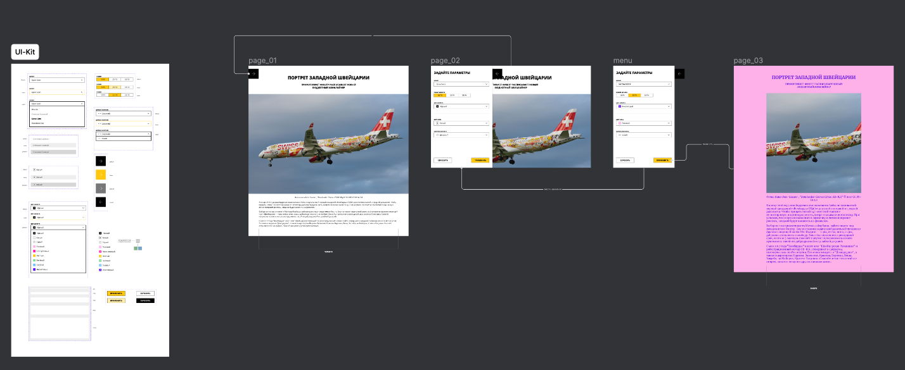

**Проект. Страница блога**

👍 **Что за проект:** кастомизация страницы

**Где описание:** на этой странице

**Откуда взять материалы:** [<span class="underline">из макетов</span>](https://www.figma.com/file/FEeiiGLOsE7ktXbPpBxYoD/Custom-dropdown?type=design&node-id=0%3A1&mode=design&t=eXRJnWC6Xsuw0qR4-1)

Из заготовки -

[frontend-developer-canonicals-blog-customizer_starter](frontend-developer-canonicals-blog-customizer_starter)

**Где работать:** после копирования заготовки в своём репозитории создайте новую ветку с именем review и пишите код в ней, а потом создайте пулл-реквест — о нём в следующем уроке

**Как проверить:** по чек-листу

В ходе этой проектной работы вы реализуете кастомизацию страницы блога через открывающуюся панель.



У вас есть [<span class="underline">заготовка проекта</span>](frontend-developer-canonicals-blog-customizer_starter): готовая вёрстка страницы блога и самой панели, уже разделенная на компоненты. Вам предстоит добавить в компоненты состояния и обработчики событий, корректно передать данные между компонентами.

Начнем по порядку, с выделения компонент.

**Шаг 1. Изучите имеющиеся компоненты**

Сначала изучите [<span class="underline">макет проекта</span>](https://www.figma.com/file/FEeiiGLOsE7ktXbPpBxYoD/Custom-dropdown?type=design&node-id=0%3A1&mode=design&t=eXRJnWC6Xsuw0qR4-1). Обратите внимание:

  - из каких ключевых частей он состоит,

  - на какие компоненты вы бы его разделили,

  - какие компоненты из них повторяющиеся.

После этого изучите уже реализованные компоненты в стартер-ките, часть из них относящихся к ui-kit задокументированы в storybook. Чтобы открыть его выполните в консоли команду:


```BASH

npm run storybook
```
Из этих компонент вам предстоит собрать форму и после этого настроить всю необходимую функциональность.

Сразу расскажем про функциональные требования:

  - При нажатии на «стрелку» открывается сайдбар с настройками, при повторном нажатии или клике вне сайдбар закрывается.

  - При изменении настроек в сайдбаре они не применяются сразу.

  - После нажатия на «применить» стили применяются к статье.

  - При нажатии «сбросить» настройки в форме сбрасываются на начальные, которые были при открытии страницы, и стили применяются к статье.

  - Настройки устанавливаются через CSS-переменные, которые уже есть в стилях и установлены в коде в дефолтные значения.

**Шаг 2. Реализуйте форму редактирования свойств**

Форма редактирования свойств размещена в компоненте ArticleParamsForm, который вам нужно доделать.

Продумайте следующие моменты, прежде чем приступать к коду:

  - как будет организована композиция,

  - где вы будете хранить состояние,

  - как передавать данные между формой и страницей.

Затем реализуйте механику открытия-закрытия панели с формой, после этого можно будет временно зафиксировать ее пропсом для удобства реализации.

После этого реализуйте форму из имеющихся компонент согласно макету.

**Шаг 3. Обеспечьте передачу данных между формой и страницей**

Реализуйте по отдельности сохранение состояния страницы и состояние формы. Обеспечьте применение нового состояния после нажатия на «применить».

Это можно сделать через CSS-переменные на основе которых строится стилизация, их достаточно задать все вместе на уровне приложения — что уже сделано в компоненте App.

**Перед началом работы**

Вы будете создавать пулл-реквест — рассказали о них в следующем уроке, обязательно изучите его.

**Чек-лист**

Когда завершите работу, обязательно проверьте себя по чек-листу.

**Чек-лист проектной работы**

В этом документе описаны критерии, которым должна соответствовать работа.

**Стиль написания кода**

  - Форматирование кода:
    
      - код проекта отформатирован единообразно;
    
      - нет нарушений иерархии отступов.

  - Объявление переменных:
    
      - для объявления переменных используется let и const, не используется объявление через var;
    
      - если переменная не перезаписывает своё значение, она объявлена через const;
    
      - нет «магических значений», все значения записаны в переменные.

  - Именование переменных:
    
      - имена переменных и функций написаны в стиле camelCase;
    
      - имена переменных — существительные, отражающие то, что в них хранится;
    
      - если в проекте есть несколько переменных с похожими данными — по их наименованиям понятно, что хранится в каждой переменной;
    
      - имена реакт компонентов, классов и типов данных написаны в стиле PascalCase;
    
      - имена массивов — существительные во множественном числе;
    
      - имена функций начинаются с глагола, отражающего то, что они делают;
    
      - для именования не используется транслит и неуместные сокращения.

**React**

  - Разметка портирована в JSX:
    
      - разметка заключена в ( ) ;
    
      - разметка вынесена в соответствующие ей компоненты.

  - Компоненты написаны корректно:
    
      - хуки не используются внутри условных блоков;
    
      - хуки вызываются в основной функции компонента;
    
      - при использовании классовых компонентов эффекты описаны внутри методов жизненного цикла компонента.

  - Стили импортированы как модули. Если есть общие стили, они импортированы в глобальную область видимости.

  - Для конкатенации имен css классов используется библиотека [<span class="underline">clsx</span>](https://www.npmjs.com/package/clsx).

  - Проект написан на TypeScript и типизация реализована верно:
    
      - Тип any не используется без необходимости.
    
      - Не используется ослабление контроля типов с помощью инлайнового отключения линтера или настроек в tsconfig.json.
    
      - Все файлы с компонентами имеют расширение .tsx.
    
      - Для функциональных компонентов типизируются пропсы и хуки. Для классовых компонентов типизируются пропсы, параметры конструктора, состояния компонента, аргументы методов жизненного цикла.
    
      - Описания одинаковых типов не дублируются. При необходимости используется объединение типов или дженерики.

  - В проекте переиспользуются компоненты предоставленные в стартовом наборе.

**Функциональность приложения работает корректно**

  - Внешний вид и расположение элементов страницы соответствует макету.

  - При нажатии на «стрелку» открывается сайдбар с настройками, при повторном нажатии или клике вне сайдбара, он закрывается.

  - При изменении настроек в сайдбаре они не применяются сразу.

  - После нажатия на «применить» стили применяются к статье.

  - При нажатии «сбросить» настройки в форме сбрасываются на дефолтные и стили применяются к статье.

  - Настройки устанавливаются через CSS-переменные которые уже есть в стартовом коде.

  - При повторном открытии сайдбара в нем сохраняются выбранные настройки.

**Хорошие практики**

  - Нет лишнего кода: неиспользуемых переменных, закомментированных фрагментов, избыточной логики.

  - Удалены все console.log, alert и debugger, которые использованы во время отладки.

  - Используются функциональные компоненты.

  - Логически связанные данные передаются между компонентами как один объект, а не как отдельные пропсы.
